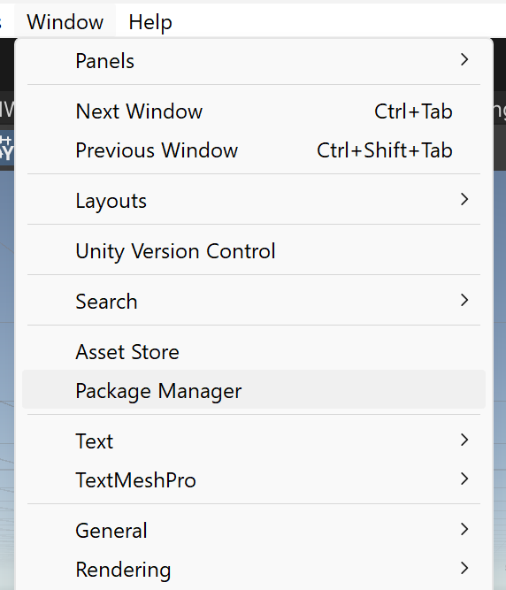
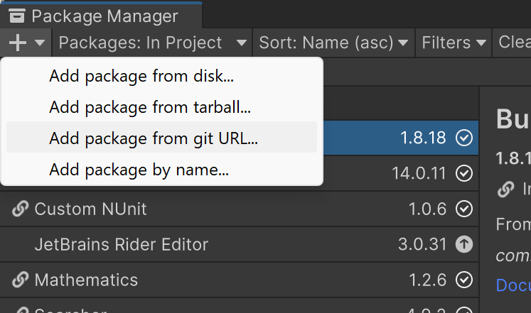
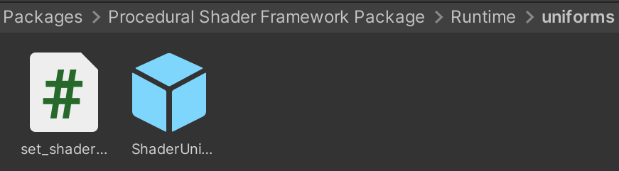
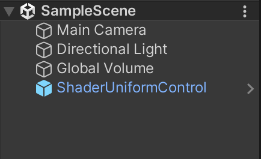
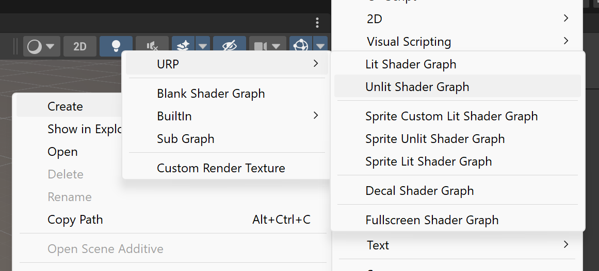
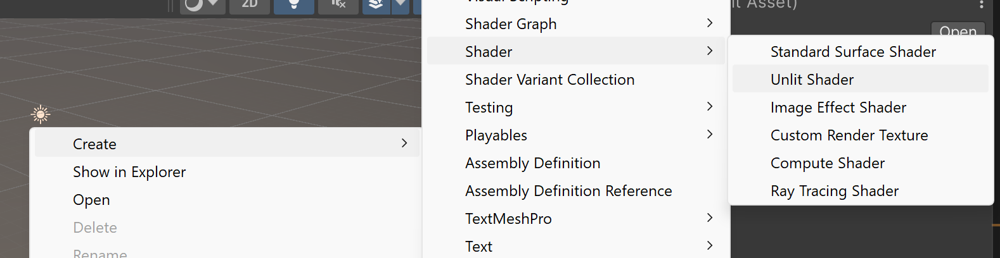
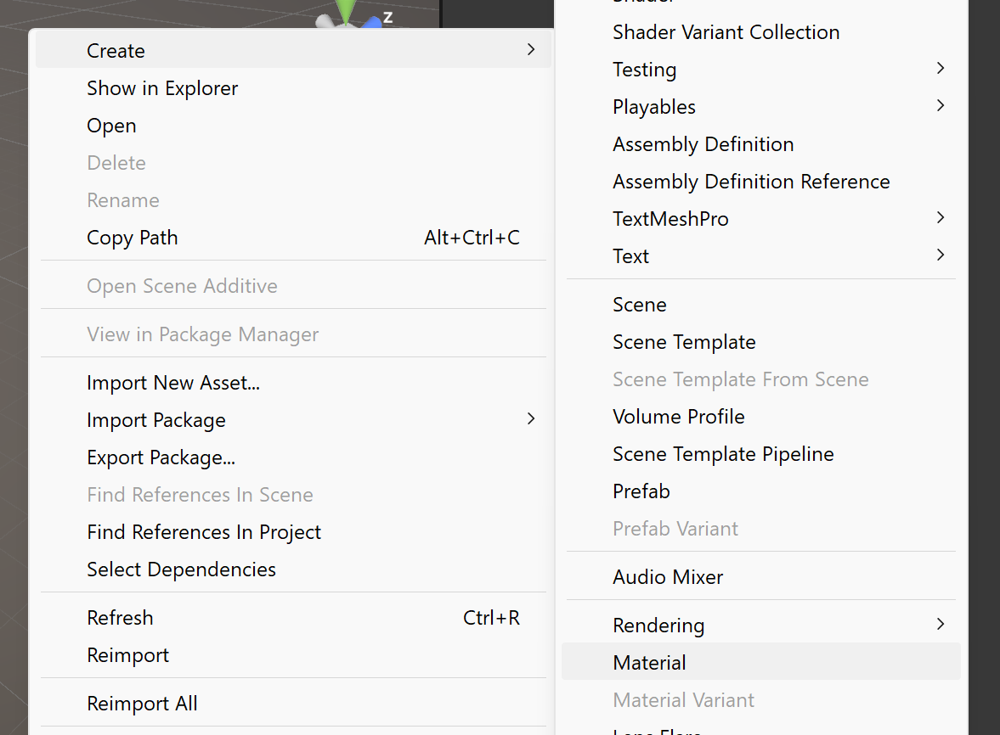
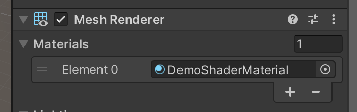
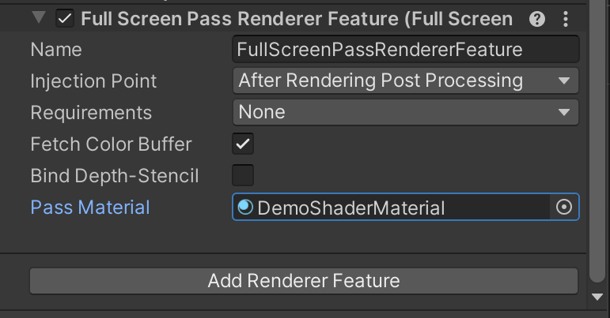
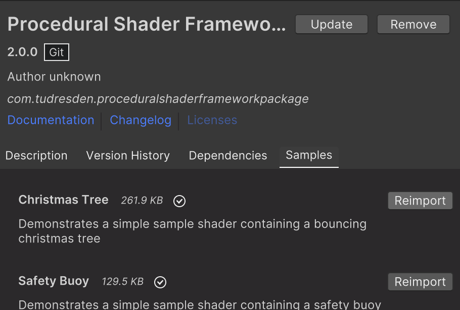

<div class="container">
    <h1 class="main-heading">Overview</h1>
    <blockquote class="author">by Frieda Hentschel</blockquote>
</div>

Unity is a versatile real-time engine known for its **ShaderGraph system**, **cross-platform support**, and ease of integration for custom shaders.

- **Integration Methods:** 
    - Visual Scripting: ShaderGraph
    - Standard Scripting: ShaderLab 
- **Supported Render Pipelines:** URP (Universal Render Pipeline), others may work but were not tested 
- **Supported Unity Versions:** All functions were tested on *Unity 2022.3.50* and *Unity 6000.0.41* 
- **Supported Shader Types:**
    - Unlit Shader
    - Lit Shader/Standard Surface Shader
    - Fullscreen Shader

---

## Integrate the Framework

To easily include the integration of the framework into any Unity project, it is available as a UPM. The following gives a step by step guide on how to set up a project with it:

1. Create a URP project (Universal Render Pipeline) in Unity

2. Navigate to *Window/Package Manager*

    <figure markdown="span">
        { width="300"}
    </figure>

3. Add a new package using *Add package from git URL*. Use the following url in the popup-window: [https://github.com/friedaxvictoria/ProceduralShaderFrameworkPackage.git](https://github.com/friedaxvictoria/ProceduralShaderFrameworkPackage.git).

    <figure markdown="span">
        { width="400" }
    </figure>

4. Locate the package in the project. Include the prefab **ShaderUniformControl** that can be found at *ProceduralShaderFrameworkPackage/Runtime/uniforms* into the scene. This is essential for the required uniforms to be set. Read more about their purpose at [Uniforms and C\#](unity/uniformsAndCs.md).

    <figure markdown="span">
        { width="500" }
    </figure>
    <figure markdown="span">
        { width="300" }
    </figure>

5. Create a custom shader with ShaderGraph or ShaderLab.

    === "Visual Scripting"
        Create a ShaderGraph via a right-click in the project *Create/Shader Graph/URP/...*. 
        Decide what kind of shader is required. 

        <figure markdown="span">
            { width="500" }
        </figure>

    === "Standard Scripting"
        Create a ShaderLab file via a right-click in the project *Create/Shader/...*. 
        Decide what kind of shader is required. The *Standard Surface Shader* is roughly the equvalent to the *Lit Shader* in ShaderGraph. *Fullscreen Shaders* have to be handled in the shader code.

        <figure markdown="span">
            { width="500" }
        </figure>

6. Create a complementary material via a right-click in the project *Create/Material*

    <figure markdown="span">
        { width="400" }
    </figure>

    > Unity's ShaderGraph supports ```half floating point``` and ```floating point``` as its precision. This framework only supports the later. Thus, ensure that in the Graph's inspector under *Graph Settings/Precision* **Single** is chosen. This is typically the default.

7. Apply the shader to a Unity material by dragging it onto the material.

8. Apply the material to an object of choice or set it up as a full screen material.

    - Object Material: Drag the Material into the Material-section of the object in the inspector.

        <figure markdown="span">
            { width="400" }
        </figure>

    - Fullscreen Material: 

        - Locate the project's renderer at *Assets/Settings/URP-High Fidelity-Renderer*
        - Add a *Full Screen Pass Renderer Feature* via the *Add Renderer Feature* in the inspector
        - Drag the material of choice to the *Pass Material* section

        <figure markdown="span">
            { width="400" }
        </figure>

9. Start composing a custom shader.

---

## Visual Scripting

!!! Note
    The visual scripting was integrated to provide a visual alternative. It's main function is to help understand the structure of Unity's integration. While it works well for small examples, the compilation time for larger scenes can drastically increase. **It is not user friendly to generate large scenes.**

The functions have been integrated as Sub Graphs that are callable as nodes in a ShaderGraph. All nodes are located under **PSF** short for **Procedural Shader Framework** once the UPM has been included. Detailed paths for the individual nodes are noted after the description of each of the functions. 

To simplify some initial setups, nodes come with default parameters. For each description of an input parameter, the node's default value for said parameter is noted. If no default value is explicitly mentioned, it can be assumed to be zero for the respective amount of dimensions. 

> Be aware that the visual previews of the nodes might not be expressive. E.g. if correctly used, the visual preview for an SDF node will always be uniformly black or white.

---

## Standard Scipting

Due to the requirement of noting the precision in ShaderGraph, all functions that were implemented as nodes for the Visual Scripting are appended with an **_float**. 

> All other helper functions (e.g. [Helper Functions](unity/helperFunctions.md)) can still be called in ShaderLab and do not have the appendix.

In Standard Scripting, after including the appropriate libraries, users can directly call the functions within their ShaderLab shader files, typically in the fragment shader. This approach is better suited for those who prefer coding over using ShaderGraph, and it becomes especially advantageous as the scene complexity increases, offering more control and clarity compared to a node-based setup.

---

## User Shaders

Find the [Tutorials](unity/tutorials/christmasTree.md) to discover in-depth explanations on how to construct custom procedural shaders in Unity and to better understand the relations between functions.

Once the UPM has been installed: 

- The full implementation of Unity's integration can be found at: 
    
    `Packages/com.tudresden.proceduralshaderframeworkpackage/Runtime/scripts`

- To get access to one of the samples, they need to be downloaded. For that, navigate to the UPM in the Package Manager. Locate the Samples-tab and download the desired one. 

    <figure markdown="span">
        { width="400" }
    </figure>

    Once downloaded, the sample can be found at: 
    
    `Packages/com.tudresden.proceduralshaderframeworkpackage/Samples~`
