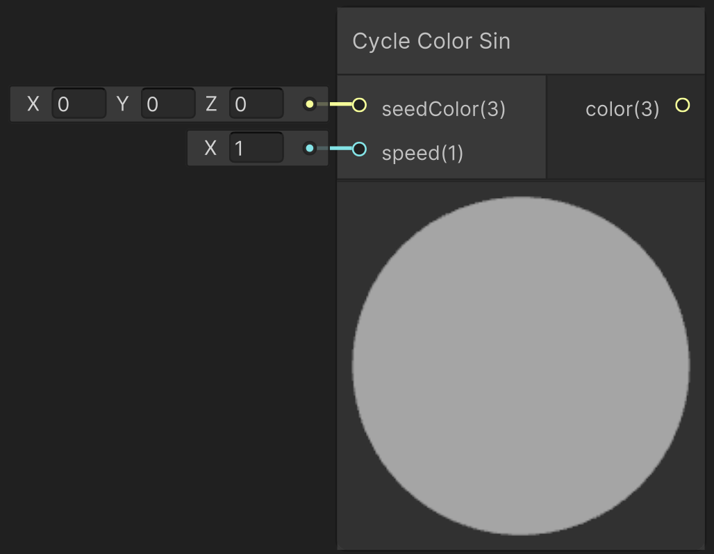

<div class="container">
    <h1 class="main-heading">Cycle Color</h1>
    <blockquote class="author">by Frieda Hentschel</blockquote>
</div>

This function applies a color animation to an arbitrary input color. It cycles through colors based on a sinus computation.

---

## The Code

``` hlsl
void changingColorSin_float(float3 seedColor, float speed, out float3 color)
{
    float3 rootColor = asin(2 * seedColor - 1);
    color = 0.5 + 0.5 * sin(_Time.y * speed * rootColor);
}
```

The computation of the root color is required to ensure that the seed color is within the cycle of colors. It is computed by solving for x when _Time.y = 0:

```seedColor = 0.5 + 0.5 * sin(_Time.y * speed * x)```

---

## The Parameters

### Inputs:
| Name            | Type     | Description |
|-----------------|----------|-------------|
| `seedColor`   | float3   | Initial color of the object|
| `speed`        | float   | Speed with which the color is changed <br> <blockquote>*ShaderGraph default value*: 1</blockquote>|

### Outputs:
| Name            | Type     | Description |
|-----------------|----------|-------------|
| `color`   | float3   | Current color of the object which can directly be plugged into the inputs of SDF functions (e.g. [Sphere](unity/cameraMatrix.md)) or lighting functions (e.g. [Point Light](unity/cameraMatrix.md)).|

> To create organic and interesting effects, the function can also be applied to position parameters. See the tutorial on the [Safety Buoy](../tutorials/safetyBuoy.md) for this.

---

## Implementation

=== "Visual Scripting"
    Find the node at `PSF/Animation/Cycle Color Sin`

    <figure markdown="span">
        { width="500" }
    </figure>

=== "Standard Scripting"
    !Utku Input
    Include ...

---

This is an engine-specific implementation without a shader-basis. It is inspired by this [shadertoy shader](https://www.shadertoy.com/view/fl3fRf){target="_blank"}.