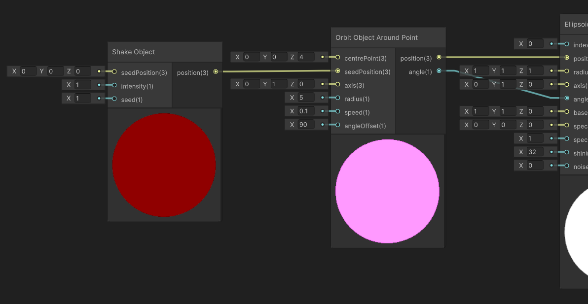

    <h1 class="main-heading">Animations in Unity</h1>
    <blockquote class="author">by Frieda Hentschel</blockquote>

The animation functions are used to periodically alter parameters of an object. They can be applied to [SDFs](../sdfs/generalInformation.md) or [Lighting Functions](../lighting/generalInformation.md) by connecting their output to the input of an object.

Animations are designed to alter parameters such as:

- Position
- Axis
- Angle
- Color
- Size
- Radius
- ...

--- 

## How to Combine Animations

Animations of the same dimension can simply be combined by connecting the functions in series.
    <figure markdown="span">
    { width="600" }
    </figure>

