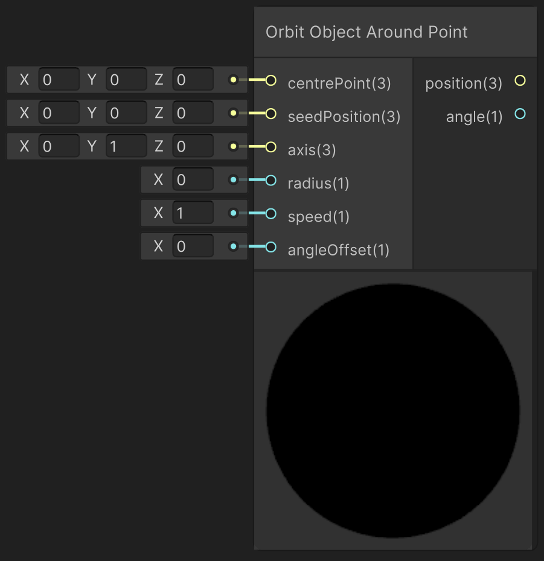

# Orbit Object Around Point

This function rotates an objects around a point. It can be applied to SDFs and lights.

---

## The Code

``` hlsl
void orbitObjectAroundPoint_float(float3 seedPosition, float3 center, float3 axis, float radius, float speed, float angleOffset, out float3 position, out float angle)
{
    axis = normalize(axis);
    angle = _Time.y * speed + angleOffset * PI / 180;
        
    float3 radiusAxis = (float3(1, 1, 1) - axis) * radius;
    float3 positionTemp = seedPosition + radiusAxis - center;

    position = center + cos(angle) * positionTemp + sin(angle) * cross(axis, positionTemp) + (1 - cos(angle)) * dot(axis, positionTemp) * axis;
    //convert to degrees as input to the sdfs is in degrees
    angle = angle * 180 / PI;
}
```

---

## The Parameters

### Inputs:
- ```float3 seedPosition```: The initial position of the object
- ```float3 centre```: The central position around which the object obits
> *ShaderGraph default value*: world origin
- ```float3 axis```: The axis around which the object rotates
> *ShaderGraph default value*: ```float3(0,1,0)```
- ```float radius```: The distance at which the object rotates around the centre point
- ```float3 speed```: The speed with which the rotation is applied
> *ShaderGraph default value*: 1
- ```float angleOffset```: An optional offset to the rotation defined in degrees. This allows objects to use the same rotation at different starting positions.

> By setting the radius to 0, a self-rotation of the object can be achieved.

### Outputs:
- ```float3 position```: The current position of the object 
- ```float angle```: The angle defining the self-rotation of the object

The outputs can directly be plugged into the inputs of SDF functions (e.g. [Sphere](unity/cameraMatrix.md)) or lighting functions (e.g. [Point Light](unity/cameraMatrix.md)). As lighting functions are not susceptible to changes of the angle, it only requires the **position** as input.

---

## Implementation

=== "Visual Scripting"
    Find the node at `PSF/Animation/Orbit Object Around Point`

    { width="500" }

=== "Standard Scripting"
    Include ...

---

Find the original shader code [here](../../../shaders/animation/sdf_animation_shader.md). Changes and simplifications where made to combine the *Orbit Animation* and *Self-Rotate Animation*. The option of different time modes was removed for simplicity reasons.