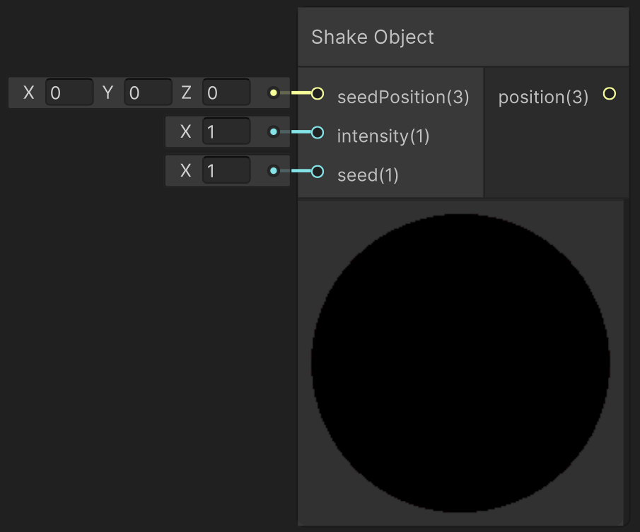

<div class="container">
    <h1 class="main-heading">Shake Object</h1>
    <blockquote class="author">by Frieda Hentschel</blockquote>
</div>

This function creates a linear shaking animation on objects by changing its position.

---

## The Code

``` hlsl
void shakeObject_float(float3 seedPosition, float intensity, float speed, out float3 position)
{
    float time = _Time.y * speed;

    float x = frac(sin((time + 1.1) * 17.23) * 43758.5453) - 0.5;
    float y = frac(sin((time + 2.3) * 17.23) * 43758.5453) - 0.5;
    float z = frac(sin((time + 3.7) * 17.23) * 43758.5453) - 0.5;

    float3 jitter = float3(x, y, z) * intensity;

    position = seedPosition + jitter;
}
```

---

## The Parameters

### Inputs:
| Name            | Type     | Description |
|-----------------|----------|-------------|
| `seedPosition`   | float3   | Initial position of the object |
| `intensity`        | float   | Intensity of the shaking <br> <blockquote>*ShaderGraph default value*: 1</blockquote> |
| `speed`        | float   | Speed with which the position change is applied <br> <blockquote>*ShaderGraph default value*: 1</blockquote> |

> Play around by adding [Tweening](tweening.md) to intensity and speed to create a more intricate animation.

### Outputs:
| Name            | Type     | Description |
|-----------------|----------|-------------|
| `position`   | float3   |  Current position of the object which can directly be plugged into the inputs of an SDF function (e.g. [Sphere](../sdfs/sphere.md)) or lighting functions (e.g. [Point Light](../lighting/pointLight.md)). |

---

## Implementation

=== "Visual Scripting"
    Find the node at `PSF/Animation/Shake Object`

    <figure markdown="span">
        { width="500" }
    </figure>

=== "Standard Scripting"
    !Utku Input
    Include ...

---

This is an engine-specific implementation without a shader-basis.