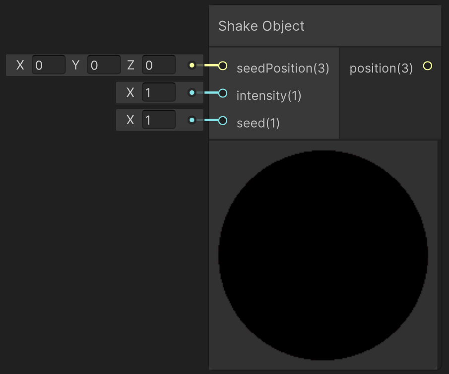

# Shake Object

This function creates a linear shaking animation on objects by changing its position. It can be applied to SDFs and lights.

---

## The Code

``` hlsl
void shakeObject_float(float3 seedPosition, float intensity, float speed, out float3 position)
{
    float time = _Time.y * speed;

    float x = frac(sin((time + 1.1) * 17.23) * 43758.5453) - 0.5;
    float y = frac(sin((time + 2.3) * 17.23) * 43758.5453) - 0.5;
    float z = frac(sin((time + 3.7) * 17.23) * 43758.5453) - 0.5;

    float3 jitter = float3(x, y, z) * intensity;

    position = seedPosition + jitter;
}
```

---

## The Parameters

### Inputs:
- ```float3 seedPosition```: The initial position of the object
- ```float intensity```: The intensity of the shaking
- ```float speed```: The speed with which the position change is applied
> *ShaderGraph default value*: 1

> Play around by adding [tweening](unity/cameraMatrix.md) to intensity and speed to create a more intricate animation.


### Outputs:
- ```float3 position```: The animated position of the object which can directly be plugged into the inputs of an SDF function (e.g. [Sphere](unity/cameraMatrix.md)) or lighting functions (e.g. [Point Light](unity/cameraMatrix.md)).


---

## Implementation

=== "Visual Scripting"
    Find the node at `PSF/Animation/Shake Object`

    { width="500" }

=== "Standard Scripting"
    Include ...

---

This is an engine-specific implementation without a shader-basis.