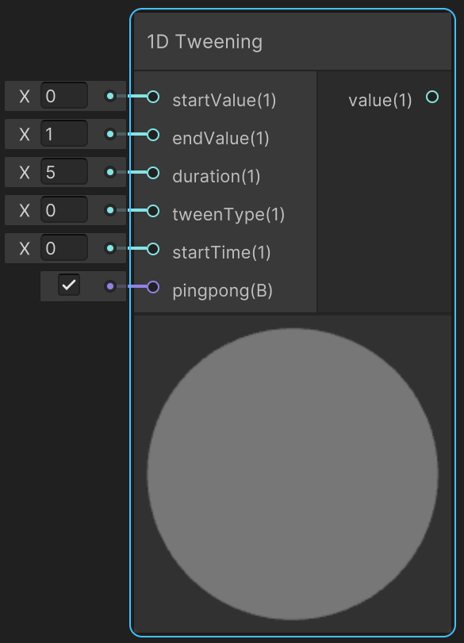
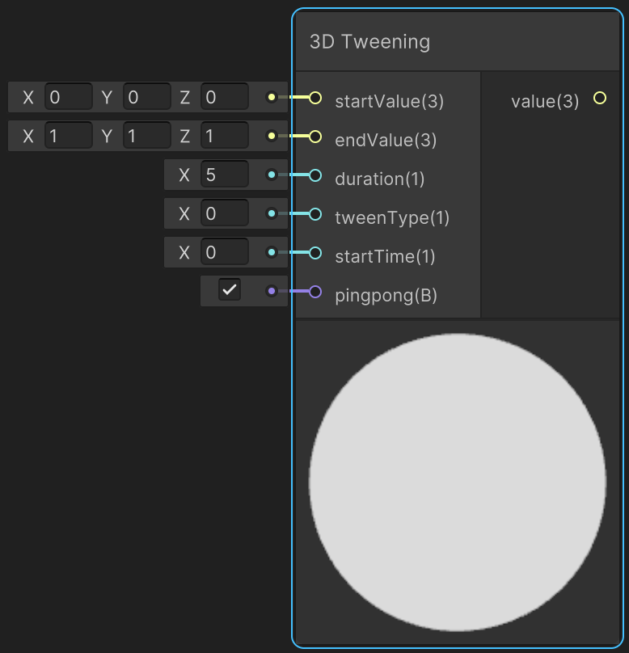

<div class="container">
    <h1 class="main-heading">Tweening Shader Library</h1>
    <blockquote class="author">by Utku Alkan</blockquote>
</div>

This header provides a library for easing (tweening) functions to interpolate values smoothly over time. The library supports 31 tweening types commonly used in animation curves (e.g., ease-in, ease-out, bounce, back, etc.).

---

## The Code
??? "Tweening-Related Helper Functions"
    ``` hlsl
    float BounceEaseOut(float p)
    {
        if (p < 4.0 / 11.0)
            return (121.0 * p * p) / 16.0;
        else if (p < 8.0 / 11.0)
            return (363.0 / 40.0 * p * p) - (99.0 / 10.0 * p) + 17.0 / 5.0;
        else if (p < 9.0 / 10.0)
            return (4356.0 / 361.0 * p * p) - (35442.0 / 1805.0 * p) + 16061.0 / 1805.0;
        else
            return (54.0 / 5.0 * p * p) - (513.0 / 25.0 * p) + 268.0 / 25.0;
    }

    float BounceEaseIn(float p)
    {
        return 1.0 - BounceEaseOut(1.0 - p);
    }

    float BounceEaseInOut(float p)
    {
        if (p < 0.5)
            return 0.5 * BounceEaseIn(p * 2.0);
        else
            return 0.5 * BounceEaseOut(p * 2.0 - 1.0) + 0.5;
    }

    float applyTweenFunction(float t, int tweenType)
    {
        if (tweenType == TWEEN_LINEAR)
            return t;
        else if (tweenType == TWEEN_QUADRATIC_IN)
            return t * t;
        else if (tweenType == TWEEN_QUADRATIC_OUT)
            return -(t * (t - 2.0));
        else if (tweenType == TWEEN_QUADRATIC_INOUT)
            return t < 0.5 ? 2.0 * t * t : (-2.0 * t * t) + (4.0 * t) - 1.0;
        else if (tweenType == TWEEN_CUBIC_IN)
            return t * t * t;
        else if (tweenType == TWEEN_CUBIC_OUT)
        {
            float f = t - 1.0;
            return f * f * f + 1.0;
        }
        else if (tweenType == TWEEN_CUBIC_INOUT)
        {
            if (t < 0.5)
                return 4.0 * t * t * t;
            float f = 2.0 * t - 2.0;
            return 0.5 * f * f * f + 1.0;
        }
        else if (tweenType == TWEEN_QUARTIC_IN)
            return t * t * t * t;
        else if (tweenType == TWEEN_QUARTIC_OUT)
        {
            float f = t - 1.0;
            return 1.0 - f * f * f * (1.0 - t);
        }
        else if (tweenType == TWEEN_QUARTIC_INOUT)
        {
            if (t < 0.5)
                return 8.0 * t * t * t * t;
            float f = t - 1.0;
            return -8.0 * f * f * f * f + 1.0;
        }
        else if (tweenType == TWEEN_QUINTIC_IN)
            return t * t * t * t * t;
        else if (tweenType == TWEEN_QUINTIC_OUT)
        {
            float f = t - 1.0;
            return f * f * f * f * f + 1.0;
        }
        else if (tweenType == TWEEN_QUINTIC_INOUT)
        {
            if (t < 0.5)
                return 16.0 * t * t * t * t * t;
            float f = 2.0 * t - 2.0;
            return 0.5 * f * f * f * f * f + 1.0;
        }
        else if (tweenType == TWEEN_SINE_IN)
            return sin((t - 1.0) * (3.14159265 * 0.5)) + 1.0;
        else if (tweenType == TWEEN_SINE_OUT)
            return sin(t * (3.14159265 * 0.5));
        else if (tweenType == TWEEN_SINE_INOUT)
            return 0.5 * (1.0 - cos(t * 3.14159265));
        else if (tweenType == TWEEN_CIRCULAR_IN)
            return 1.0 - sqrt(1.0 - t * t);
        else if (tweenType == TWEEN_CIRCULAR_OUT)
            return sqrt((2.0 - t) * t);
        else if (tweenType == TWEEN_CIRCULAR_INOUT)
        {
            if (t < 0.5)
                return 0.5 * (1.0 - sqrt(1.0 - 4.0 * t * t));
            return 0.5 * (sqrt(-((2.0 * t - 3.0) * (2.0 * t - 1.0))) + 1.0);
        }
        else if (tweenType == TWEEN_EXPONENTIAL_IN)
            return (t == 0.0) ? 0.0 : pow(2.0, 10.0 * (t - 1.0));
        else if (tweenType == TWEEN_EXPONENTIAL_OUT)
            return (t == 1.0) ? 1.0 : 1.0 - pow(2.0, -10.0 * t);
        else if (tweenType == TWEEN_EXPONENTIAL_INOUT)
        {
            if (t == 0.0 || t == 1.0)
                return t;
            if (t < 0.5)
                return 0.5 * pow(2.0, 20.0 * t - 10.0);
            return -0.5 * pow(2.0, -20.0 * t + 10.0) + 1.0;
        }
        else if (tweenType == TWEEN_ELASTIC_IN)
            return sin(13.0 * 3.14159265 * 0.5 * t) * pow(2.0, 10.0 * (t - 1.0));
        else if (tweenType == TWEEN_ELASTIC_OUT)
            return sin(-13.0 * 3.14159265 * 0.5 * (t + 1.0)) * pow(2.0, -10.0 * t) + 1.0;
        else if (tweenType == TWEEN_ELASTIC_INOUT)
        {
            if (t < 0.5)
                return 0.5 * sin(13.0 * 3.14159265 * (2.0 * t) * 0.5) * pow(2.0, 10.0 * (2.0 * t - 1.0));
            return 0.5 * (sin(-13.0 * 3.14159265 * 0.5 * ((2.0 * t - 1.0) + 1.0)) * pow(2.0, -10.0 * (2.0 * t - 1.0)) + 2.0);
        }
        else if (tweenType == TWEEN_BACK_IN)
            return t * t * t - t * sin(t * 3.14159265);
        else if (tweenType == TWEEN_BACK_OUT)
        {
            float f = 1.0 - t;
            return 1.0 - (f * f * f - f * sin(f * 3.14159265));
        }
        else if (tweenType == TWEEN_BACK_INOUT)
        {
            if (t < 0.5)
            {
                float f = 2.0 * t;
                return 0.5 * (f * f * f - f * sin(f * 3.14159265));
            }
            else
            {
                float f = 1.0 - (2.0 * t - 1.0);
                return 0.5 * (1.0 - (f * f * f - f * sin(f * 3.14159265))) + 0.5;
            }
        }
        else if (tweenType == TWEEN_BOUNCE_IN)
            return BounceEaseIn(t);
        else if (tweenType == TWEEN_BOUNCE_OUT)
            return BounceEaseOut(t);
        else if (tweenType == TWEEN_BOUNCE_INOUT)
            return BounceEaseInOut(t);
        
        return t; // fallback
    }

    float getTweenProgress(float startTime, float duration, bool pingpong)
    {
        float t = (_Time.y - startTime) / duration;

        if (t < 0)
            return 0;

        if (pingpong == true)
        {
            // Double duration for full ping-pong cycle
            float cycleTime = fmod(t, 2.0); // 0–2
            return cycleTime < 1.0 ? cycleTime : 2.0 - cycleTime; // Ping (0–1), Pong (1–0)
        }
        else
        {
            return frac(t); // Loops from 0 to 1
        }
    }
    ```

``` hlsl
void tween3D_float(float3 start, float3 end, float duration, int tweenType, float startTime, bool pingpong, out float3 value)
{
    float t = getTweenProgress(startTime, duration, pingpong);

    float eased = applyTweenFunction(t, tweenType);
    value = lerp(start, end, eased);
}

void tween1D_float(float start, float end, float duration, int tweenType, float startTime, bool pingpong, out float value)
{
    float t = getTweenProgress(startTime, duration, pingpong);

    float eased = applyTweenFunction(t, tweenType);
    value = lerp(start, end, eased);
}
```

## Parameters

### Inputs

| Name         | Type   | Description |
|--------------|--------|-------------|
| `start`  | float3/float  | Starting value |
| `end`   | float3/float  | Target value  <br> <blockquote>*ShaderGraph default value*: float3(1,1,1)/1</blockquote> |
| `duration` | float  | Duration of the tween in seconds <br> <blockquote>*ShaderGraph default value*: 5</blockquote> |
| `tweenType`   | enum/int  | Easing type (see Tween Types below) |
| `startTime`  | float    | Time at which the tween should start (in seconds) |
| `pingpong`   | bool   | If true, animates back and forth (0→1→0...), else loops from 0→1 repeatedly <br> <blockquote>*ShaderGraph default value*: true</blockquote>  |

### Output

| Name         | Type   | Description |
|--------------|--------|-------------|
| `value`  | float3/float  | Interpolated value at current time |

The output can be used for an arbitrary input parameter. It is the most suitable for animating an SDF's parameters such as *Position*, *Color*, *Scale*, ...


## Tween Types

Use one of the following constants as `tweenType` in the functions above:

| Constant Name              | Value |
|---------------------------|-------|
| `TWEEN_LINEAR`            | 0     |
| `TWEEN_QUADRATIC_IN`      | 1     |
| `TWEEN_QUADRATIC_OUT`     | 2     |
| `TWEEN_QUADRATIC_INOUT`   | 3     |
| `TWEEN_CUBIC_IN`          | 4     |
| `TWEEN_CUBIC_OUT`         | 5     |
| `TWEEN_CUBIC_INOUT`       | 6     |
| `TWEEN_QUARTIC_IN`        | 7     |
| `TWEEN_QUARTIC_OUT`       | 8     |
| `TWEEN_QUARTIC_INOUT`     | 9     |
| `TWEEN_QUINTIC_IN`        | 10    |
| `TWEEN_QUINTIC_OUT`       | 11    |
| `TWEEN_QUINTIC_INOUT`     | 12    |
| `TWEEN_SINE_IN`           | 13    |
| `TWEEN_SINE_OUT`          | 14    |
| `TWEEN_SINE_INOUT`        | 15    |
| `TWEEN_CIRCULAR_IN`       | 16    |
| `TWEEN_CIRCULAR_OUT`      | 17    |
| `TWEEN_CIRCULAR_INOUT`    | 18    |
| `TWEEN_EXPONENTIAL_IN`    | 19    |
| `TWEEN_EXPONENTIAL_OUT`   | 20    |
| `TWEEN_EXPONENTIAL_INOUT` | 21    |
| `TWEEN_ELASTIC_IN`        | 22    |
| `TWEEN_ELASTIC_OUT`       | 23    |
| `TWEEN_ELASTIC_INOUT`     | 24    |
| `TWEEN_BACK_IN`           | 25    |
| `TWEEN_BACK_OUT`          | 26    |
| `TWEEN_BACK_INOUT`        | 27    |
| `TWEEN_BOUNCE_IN`         | 28    |
| `TWEEN_BOUNCE_OUT`        | 29    |
| `TWEEN_BOUNCE_INOUT`      | 30    |


To check the easings of the tween types [here](https://easings.net/).

---

## Implementation

=== "Visual Scripting"
    Find the node for 1D Tweening at ```PSF/Animation/1D Tweening```

    <figure markdown="span">
        { width="300" }
    </figure>

    Find the node for 3D Tweening at ```PSF/Animation/3D Tweening```

    <figure markdown="span">
        { width="300" }
    </figure>

    > The tween type can be provided by the tween value as an integer.

=== "Standard Scripting"
    Include - ```#include "Packages/com.tudresden.proceduralshaderframeworkpackage/Runtime/scripts/tween_functions.hlsl"```
    
    Example Usage

    This function call eases 3D position from (0, 0, 3) to (5, 5, 3) over 5 seconds using a bounce in-out easing, with ping-pong enabled to reverse the motion back and forth, starting at time 0. The position is stored in float3 position.

    ```hlsl
    float3 position;
    tween3D_float(float3(0,0,3), float3(5,5,3), 5.0, TWEEN_BOUNCE_INOUT, 0.0, true, position);
    ```
---

This is an engine-specific implementation without a shader-basis.