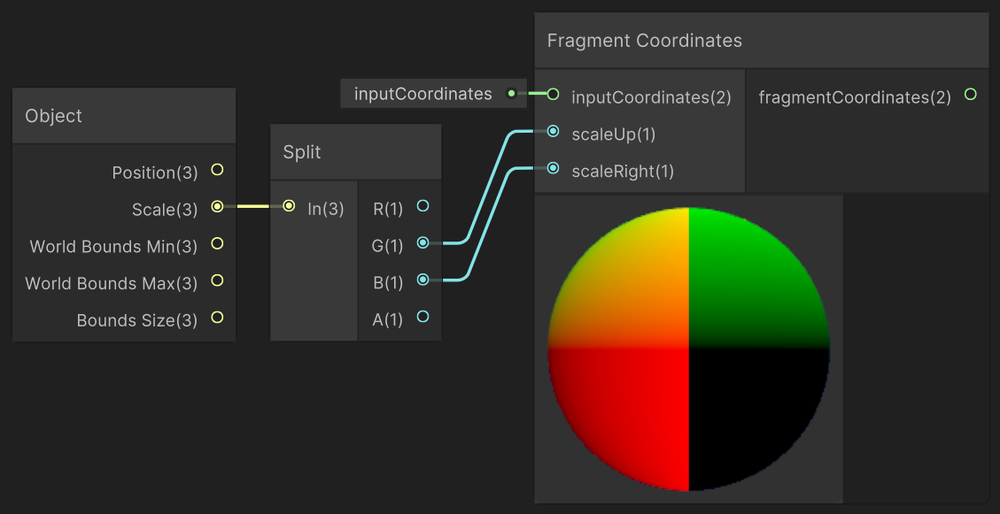
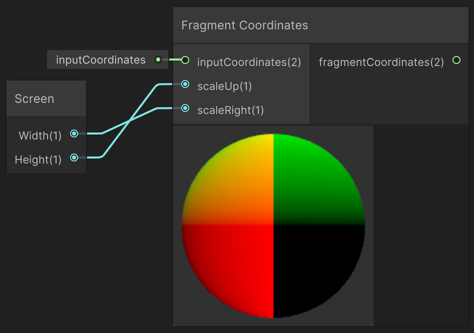
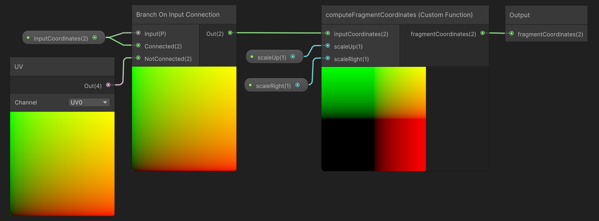

<div class="container">
    <h1 class="main-heading">Fragment Coordinates</h1>
    <blockquote class="author">by Frieda Hentschel</blockquote>
</div>

This function computes fragment coordinates ranging from 0 to 1 based on input coordinates. As this function is responsible for computing the coordinates at which a fragement is computed, it is the basis for all others. **It should always be included in a shader.**

---

## The Code

``` hlsl
void computeFragmentCoordinates_float(float2 inputCoordinates, float scaleUp, float scaleRight, out float2 fragmentCoordinates)
{
    fragmentCoordinates = inputCoordinates.xy * 2 - 1;
    if (scaleRight>scaleUp)
        fragmentCoordinates.x *= scaleRight / scaleUp;
    else
        fragmentCoordinates.y *= scaleUp / scaleRight;
}
```

---

## The Parameters

### Inputs:
| Name            | Type     | Description |
|-----------------|----------|-------------|
| `inputCoordinates`    | float2   | Input coordinates - usually uv-input of the object the shader is applied to|
| `scaleUp`        | float   | Vertical scale of the object <br> <blockquote>*ShaderGraph default value*: 1</blockquote>|
| `scaleRight`   | float  | Horizontal scale of the object <br> <blockquote>*ShaderGraph default value*: 1</blockquote>|

### Outputs:
| Name            | Type     | Description |
|-----------------|----------|-------------|
| `fragmentCoordinates`    | float2   | Coordinates mapped to 0 to 1 which are a required input to [SDF Raymarching](../sdfs/raymarching.md), [Water Surface](../water/waterSurface.md), and certain lighting functions|

---

## Notes on Non-Uniformly Shaped Objects

If a square-shaped object is used to apply the shader to, both the **scaleUp** and the **scaleRight** can be disregarded in the ShaderGraph oder simply be set to *1* for the Standard Scripting. However, if rectangles (e.g. fullscreen shaders) or cuboids are utilised, the scaling parameters are necessary to ensure that no distortion occurs. This is done by applying the ratio of the scales to the coordinates.

The required scaling-values depend on the object's extent as well as Unity's camera:

- For a rectangle choose the vertical scale as **scaleUp** and the horizontal scale as **scaleRight**.
- For a cuboid choose the scaling-values as above taking Unity's camera into account. If the camera looks along the z-axis and the y-axis defines the upwards vector, choose the y-scale as **scaleUp** and the x-scale as **scaleRight**.

> If a cuboid is used that is differently scaled in each dimension, the procedural results can only be non-distorted for a combination of two axis.

!ADD IMAGE

---

## Implementation

=== "Visual Scripting"
    Find the node at `PSF/Basics/Fragment Coordinates`

    To easily get access to the scale:

    - For objects: Add Unity's *Object Node*, connect the scale-parameter to Unity's *Splitter Node*, and choose the required dimensions to connect to the custom node's inputs. 

        <figure markdown="span">
            { width="500" }
        </figure>
    
    - For fullscreen shaders: Add Unity's *Screen Node* to access the width and height of the screen 

        <figure markdown="span">
            { width="400" }
        </figure>

    > Due to internal workings of the node, the input-coordinates-input is not required. Within the SubGraph a *Branch On Input Connection* node is used to determine whether any input coordinates were connected to their respective input. If this is not the case, the uv-coordinates are used as a default input. 

    <figure markdown="span">
        { width="700" }
    </figure>
    
    > For an alternative effect, the input-coordinates can also be customised. The *Screen Position Node* can be used if zooming in should not effect the scale of the material.

=== "Standard Scripting"
    Include - ```#include "Packages/com.tudresden.proceduralshaderframeworkpackage/Runtime/scripts/basics_functions.hlsl"```

    Example Usage

    ```hlsl
    float2 uv;
    computeFragmentCoordinates_float(IN.uv, 10, 12, uv);
    ```

---

This is an engine-specific implementation without a shader-basis.