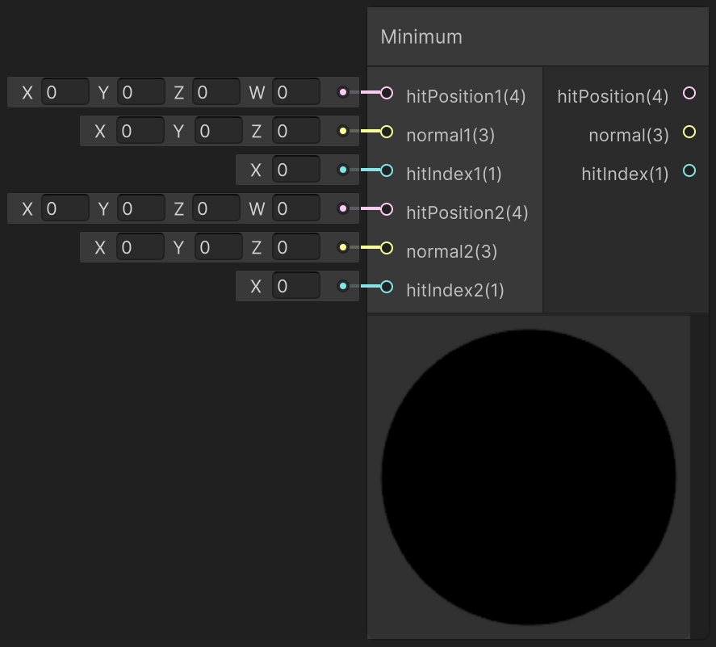

<div class="container">
    <h1 class="main-heading">Minimum</h1>
    <blockquote class="author">by Frieda Hentschel</blockquote>
</div>

This function outputs the hit-position, normal, and hit-index out of two sets of inputs based on which hit-position is closer to the camera. It is used **before** all the lighting functions are applied. 

Therefore, it can be used to combine outputs of raymarching functions. The subsequent lighting functions are then applied to the output of this function. Other than [Combine Color](combineColor.md), the [Sunrise](../lighting/sunriseLight.md) and [Point Light](../lighting/pointLight.md) functions have effects.

---

## The Code

``` hlsl
void getMinimum_float(float4 hitPosition1, float3 normal1, int hitIndex1, float4 hitPosition2, float3 normal2, int hitIndex2, out float4 hitPosition, out float3 normal, out int hitIndex)
{
    if (hitPosition1.w < hitPosition2.w && hitPosition1.w < _raymarchStoppingCriterium)
    {
        hitPosition = hitPosition1;
        normal = normal1;
        hitIndex = hitIndex1;
    }
    else
    {
        hitPosition = hitPosition2;
        normal = normal2;
        hitIndex = hitIndex2;
    }
}
```

---

## The Parameters

### Inputs:
| Name            | Type     | Description |
|-----------------|----------|-------------|
| `hitPosition1`    | float4   | Hit-position of the first input where the first three dimensions define the point in space and the w-component contains the raymarching parameter at which the hit occured|
| `normal1`        | float3   | Normal of the first input|
| `hitIndex1`        | int   | Hit-index of the first input|
| `hitPosition2`   | float4   | Hit-position of the second input where the first three dimensions define the point in space and the w-component contains the raymarching parameter at which the hit occured|
| `normal3`        | float3   | Normal of the second input|
| `hitIndex2`        | int   | Hit-index of the second input|

### Outputs:
| Name            | Type     | Description |
|-----------------|----------|-------------|
| `hitPosition`    | float4   | Hit-position that is the closest to the camera out of the two sets of inputs|
| `normal`        | float3   | Normal corresponding to the closest hit-position|
| `hitIndex`        | int   | Hit-index corresponding to the closest hit-position|

The outputs can be used for further computations using lighting functions (e.g. [Sunrise](../lighting/sunriseLight.md)).

---

## Implementation

=== "Visual Scripting"
    Find the node at `PSF/Basics/Minimum`

    <figure markdown="span">
        { width="500" }
    </figure>

=== "Standard Scripting"
    Include - ```#include "Packages/com.tudresden.proceduralshaderframeworkpackage/Runtime/scripts/basics_functions.hlsl"```

    Example Usage

    ```hlsl
    getMinimum_float(hitPos1, normal1, hitID1, hitPos2, normal2, hitID2, hitPos, normal, hitID);
    ```
---

This is an engine-specific implementation without a shader-basis.