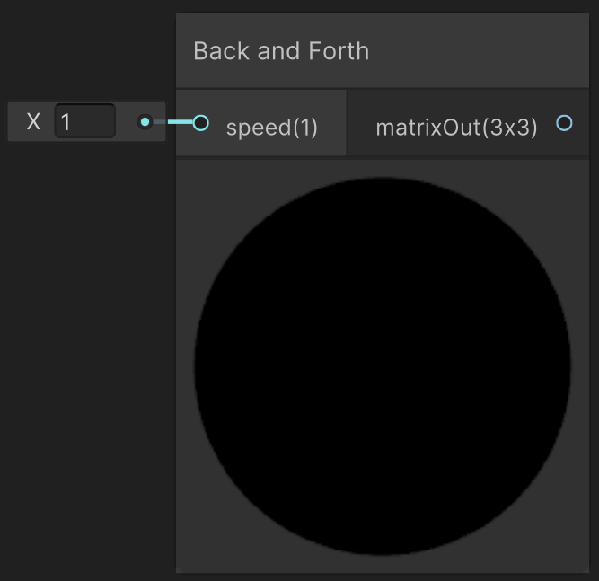

# Camera Back and Forth

This function imitates a camera translation by changing the ray origin and the camera matrix. The translation occurs along the z-axis going from 0 to 1 using a sinus function.

---

## The Code

``` hlsl
void backAndForth_float(float speed, out float3x3 mat)
{
    float t = _Time.y * speed;
    mat = float3x3(1, 0, 0, 0, 1, 0, 0, 0, abs(sin(t)));
}
```

---

## The Parameters

### Inputs:
- ```float speed```: The speed with which the translation is applied
> *ShaderGraph default value*: 1

### Outputs:
- ```float3x3 mat```: The rotation matrix which __needs to be__ plugged into the [Camera Matrix](cameraMatrix.md) before it can be used within the rest of the pipeline. This is necessary to apply the rotation matrix to the ray origin and to compute the correct camera matrix.

---

## Implementation

=== "Visual Scripting"
    Find the node at `PSF/Camera/Back and Forth`

    { width="400" }

=== "Standard Scripting"
    Include ...

---

Find the original shader code [here](unity/cameraMatrix.md).