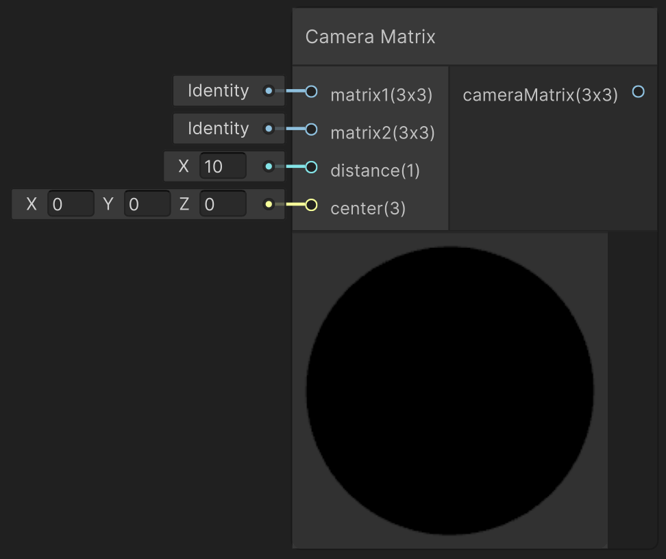

# Camera Matrix

This function computes the camera matrix based on two input matrices. It is required after a camera animation is applied. 

---

## The Code

``` hlsl
void getCameraMatrix_float(float3x3 mat1, float3x3 mat2, float distance, float3 lookAtPosition, out float3x3 cameraMatrix)
{
    float3x3 combinedMatrix = mul(mat1, mat2);
    _rayOrigin = mul(float3(0, 0, distance), combinedMatrix);
    cameraMatrix = computeCameraMatrix(lookAtPosition, _rayOrigin, combinedMatrix);
}
```

See [Helper Functions](../helperFunctions.md.md) to find out more about ```computeCameraMatrix(float3 lookAtPosition, float3 eye, float3x3 mat)```

---

## The Parameters

### Inputs:
- ```float3 mat1```: The first matrix to be combined for the computation
> *ShaderGraph default value*: 3x3 identity matrix
- ```float3 mat2```: The second matrix to be combined for the computation
> *ShaderGraph default value*: 3x3 identity matrix
- ```float distance```: The distance of the camera to the world origin along the z-axis
> *ShaderGraph default value*: 10
- ```float3 lookAtPosition```: The focal point of the camera
> *ShaderGraph default value*: world origin

Examplary matrices that can be used as input to this function are [Camera Rotation](../camera/cameraRotation.md) or [Camera Translation](../camera/cameraBackAndForth.md). It is possible to only add one custom matrix as the multiplication with the default identity matrix yields correct results. If more than two matrices are to be combined, manually multiply them together via script or a Multiply Node before plugging the result into this function.

### Outputs:
- ```float3x3 cameraMatrix```: The final camera matrix that can be plugged into the [Water Shader](unity/cameraMatrix.md) or the [Raymarching](unity/cameraMatrix.md).

---

## Implementation

=== "Visual Scripting"
    Find the node at `PSF/Camera/Camera Matrix`

    { width="500" }

=== "Standard Scripting"
    Include ...

---

Find the original shader code [here](unity/cameraMatrix.md).