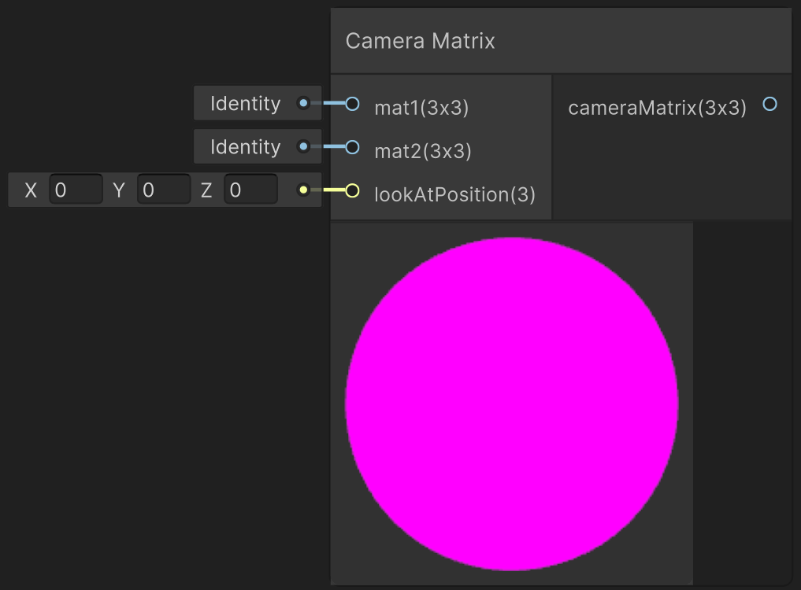

<div class="container">
    <h1 class="main-heading">Camera Matrix</h1>
    <blockquote class="author">by Frieda Hentschel</blockquote>
</div>

This function computes the camera matrix based on two input matrices. This allows the combination of two or more camera animations. It is **required after a camera animation** is applied. 

---

## The Code

``` hlsl
void getCameraMatrix_float(float3x3 mat1, float3x3 mat2, float3 lookAtPosition, out float3x3 cameraMatrix)
{
    float3x3 combinedMatrix = mul(mat1, mat2);
    _rayOrigin = mul(_rayOrigin, combinedMatrix);
    cameraMatrix = computeCameraMatrix(lookAtPosition, _rayOrigin, combinedMatrix);
}
```

See [Helper Functions](../helperFunctions.md) to find out more about ```computeCameraMatrix(float3 lookAtPosition, float3 eye, float3x3 mat)```

---

## The Parameters

### Inputs:
| Name            | Type     | Description |
|-----------------|----------|-------------|
| `mat1`        | float3x3   | First transformation matrix to be combined for the computation <br> <blockquote>*ShaderGraph default value*: 3x3 identity matrix</blockquote>|
| `mat2`        | float3x3   | Second transformation matrix to be combined for the computation <br> <blockquote>*ShaderGraph default value*: 3x3 identity matrix</blockquote>|
| `lookAtPosition`        | float3   | Focal point of the camera|

Examplary matrices that can be used as input to this function are [Camera Rotation](cameraRotation.md) or [Camera Back and Forth](../camera/cameraBackAndForth.md). 

> It is possible to only add one custom matrix as the multiplication with the default identity matrix yields correct results. If more than two matrices are to be combined, multiply them together via script or a *Multiply Node* before plugging the result into this function.

### Outputs:
| Name            | Type     | Description |
|-----------------|----------|-------------|
| `cameraMatrix`           | float3x3   | final camera matrix that can be plugged into the [Water Shader](../water/waterSurface.md) or the [SDF Raymarching](../sdfs/raymarching.md)|

---

## Implementation

=== "Visual Scripting"
    Find the node at `PSF/Camera/Camera Matrix`

    <figure markdown="span">
        { width="500" }
    </figure>

=== "Standard Scripting"
    Include - ```#include "Packages/com.tudresden.proceduralshaderframeworkpackage/Runtime/scripts/animation_functions.hlsl"```

    Example Usage

    ```hlsl
    float3x3 camMatrix;
    getCameraMatrix_float(matA, matB, dist, targetPos, camMatrix);
    ```

---

Find the original shader code [here](../../../shaders/animation/Camera_Anim.md). It was expanded to allow the combination of multiple camera animations.