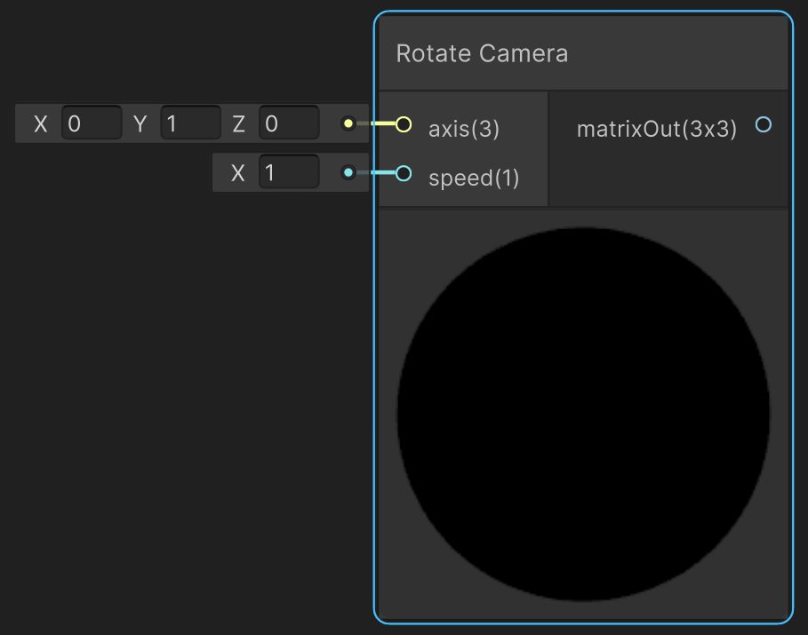

<div class="container">
    <h1 class="main-heading">Camera Rotation</h1>
    <blockquote class="author">by Frieda Hentschel</blockquote>
</div>

This function imitates a camera rotation by changing the ray origin and the camera matrix. The rotation will always be __centred at the world origin__. The distance at which the rotation is applied is defined by the __distance between the world origin and the current ray origin__.

---

## The Code

``` hlsl
void rotateCamera_float(float3 axis, float speed, out float3x3 mat)
{
    float angle = _Time.y * speed;
    mat = computeRotationMatrix(normalize(axis), angle);
}
```

See [Helper Functions](../helperFunctions.md) to find out more about ```computeRotationMatrix(float3 axis, float angle)```

---

## The Parameters

### Inputs:
- ```float3 axis```: The axis around which the camera rotates 
> *ShaderGraph default value*: ```float3(0,1,0)```
- ```float speed```: The speed with which the rotation is applied
> *ShaderGraph default value*: 1

### Outputs:
- ```float3x3 mat```: The rotation matrix which __needs to be__ plugged into the [Camera Matrix](cameraMatrix.md) before it can be used within the rest of the pipeline. This is necessary to apply the rotation matrix to the ray origin and to compute the correct camera matrix.

---

## Implementation

=== "Visual Scripting"
    Find the node at `PSF/Camera/Rotate Camera`

    { width="500" }

=== "Standard Scripting"
    Include ...

---

Find the original shader code [here](unity/cameraMatrix.md).