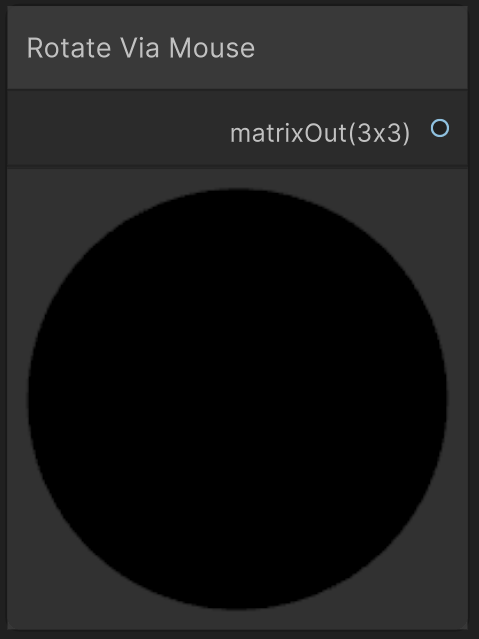

# Mouse-Based Camera Rotation

This function imitates a camera rotation based on the mouse position. With a left mouse-click the world can be rotated in the x- and y-direction. 

---

## The Code

``` hlsl
void rotateViaMouse_float(out float3x3 mat)
{
    float2 mouse = _mousePoint.xy / _ScreenParams.xy;

    // Center mouse to [-0.5, +0.5]
    mouse = mouse - 0.5;

    // Convert to yaw and pitch
    // == PI * mouse.x when centered
    float yaw = lerp(-PI, PI, mouse.x + 0.5); 
    // Invert Y axis
    float pitch = lerp(-PI / 2, PI / 2, -mouse.y + 0.5); 

    float3x3 rotY = computeRotationMatrix(float3(0, 1, 0), yaw);
    float3x3 rotX = computeRotationMatrix(float3(1, 0, 0), pitch);

    mat = mul(rotY, rotX);
}
```

See [Helper Functions](unity/helperFunctions.md) to find out more about ```computeRotationMatrix(float3 axis, float angle)```

---

## The Parameters

### Inputs:
- None

### Outputs:
- ```float3x3 mat```: The final camera matrix that can be plugged into the [Water Shader](unity/cameraMatrix.md) or the [SDF Raymarching](unity/cameraMatrix.md). 
> Contrary to other animation functions, this function does not need to be finished off with a computation of the [Camera Matrix](cameraMatrix.md). 

---

## Experience

- Rotations via clicking the left mouse-button
    - Drag left and right for a rotation around the y-axis.
    - Drag up and down for a rotation around the x-axis.

---

## Implementation

=== "Visual Scripting"
    Find the node at PSF/Camera/Rotate Via Mouse

    { width="300" }

=== "Standard Scripting"
    Include ...

---

This is an engine-specific implementation without a shader-basis.