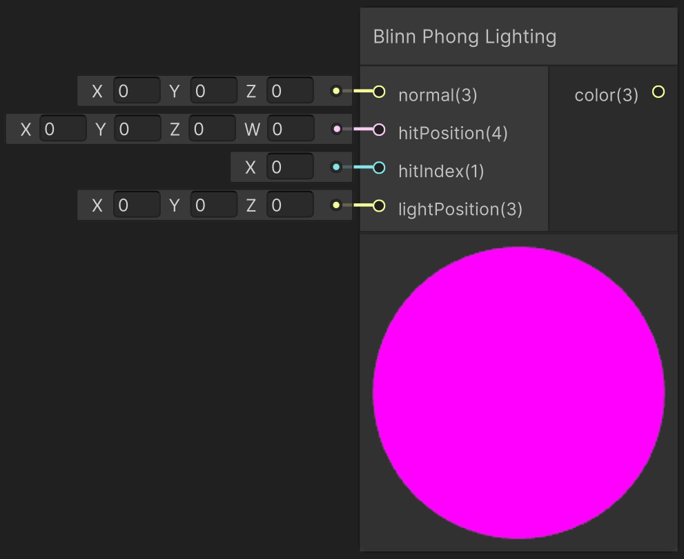

<div class="container">
    <h1 class="main-heading">Blinn-Phong Lighting</h1>
    <blockquote class="author">by Utku Alkan</blockquote>
</div>

This function implements the Blinn-Phong lighting model using per-pixel calculations. It computes diffuse and specular reflections based on the surface normal, view direction, and light direction. A small ambient component is added for minimal base illumination.
    <figure markdown="span">
    { width="500" }
    </figure>

---

## The Code
```hlsl
void applyBlinnPhongLighting_float(float4 hitPosition, float3 normal, float hitIndex, float3 lightPosition, out
float3 lightingColor)
{
    float3 viewDirection = normalize(_rayOrigin - hitPosition.xyz);
    float3 lightDirection = normalize(lightPosition - hitPosition.xyz);
    float3 lightColor = float3(1.0, 1.0, 1.0);
    float3 ambientColor = float3(0.05, 0.05, 0.05);

    float3 halfVec = normalize(viewDirection + lightDirection);
    float diffuseValue = max(dot(normal, lightDirection), 0.0);
    float specularValue = pow(max(dot(normal, halfVec), 0.0), _objectShininess[hitIndex]);

    float3 diffuseColor = diffuseValue * _objectBaseColor[hitIndex] * lightColor;
    float3 specular = specularValue * _objectSpecularColor[hitIndex] * _objectSpecularStrength[hitIndex];

    lightingColor = ambientColor + diffuseColor + specular;
}
```

---

## Parameters

### Inputs

| Name            | Type     | Description |
|-----------------|----------|-------------|
| `hitPosition`   | float4   | World position of the surface hit; the w-component may be ignored |
| `normal`        | float3   | Surface normal at the hit point |
| `hitIndex`      | float    | Object/material index used to fetch shading parameters |
| `lightPosition` | float3   | World-space position of the light source |

The inputs are typically provided by the functions [SDF Raymarching](../sdfs/raymarching.md) or [Water Surface](../water/waterSurface.md).

### Output
| Name            | Type     | Description |
|-----------------|----------|-------------|
| `lightingColor`   | float3   | Final RGB lighting result using Blinn-Phong shading |

---

## Implementation

=== "Visual Scripting"  
    Find the node at ```PSF/Lighting/Blinn Phong Lighting```

    <figure markdown="span">
        { width="500" }
    </figure>

=== "Standard Scripting"  
    Include - ```#include "Packages/com.tudresden.proceduralshaderframeworkpackage/Runtime/scripts/lighting_functions.hlsl"```

    Example Usage

    ```hlsl
    float3 lightColor;
    applyBlinnPhongLighting_float(hitPos, surfaceNormal, objectIndex, float3(3, 6, -2), lightColor);
    ```

---

Find the original shader code [here](../../../shaders/lighting/lighting_functions.md). This basis was adapted to be compatible with Unity's workflow and to allow it to be modifyable within the framework.