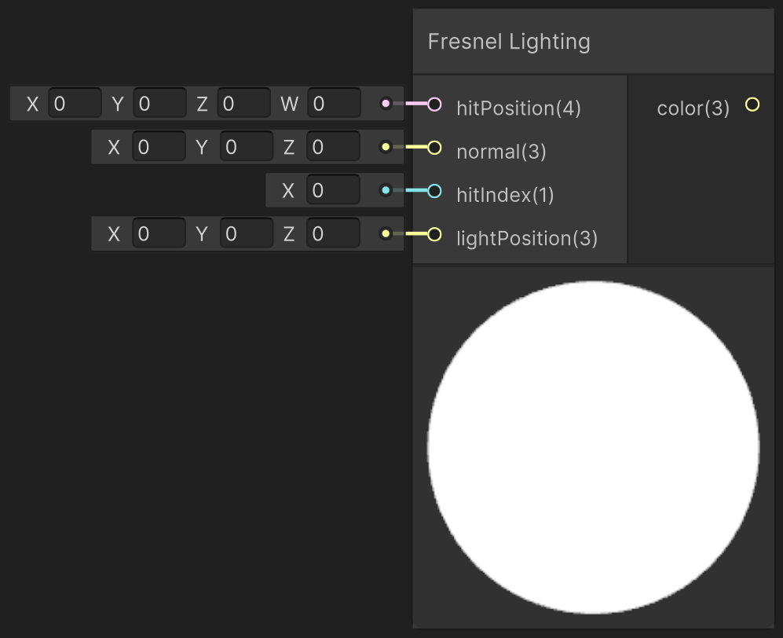

<div class="container">
    <h1 class="main-heading">Fresnel Lighting</h1>
    <blockquote class="author">by Utku Alkan</blockquote>
</div>

This function applies Fresnel-based lighting using Schlick’s approximation to simulate view-dependent reflectivity. It combines Lambertian diffuse shading with a specular fresnel effect that intensifies as the viewing angle approaches grazing.

---

## The Code
```hlsl
void applyFresnelLighting_float(float4 hitPosition, float3 normal, int hitIndex, float3 lightPosition, out float3 lightingColor)
{
    if (hitPosition.w > _raymarchStoppingCriterium)
    {
        lightingColor = float3(0, 0, 0);
        return;
    }

    float3 viewDirection = normalize(_rayOrigin - hitPosition.xyz);
    float3 lightDirection = normalize(lightPosition - hitPosition.xyz);
    
    float3 baseColor = _objectBaseColor[hitIndex];
    float3 specularColor = _objectSpecularColor[hitIndex];

    float3 ambientColor = float3(0.05, 0.05, 0.05);
    float3 lightColor = float3(1.0, 1.0, 1.0);
    float NdotL = saturate(dot(normal, lightDirection));
    float3 diffuse = baseColor * lightColor * NdotL;

    // Schlick's approximation
    float3 F0 = specularColor;
    float cosTheta = saturate(dot(viewDirection, normal));
    float3 fresnel = F0 + (1.0 - F0) * pow(1.0 - cosTheta, 5.0);

    lightingColor = ambientColor + diffuse + fresnel;
}
```

---

## Parameters

### Inputs

| Name            | Type     | Description |
|-----------------|----------|-------------|
| `hitPosition`    | float4   | World position of the surface hit; the w-component holds the raymarch distance |
| `normal`        | float3   | Surface normal at the hit point |
| `hitIndex`      | int    | Object/material index used to fetch shading parameters |
| `lightPosition` | float3   | World-space position of the light source |

The inputs are typically provided by the functions [SDF Raymarching](../sdfs/raymarching.md) or [Water Surface](../water/waterSurface.md).

### Output
| Name            | Type     | Description |
|-----------------|----------|-------------|
| `lightingColor`   | float3   | Final RGB lighting result using diffuse and Fresnel specular reflection |

---

## Implementation

=== "Visual Scripting"  
    Find the node at ```PSF/Lighting/Fresnel Lighting```

    <figure markdown="span">
        { width="500" }
    </figure>

=== "Standard Scripting"  
    Include - ```#include "Packages/com.tudresden.proceduralshaderframeworkpackage/Runtime/scripts/lighting_functions.hlsl"```

    Example Usage

    ```hlsl
    float3 lightColor;
    applyFresnelLighting_float(hitPos, surfaceNormal, objectIndex, float3(1, 4, -1), lightColor);
    ```

---

This is an engine-specific implementation without a shader-basis.