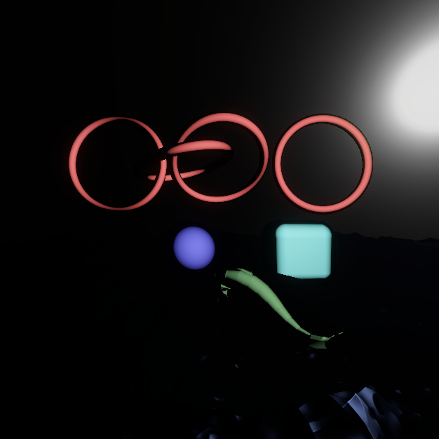
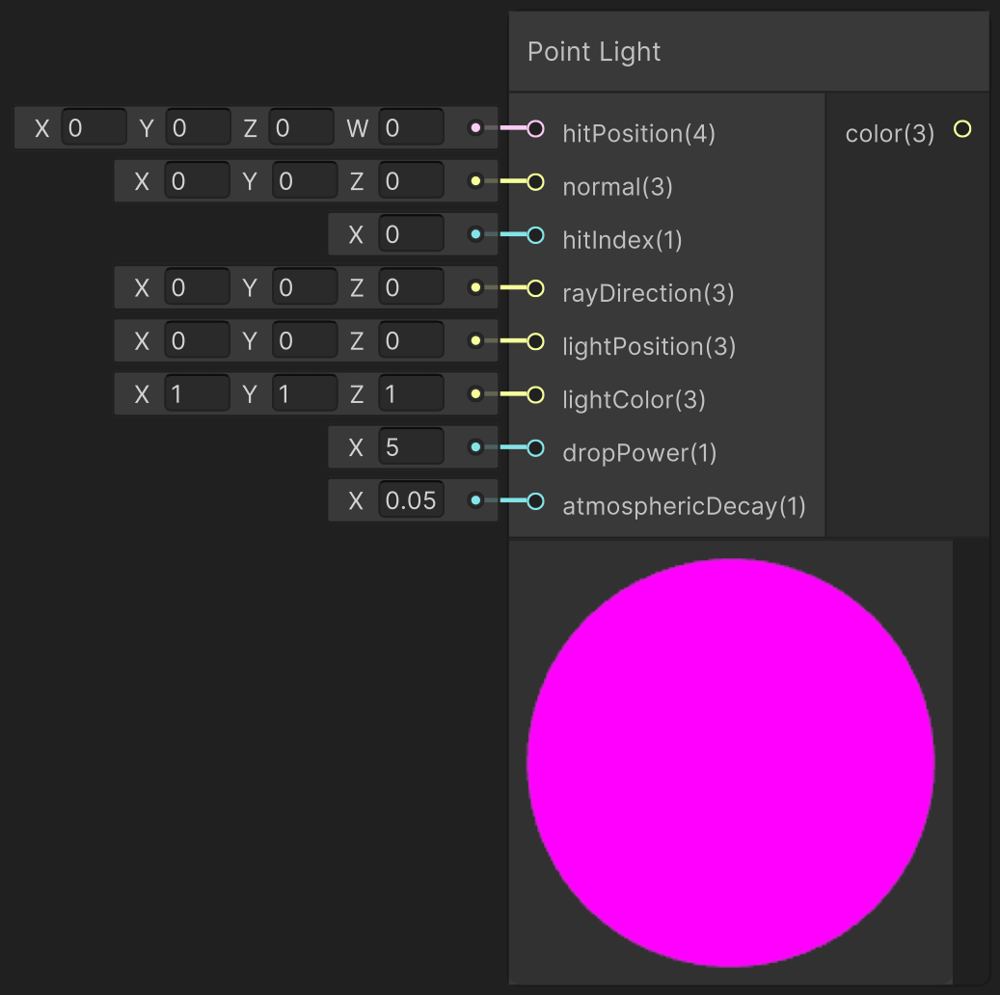

<div class="container">
    <h1 class="main-heading">Point Light</h1>
    <blockquote class="author">by Utku Alkan</blockquote>
</div>

This function simulates a point light source with distance-based attenuation and optional atmospheric decay. It casts a ray through the scene and accumulates light color based on distance from the point light, then applies Phong-based shading at the surface hit point.

> The function does not check for objects between a point in space and the light. Therefore, it does not reproduce shadows. 
    
*<figure markdown="span">
    { width="500" }
</figure>*

---

## The Code
```hlsl
void pointLight_float(float4 hitPosition, float3 normal, int hitIndex, float3 rayDirection, float3 lightPosition, float3 lightColor, float dropPower, float atmosphericDecay, out float3 lightingColor)
{
    //raymarch the environment    
    float t = 0;
    float3 pixelLightColor = float3(0, 0, 0);
    while (t < hitPosition.w)
    {
        float3 pt = _rayOrigin + t * rayDirection;
        float dist = distance(pt, lightPosition);
    
        float attenuation = clamp(1.0 / (pow(dist, dropPower)), 0.0, 1.0); 
        float absorption = exp(-t * atmosphericDecay);
        
        pixelLightColor += attenuation * lerp(lightColor, float3(1.0, 1.0, 1.0), attenuation) * absorption;

        t += 1;
    }

    if (hitPosition.w > _raymarchStoppingCriterium)
    {
        lightingColor = pixelLightColor;
        return;
    }
    
    float3 lightDirection = normalize(lightPosition - hitPosition.xyz);
    float3 viewDirection = normalize(_rayOrigin - hitPosition.xyz);
    float3 reflectedDirection = reflect(-lightDirection, normal);
    
    float3 ambientColor = float3(0, 0, 0);
    
    float diffuseValue = max(dot(normal, lightDirection), 0.0);
    float specularValue = pow(max(dot(reflectedDirection, viewDirection), 0.0), _objectShininess[hitIndex]);

    float3 diffuseColor = diffuseValue * _objectBaseColor[hitIndex] * pixelLightColor;
    float3 specularColor = specularValue * _objectSpecularColor[hitIndex] * _objectSpecularStrength[hitIndex];
    
    lightingColor = ambientColor + diffuseColor + specularColor;
}
```

---

## Parameters

### Inputs

| Name               | Type     | Description |
|--------------------|----------|-------------|
| `hitPosition`       | float4   | World position of the surface hit; the w-component holds the raymarch step or distance |
| `normal`           | float3   | Surface normal at the hit point |
| `hitIndex`         | int    | Object/material index used to fetch shading parameters |
| `rayDirection`     | float3   | Direction of the incoming ray |
| `lightPosition`    | float3   | World-space position of the point light |
| `lightColor`       | float3   | Base color of the point light <br> <blockquote>*ShaderGraph default value*:float3(1,1,1)</blockquote> |
| `dropPower`        | float    | Exponent for light attenuation falloff <br> <blockquote>*ShaderGraph default value*: 5</blockquote>|
| `atmosphericDecay` | float    | Exponential decay factor for atmospheric light absorption <br> <blockquote>*ShaderGraph default value*: 0.05</blockquote>|

The inputs are typically provided by the functions [SDF Raymarching](../sdfs/raymarching.md) or [Water Surface](../water/waterSurface.md).

### Output
| Name            | Type     | Description |
|-----------------|----------|-------------|
| `lightingColor`   | float3   | Final RGB lighting result from the point light and material shading |

---

## Implementation

=== "Visual Scripting"  
    Find the node at ```PSF/Lighting/Point Light```

    <figure markdown="span">
        { width="500" }
    </figure>

=== "Standard Scripting"  
    Include - ```#include "Packages/com.tudresden.proceduralshaderframeworkpackage/Runtime/scripts/lighting_functions.hlsl"```

    Example Usage

    ```hlsl
    float3 lightColor;
    pointLight_float(hitPos, normal, hitID, rayDir, float3(2, 5, -2), float3(1,1,1), 5, 0.05, lightColor);
    ```

---

This is an engine-specific implementation without a shader-basis.