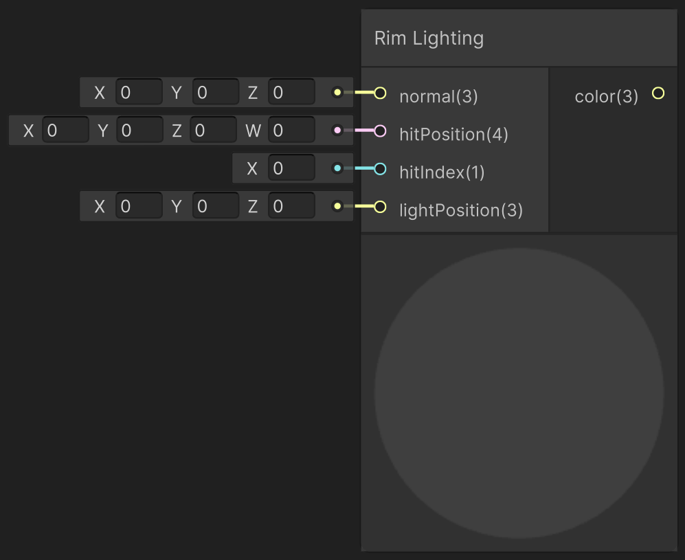

<div class="container">
    <h1 class="main-heading">Rim Lighting</h1>
    <blockquote class="author">by Utku Alkan</blockquote>
</div>

This function implements rim lighting, a non-photorealistic effect that highlights the edges of an object based on the view angle. It enhances silhouettes by boosting brightness where the view direction is nearly perpendicular to the surface normal. The effect is combined with ambient and base lighting, and uses the specular color to tint the rim.

---

## The Code
```hlsl
void applyRimLighting_float(float4 hitPosition, float3 normal, int hitIndex, float3 lightPosition, out
float3 lightingColor)
{
    if (hitPosition.w > _raymarchStoppingCriterium)
    {
        lightingColor = float3(0, 0, 0);
        return;
    }
    
    float3 viewDirection = normalize(_rayOrigin - hitPosition.xyz);
    float3 lightDirection = normalize(lightPosition - hitPosition.xyz);
    float3 lightColor = float3(1.0, 1.0, 1.0);
    float3 ambientColor = float3(0.05, 0.05, 0.05);

    float rim = 1.0 - saturate(dot(viewDirection, normal));
    rim = pow(rim, 4.0);

    float3 baseColor = _objectBaseColor[hitIndex];
    lightingColor = ambientColor + baseColor * lightColor + rim * _objectSpecularColor[hitIndex];
}
```

---

## Parameters

### Inputs

| Name            | Type     | Description |
|-----------------|----------|-------------|
| `hitPosition`    | float4   | World position of the surface hit; the w-component holds the raymarch distance |
| `normal`        | float3   | Surface normal at the hit point |
| `hitIndex`      | int    | Object/material index used to fetch shading parameters |
| `lightPosition` | float3   | World-space position of the light source |

The inputs are typically provided by the functions [SDF Raymarching](../sdfs/raymarching.md) or [Water Surface](../water/waterSurface.md).

### Output
| Name            | Type     | Description |
|-----------------|----------|-------------|
| `lightingColor`   | float3   | Final RGB lighting result using rim lighting, ambient, and base color shading |

---

## Implementation

=== "Visual Scripting"  
    Find the node at ```PSF/Lighting/Rim Lighting```

    <figure markdown="span">
        { width="500" }
    </figure>

=== "Standard Scripting"  
    Include - ```#include "Packages/com.tudresden.proceduralshaderframeworkpackage/Runtime/scripts/lighting_functions.hlsl"```

    Example Usage

    ```hlsl
    float3 lightColor;
    applyRimLighting_float(hitPos, surfaceNormal, objectIndex, float3(1, 3, -2), lightColor);
    ```

Find the original shader code [here](../../../shaders/lighting/lighting_functions.md). This basis was adapted to be compatible with Unity's workflow and to allow it to be modifyable within the framework.
