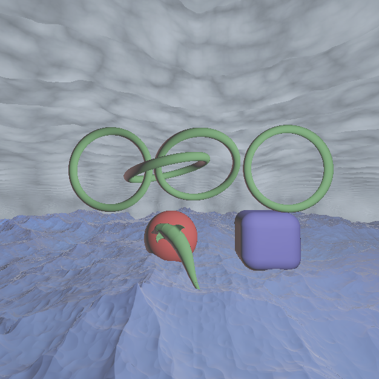
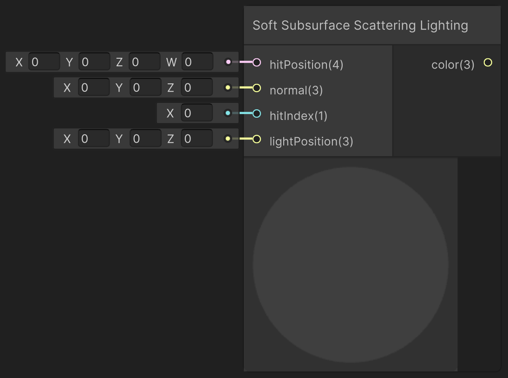

<div class="container">
    <h1 class="main-heading">Soft Subsurface Scattering (SSS) Lighting</h1>
    <blockquote class="author">by Utku Alkan</blockquote>
</div>

This function simulates a simple soft subsurface scattering (SSS) effect by adding light transmitted through the object’s surface. It enhances realism by combining standard Lambertian diffuse shading with a soft backlighting term.
    <figure markdown="span">
        { width="500" }
    </figure>
---

## The Code
```hlsl
void applySoftSSLighting_float(float4 hitPosition, float3 normal, float hitIndex, float3 lightPosition, out
float3 lightingColor)
{
    float3 viewDirection = normalize(_rayOrigin - hitPosition.xyz);
    float3 lightDirection = normalize(lightPosition - hitPosition.xyz);
    float3 lightColor = float3(1.0, 1.0, 1.0);
    float3 ambientColor = float3(0.05, 0.05, 0.05);

    float diffuseValue = max(dot(normal, lightDirection), 0.0);
    float backLight = max(dot(-normal, lightDirection), 0.0);

    float3 baseColor = _objectBaseColor[hitIndex];
    float3 sssColor = float3(1.0, 0.5, 0.5);

    float3 diffuseColor = diffuseValue * baseColor * lightColor;
    float3 sss = backLight * sssColor * 0.25;

    lightingColor = ambientColor + diffuseColor + sss;
}
```

---

## Parameters

### Inputs

| Name            | Type     | Description |
|-----------------|----------|-------------|
| `hitPosition`   | float4   | World position of the surface hit; the w-component may be ignored |
| `normal`        | float3   | Surface normal at the hit point |
| `hitIndex`      | float    | Object/material index used to fetch shading parameters |
| `lightPosition` | float3   | World-space position of the light source |

The inputs are typically provided by the functions [SDF Raymarching](../sdfs/raymarching.md) or [Water Surface](../water/waterSurface.md).

### Output
| Name            | Type     | Description |
|-----------------|----------|-------------|
| `lightingColor`    | float3   | Final RGB lighting result including diffuse shading and soft backlight (SSS) contribution |

---

## Implementation

=== "Visual Scripting"  
    Find the node at ```PSF/Lighting/SoftSSSLight```

    <figure markdown="span">
        { width="500" }
    </figure>

=== "Standard Scripting"  
    Include - ```#include "Packages/com.tudresden.proceduralshaderframeworkpackage/Runtime/scripts/lighting_functions.hlsl"```

    Example Usage

    ```hlsl
    float3 lightColor;
    applySoftSSLighting_float(hitPos, surfaceNormal, objectIndex, float3(0, 5, -2), lightColor);
    ```

---

This is an engine-specific implementation without a shader-basis.