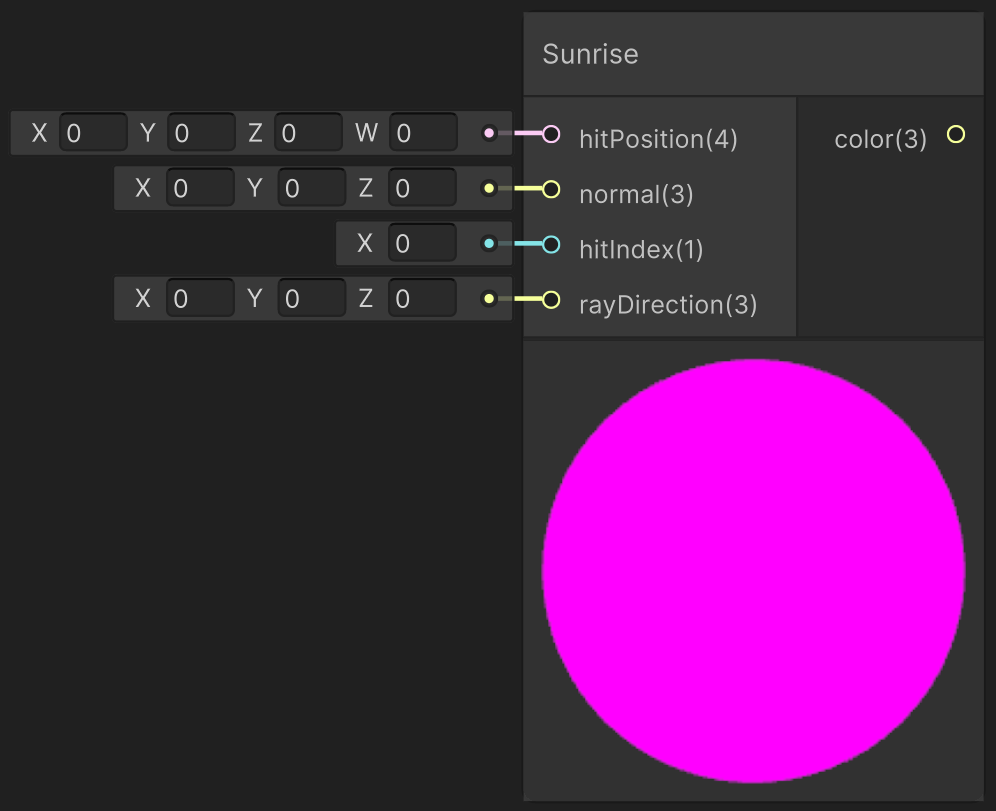

<div class="container">
    <h1 class="main-heading">Sunrise</h1>
    <blockquote class="author">by Utku Alkan</blockquote>
</div>

This function computes realistic atmospheric lighting based on a simplified earth-sun model. It simulates sunlight scattering through the atmosphere and includes diffuse and specular reflections using a Phong lighting model. If the ray hits the sky (escapes before hitting geometry), it returns the atmospheric color.

---

## The Code

??? "Sunrise Related Helper Functions"
    ```` hlsl
    struct SunriseLight
    {
        float3 sundir;
        float3 earthCenter;
        float earthRadius;
        float atmosphereRadius;
        float sunIntensity;
    };

    float2 densitiesRM(float3 position, SunriseLight light)
    {
        float h = max(0., length(position - light.earthCenter) - light.earthRadius);
        return float2(exp(-h / 8e3), exp(-h / 12e2));
    }

    float escape(float3 position, float3 direction, float atmosphereRadius, float3 earthCenter)
    {
        float3 v = position - earthCenter;
        float b = dot(v, direction);
        float det = b * b - dot(v, v) + atmosphereRadius * atmosphereRadius;
        if (det < 0.)
            return -1.;
        det = sqrt(det);
        float t1 = -b - det;
        float t2 = -b + det;
        return (t1 >= 0.) ? t1 : t2;
    }

    float2 scatterDepthInt(float3 position, float3 direction, float atmosphericDistance, float steps, SunriseLight light)
    {
        float2 depthRMs = float2(0., 0);
        atmosphericDistance /= steps;
        direction *= atmosphericDistance;

        for (float i = 0.; i < steps; ++i)
            depthRMs += densitiesRM(position + direction * i, light);

        return depthRMs * atmosphericDistance;
    }

    float3 applySunriseLighting(float3 position, float3 direction, float atmosphericDistance, float3 Lo, SunriseLight light)
    {
        float3 bR = float3(58e-7, 135e-7, 331e-7); // Rayleigh scattering coefficient
        float3 bMs = float3(2e-5, 2e-5, 2e-5); // Mie scattering coefficients
        float3 bMe = float3(2e-5, 2e-5, 2e-5) * 1.1;
        float2 totalDepthRM = float2(0., 0);
        float3 I_R = float3(0., 0, 0);
        float3 I_M = float3(0., 0, 0);
        float3 oldDirection = direction;
        atmosphericDistance /= 16.0;
        direction *= atmosphericDistance;

        for (float i = 0.; i < 16.0; ++i)
        {
            float3 currentPosition = position + direction * i;
            float2 dRM = densitiesRM(currentPosition, light) * atmosphericDistance;
            totalDepthRM += dRM;
            float2 depthRMsum = totalDepthRM + scatterDepthInt(currentPosition, light.sundir, escape(currentPosition, light.sundir, light.atmosphereRadius, light.earthCenter), 4., light);
            float3 A = exp(-bR * depthRMsum.x - bMe * depthRMsum.y);
            I_R += A * dRM.x;
            I_M += A * dRM.y;
        }

        float mu = dot(oldDirection, light.sundir);
        return Lo + Lo * exp(-bR * totalDepthRM.x - bMe * totalDepthRM.y)
            + light.sunIntensity * (1. + mu * mu) * (
                I_R * bR * .0597 +
                I_M * bMs * .0196 / pow(1.58 - 1.52 * mu, 1.5));
    }
    ````

```hlsl
void sunriseLight_float(float4 hitPosition, float3 normal, int hitIndex, float3 rayDirection, out float3 lightingColor)
{ 
    SunriseLight sunrise;
    sunrise.sundir = normalize(float3(0.5, 0.4 * (1. + sin(0.5 * _Time.y)), -1.));
    sunrise.earthCenter = float3(0., -6360e3, 0.);
    sunrise.earthRadius = 6360e3;
    sunrise.atmosphereRadius = 6380e3;
    sunrise.sunIntensity = 10.0;
    
    float atmosphereDist = escape(hitPosition.xyz, rayDirection, sunrise.atmosphereRadius, sunrise.earthCenter);
    float3 lightColor = applySunriseLighting(hitPosition.xyz, rayDirection, atmosphereDist, float3(0, 0, 0), sunrise);
        
    if (hitPosition.w > _raymarchStoppingCriterium)
    {
        lightingColor = lightColor;
        return;
    }
        
    float3 lightDirection = sunrise.sundir;
    float3 viewDirection = normalize(_rayOrigin - hitPosition.xyz);
    float3 reflectedDirection = reflect(-lightDirection, normal);
    
    float3 ambientColor = float3(0, 0, 0);

    float diffuseValue = max(dot(normal, lightDirection), 0.0);
    float specularValue = pow(max(dot(reflectedDirection, viewDirection), 0.0), _objectShininess[hitIndex]);
    
    float3 diffuseColor = diffuseValue * (0.5 * _objectBaseColor[hitIndex] + 0.5 * lightColor);
    float3 specularColor = specularValue * _objectSpecularColor[hitIndex] * _objectSpecularStrength[hitIndex];
        
    lightingColor = ambientColor + diffuseColor + specularColor;
}
```

---

## Parameters

### Inputs

| Name           | Type     | Description |
|----------------|----------|-------------|
| `hitPosition`   | float4   | World position of the surface hit; the w-component holds the raymarch step or distance |
| `normal`       | float3   | Surface normal at the hit point |
| `hitIndex`     | int    | Object/material index used to fetch shading parameters |
| `rayDirection` | float3   | Direction of the incoming ray |

The inputs are typically provided by the functions [SDF Raymarching](../sdfs/raymarching.md) or [Water Surface](../water/waterSurface.md).

### Output
| Name            | Type     | Description |
|-----------------|----------|-------------|
| `lightingColor`   | float3   | Final RGB lighting result, including sunrise sky or surface lighting |

---

## Implementation

=== "Visual Scripting"  
    Find the node at ```PSF/Lighting/Sunrise```

    <figure markdown="span">
        { width="500" }
    </figure>

=== "Standard Scripting"  
    Include - ```#include "Packages/com.tudresden.proceduralshaderframeworkpackage/Runtime/scripts/lighting_functions.hlsl"```

    Example Usage

    ```hlsl
    float3 lightColor;
    sunriseLight_float(hitPos, surfaceNormal, objectIndex, rayDir, lightColor);
    ```
---

ADD CORRECT LINK
Find the original shader code [here](../../../shaders/lighting/lighting_functions.md). This basis was adapted to be compatible with Unity's workflow and to allow it to be modifyable within the framework.