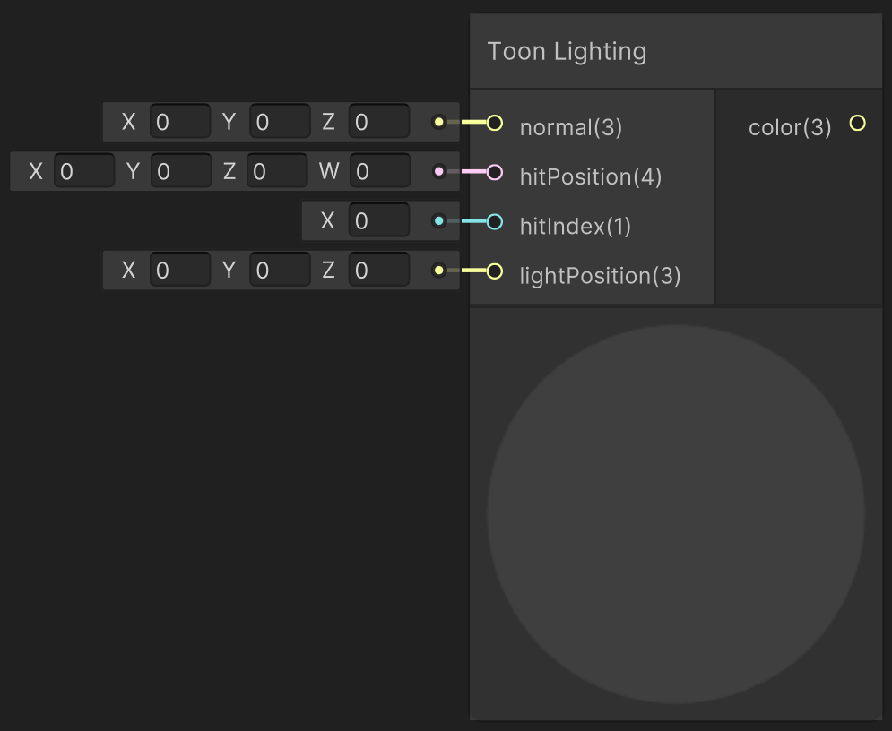

<div class="container">
    <h1 class="main-heading">Toon Lighting</h1>
    <blockquote class="author">by Utku Alkan</blockquote>
</div>

This function implements a stylized toon shading model using stepped diffuse bands instead of smooth gradients. It divides diffuse reflection into discrete levels and combines it with a minimal ambient term. This creates a cartoon-like appearance with clear lighting bands and no specular highlights.

---

## The Code
```hlsl
void applyToonLighting_float(float4 hitPosition, float3 normal, int hitIndex, float3 lightPosition, out
float3 lightingColor)
{
    if (hitPosition.w > _raymarchStoppingCriterium)
    {
        lightingColor = float3(0, 0, 0);
        return;
    }
    
    float3 viewDirection = normalize(_rayOrigin - hitPosition.xyz);
    float3 lightDirection = normalize(lightPosition - hitPosition.xyz);
    float3 lightColor = float3(1.0, 1.0, 1.0);
    float3 ambientColor = float3(0.05, 0.05, 0.05);

    float diffuseValue = max(dot(normal, lightDirection), 0.0);

    float step1 = 0.3;
    float step2 = 0.6;
    float step3 = 0.9;

    float toonDiff =
        diffuseValue > step3 ? 1.0 :
        diffuseValue > step2 ? 0.7 :
        diffuseValue > step1 ? 0.4 : 0.1;

    lightingColor = ambientColor + toonDiff * _objectBaseColor[hitIndex] * lightColor;
}
```

---

## Parameters

### Inputs

| Name            | Type     | Description |
|-----------------|----------|-------------|
| `hitPosition`    | float4   | World position of the surface hit; the w-component holds the raymarch distance |
| `normal`        | float3   | Surface normal at the hit point |
| `hitIndex`      | int    | Object/material index used to fetch shading parameters |
| `lightPosition` | float3   | World-space position of the light source |

The inputs are typically provided by the functions [SDF Raymarching](../sdfs/raymarching.md) or [Water Surface](../water/waterSurface.md).

### Output
| Name            | Type     | Description |
|-----------------|----------|-------------|
| `lightingColor`   | float3   | Final RGB lighting result using stepped toon shading |

---

## Implementation

=== "Visual Scripting"  
    Find the node at ```PSF/Lighting/Toon Lighting```

    <figure markdown="span">
        { width="500" }
    </figure>

=== "Standard Scripting"  
    Include - ```#include "Packages/com.tudresden.proceduralshaderframeworkpackage/Runtime/scripts/lighting_functions.hlsl"```

    Example Usage

    ```hlsl
    float3 lightColor;
    applyToonLighting_float(hitPos, surfaceNormal, objectIndex, float3(2, 4, -3), lightColor);
    ```

---

This is an engine-specific implementation without a shader-basis.
