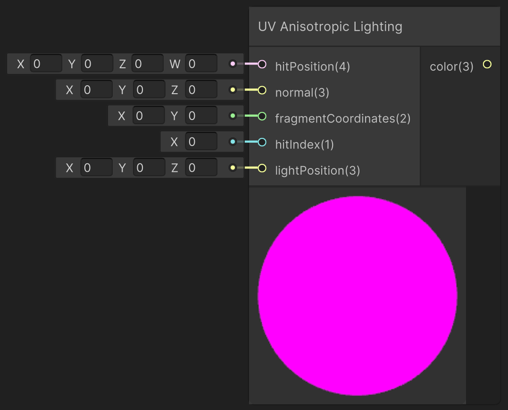

<div class="container">
    <h1 class="main-heading">UV Anisotropic Lighting</h1>
    <blockquote class="author">by Utku Alkan</blockquote>
</div>

This function simulates anisotropic lighting effects using per-pixel tangent vectors derived from UV coordinates. The result mimics materials like brushed metal or hair by modulating specular highlights along UV-based tangent directions. It combines Lambertian diffuse lighting with a directional specular term.

---

## The Code
```hlsl
void applyUVAnisotropicLighting_float(float4 hitPosition, float3 normal, float hitIndex, float2 uv, float3 lightPosition, out
float3 lightingColor)
{
    float3 viewDirection = normalize(_rayOrigin - hitPosition.xyz);
    float3 lightDirection = normalize(lightPosition - hitPosition.xyz);
    float3 halfVec = normalize(viewDirection + lightDirection);

    float angle = uv.x * 6.2831853; // 2π
    float3 localTangent = float3(cos(angle), sin(angle), 0.0);
    float3 tangent = normalize(localTangent - normal * dot(localTangent, normal));
    float3 bitangent = cross(normal, tangent);

    float TdotH = dot(tangent, halfVec);
    float BdotH = dot(bitangent, halfVec);
    float spectralAnisotropic = pow(TdotH * TdotH + BdotH * BdotH, 8.0);
    float diffuseValue = max(dot(normal, lightDirection), 0.0);

    float3 ambientColor = float3(0.1, 0.1, 0.1);

    lightingColor = ambientColor + diffuseValue * _objectBaseColor[hitIndex] + spectralAnisotropic * _objectSpecularColor[hitIndex];
}
```

---

## Parameters

### Inputs

| Name            | Type     | Description |
|-----------------|----------|-------------|
| `hitPosition`    | float4   | World-space surface hit position; `w` holds the raymarch step or distance |
| `normal`        | float3   | Surface normal at the hit location |
| `hitIndex`      | float    | Index used to fetch object material properties |
| `uv`            | float2   | UV coordinates used to define local tangent direction; for this framework the *fragment coordinates* from [Fragment Coordinates](../basics/fragCoords.md) can be used |
| `lightPosition` | float3   | World-space position of the light source |

The inputs are typically provided by the functions [SDF Raymarching](../sdfs/raymarching.md) or [Water Surface](../water/waterSurface.md).

### Output
| Name            | Type     | Description |
|-----------------|----------|-------------|
| `lightingColor`    | float3   | RGB lighting result including anisotropic specular highlights and standard diffuse |

---

## Implementation

=== "Visual Scripting"  
    Find the node at ```PSF/Lighting/UV Anisotropic Lighting```

    <figure markdown="span">
        { width="500" }
    </figure>

=== "Standard Scripting"  
    Include - ```#include "Packages/com.tudresden.proceduralshaderframeworkpackage/Runtime/scripts/lighting_functions.hlsl"```

    Example Usage

    ```hlsl
    float3 lightColor;
    applyUVAnisotropicLighting_float(hitPos, surfaceNormal, objectIndex, uvCoords, lightPos, lightColor);
    ```

---

This is an engine-specific implementation without a shader-basis.
