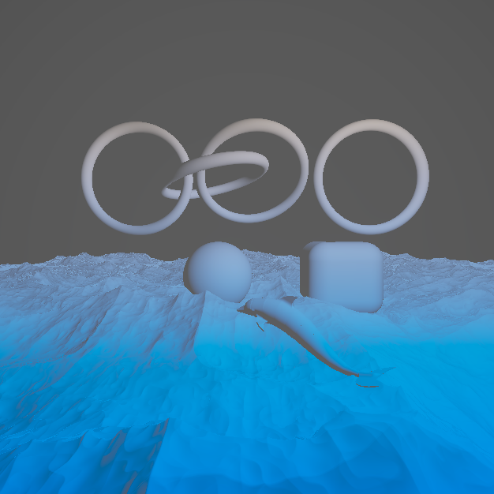
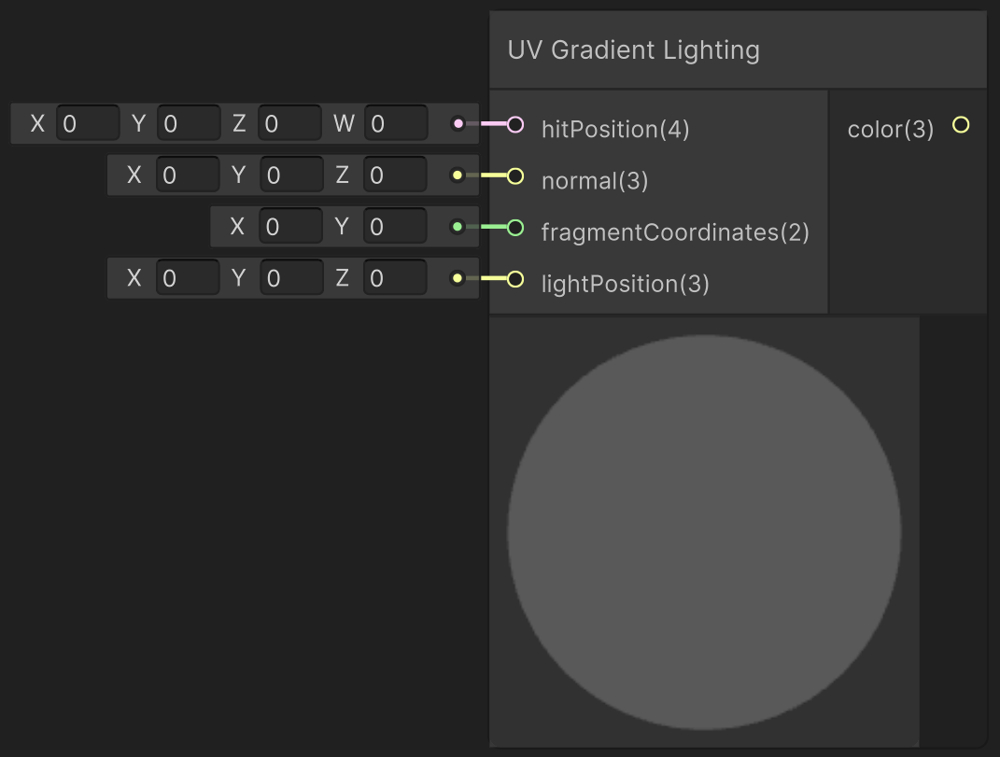

<div class="container">
    <h1 class="main-heading">UV Gradient Lighting</h1>
    <blockquote class="author">by Utku Alkan</blockquote>
</div>

This function applies Lambertian diffuse lighting with a color gradient based on the surface's UV coordinates. The gradient interpolates from blue to orange depending on the `uv.y` value, creating visually interesting color variation across a surface. Ambient light is added for minimal base illumination.
    <figure markdown="span">
        { width="500" }
    </figure>
---

## The Code
```hlsl
void applyUVGradientLighting_float(float4 hitPosition, float3 normal, float2 uv, float3 lightPosition, out float3 lightingColor)
{
    float3 viewDirection = normalize(_rayOrigin - hitPosition.xyz);
    float3 lightDirection = normalize(lightPosition - hitPosition.xyz);
    float3 lightColor = float3(1.0, 1.0, 1.0);
    float3 ambientColor = float3(0.1, 0.1, 0.1);

    float diffuseValue = max(dot(normal, lightDirection), 0.0);
    float3 gradientColor = lerp(float3(0.2, 0.4, 0.9), float3(1.0, 0.6, 0.0), uv.y);

    lightingColor = ambientColor + diffuseValue * gradientColor * lightColor;
}
```

---

## Parameters

### Inputs

| Name            | Type     | Description |
|-----------------|----------|-------------|
| `hitPosition`    | float4   | World position of the surface hit; the w-component is typically the raymarch distance |
| `normal`        | float3   | Surface normal at the hit point |
| `uv`            | float2   | UV coordinates used for gradient calculation; for this framework the *fragment coordinates* from [Fragment Coordinates](../basics/fragCoords.md) can be used |
| `lightPosition` | float3   | World-space position of the light source |

The inputs are typically provided by the functions [SDF Raymarching](../sdfs/raymarching.md) or [Water Surface](../water/waterSurface.md).

### Output
| Name            | Type     | Description |
|-----------------|----------|-------------|
| `lightingColor`    | float3   | Final RGB lighting result using UV-based color gradients and diffuse shading |

---

## Implementation

=== "Visual Scripting"  
    Find the node at ```PSF/Lighting/UV Gradient Lighting```

    <figure markdown="span">
        { width="500" }
    </figure>

=== "Standard Scripting"  
    Include - ```#include "Packages/com.tudresden.proceduralshaderframeworkpackage/Runtime/scripts/lighting_functions.hlsl"```

    Example Usage

    ```hlsl
    float3 lightColor;
    applyUVGradientLighting_float(hitPos, surfaceNormal, uvCoords, float3(1, 4, -1), lightColor);
    ```
---

This is an engine-specific implementation without a shader-basis.
