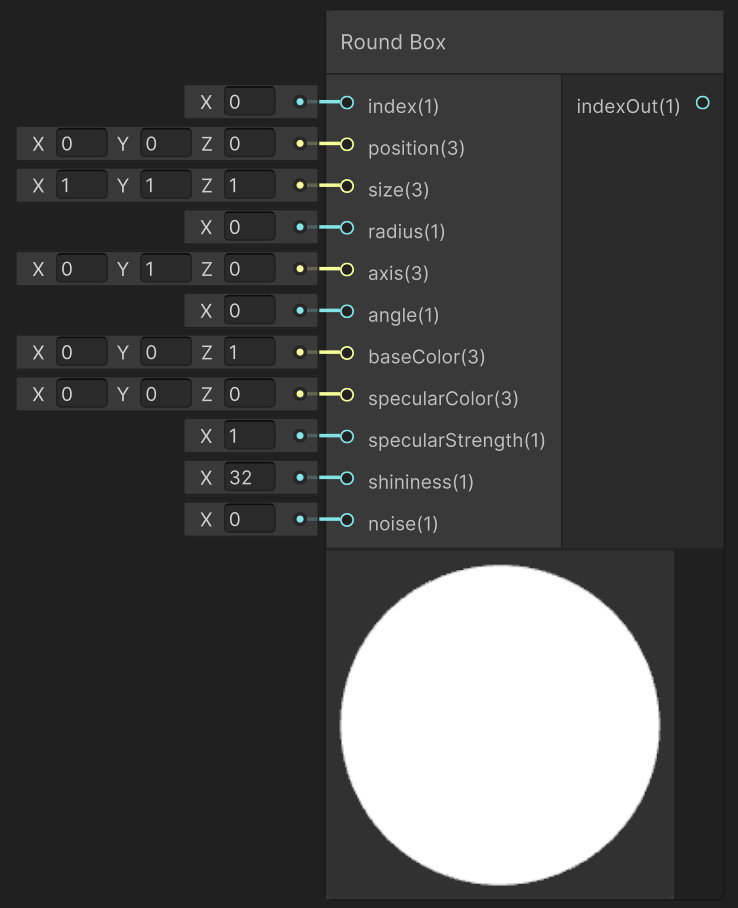

<div class="container">
    <h1 class="main-heading">SDF Round Box</h1>
    <blockquote class="author">by Frieda Hentschel</blockquote>
</div>

This function creates an internal instance of an SDF-based cube with rounded corners. In order for the cube to be visible in the final output, [SDF Raymarching](raymarching.md) and an arbitrary [Lighting Function](../lighting/generalInformation.md) have to be included. 

---

## The Code

``` hlsl
float sdRoundBox(float3 position, float3 size, float radius)
{
    float3 q = abs(position) - size + radius;
    return length(max(q, 0.0)) + min(max(q.x, max(q.y, q.z)), 0.0) - radius;
}

void addRoundBox_float(int index, float3 position, float3 size, float radius, float3 axis, float angle, float3 baseColor, float3 specularColor, float specularStrength,
float shininess, float noise, out int indexOut)
{
    addSDF(index, 1, position, size, radius, axis, angle, noise, baseColor, specularColor, specularStrength, shininess, 0, 0);
    indexOut = index + 1;
}
```

---

## The Parameters

### Inputs:
| Name            | Type     | Description |
|-----------------|----------|-------------|
| `index`    | int   | Index at which the cube is stored  |
| `position`        | float3   | Central position |
| `size`        | float3   | Expand in each of the three dimensions <br> <blockquote>*ShaderGraph default value*: float3(1,1,1)</blockquote>|
| `radius`        | float   | Radius with which the corners are rounded |
| `axis`            | float3   | Axis determining the orientation <br> <blockquote>*ShaderGraph default value*: float3(0,1,0)</blockquote>|
| `angle` | float   | World-space position of the light source |
| `baseColor`  | float3   | Underlying color <br> <blockquote>*ShaderGraph default value*: float3(0,0,1)</blockquote>|
| `specularColor`        | float3   | Color of the highlights |
| `specularStrength`            | float   | Intensity with which highlights are created between 0 and 1 <br> <blockquote>*ShaderGraph default value*: 1</blockquote> |
| `shininess` | float   | Shape and sharpness of the highlights; the larger the value, the more focussed the highlight  <br> <blockquote>*ShaderGraph default value*: 32</blockquote>|
| `noise` | float   | Noise that is added to the shape of the cube |

### Outputs:
| Name            | Type     | Description |
|-----------------|----------|-------------|
| `indexOut`  | int   | Incremented input index that can be used as either the input index to another SDF function or as the amount of SDFs in the scene to the [SDF Raymarching](raymarching.md) |

---

## Implementation

=== "Visual Scripting"
    Find the node at `PSF/SDFs/Round Box`

    <figure markdown="span">
        { width="500" }
    </figure>

=== "Standard Scripting"
    Include - ```#include "Packages/com.tudresden.proceduralshaderframeworkpackage/Runtime/scripts/sdf_functions.hlsl"```

    Example Usage

    ```hlsl
    addRoundBox_float(index, float3(5,0,-5), float3(2,2,2), 1, float3(0.8,0.1,0.1), 0, float3(0.2,0.2,0.8), float3(0.2,0.8,0.8), 2, 1, 0, index);
    ```


---

Find the original shader code [here](..).