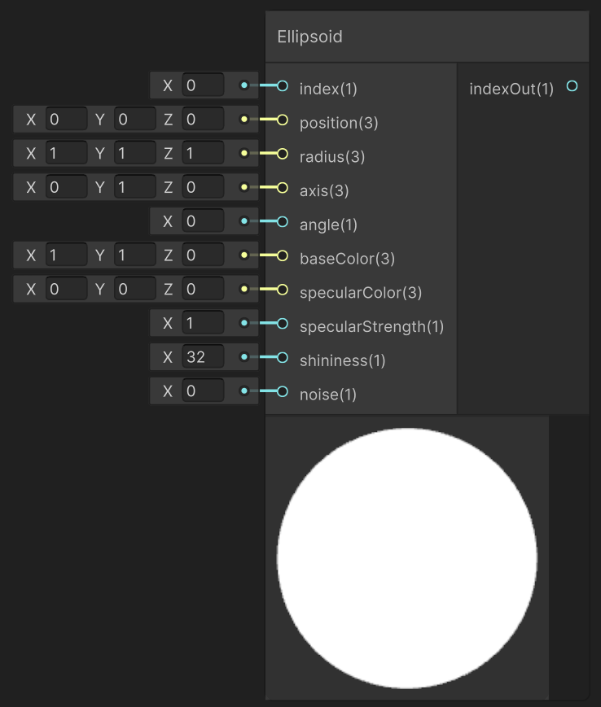

<div class="container">
    <h1 class="main-heading">SDF Ellipsoid</h1>
    <blockquote class="author">by Frieda Hentschel</blockquote>
</div>

This function creates an internal instance of an SDF-based ellipsoid. In order for the cube to be visible in the final output, [SDF Raymarching](raymarching.md) and an arbitrary [Lighting Function](../lighting/generalInformation.md) have to be included. 

---

## The Code

``` hlsl
float sdEllipsoid(float3 position, float3 r)
{
    float k0 = length(position / r);
    float k1 = length(position / (r * r));
    return k0 * (k0 - 1.0) / k1;
}

void addEllipsoid_float(int index, float3 position, float3 size, float3 axis, float angle, float3 baseColor, float3 specularColor, float specularStrength,
float shininess, float noise, out int indexOut)
{
    addSDF(index, 3, position, size, 0, axis, angle, noise, baseColor, specularColor, specularStrength, shininess, 0, 0);
    indexOut = index + 1;
}
```

---

## The Parameters

### Inputs:
| Name            | Type     | Description |
|-----------------|----------|-------------|
| `index`    | int   | Index at which the ellipsoid is stored  |
| `position`        | float3   | Central position |
| `size`        | float3   | Expand in each of the three dimensions <br> <blockquote>*ShaderGraph default value*: float3(1,1,1)</blockquote>|
| `axis`            | float3   | Axis determining the orientation <br> <blockquote>*ShaderGraph default value*: float3(0,1,0)</blockquote>|
| `angle` | float   | World-space position of the light source |
| `baseColor`  | float3   | Underlying color <br> <blockquote>*ShaderGraph default value*: float3()</blockquote>|
| `specularColor`        | float3   | Color of the highlights |
| `specularStrength`            | float   | Intensity with which highlights are created <br> <blockquote>*ShaderGraph default value*: 1</blockquote> |
| `shininess` | float   | Shape and sharpness of the highlights; the larger the value, the more focussed the highlight  <br> <blockquote>*ShaderGraph default value*: 32</blockquote>|
| `noise` | float   | Noise that is added to the shape of the ellipsoid |

> Naturally, the sphere can be imitated by the ellipsoid by setting its size to be uniform.

### Outputs:
| Name            | Type     | Description |
|-----------------|----------|-------------|
| `indexOut`  | int   | Incremented input index that can be used as either the input index to another SDF function or as the amount of SDFs in the scene to the [SDF Raymarching](raymarching.md) |

---

## Implementation

=== "Visual Scripting"
    Find the node at `PSF/SDFs/Ellipsoid`

    <figure markdown="span">
        { width="500" }
    </figure>

=== "Standard Scripting"
    !Utku Input
    Include ...

---

This is an engine-specific implementation without a shader-basis.