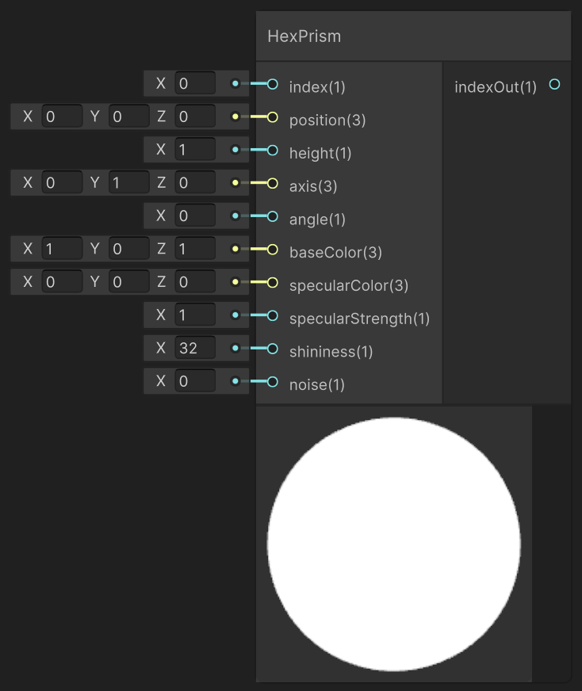

<div class="container">
    <h1 class="main-heading">SDF Hexagonal Prism</h1>
    <blockquote class="author">by Frieda Hentschel</blockquote>
</div>

This function creates an internal instance of an SDF-based hexagonal prism. In order for the cube to be visible in the final output, [SDF Raymarching](raymarching.md) and an arbitrary [Lighting Function](../lighting/generalInformation.md) have to be included. 

---

## The Code

``` hlsl
float sdHexPrism(float3 position, float2 height)
{
    const float3 k = float3(-0.8660254, 0.5, 0.57735);
    position = abs(position);
    position.xy -= 2.0 * min(dot(k.xy, position.xy), 0.0) * k.xy;
    float2 d = float2(
       length(position.xy - float2(clamp(position.x, -k.z * height.x, k.z * height.x), height.x)) * sign(position.y - height.x),
       position.z - height.y);
    return min(max(d.x, d.y), 0.0) + length(max(d, 0.0));
}

void addHexPrism_float(int index, float3 position, float height, float3 axis, float angle, float3 baseColor, float3 specularColor, float specularStrength,
float shininess, float noise, out int indexOut)
{
    addSDF(index, 4, position, float3(0.0, 0.0, 0.0), height, axis, angle, noise, baseColor, specularColor, specularStrength, shininess, 0, 0);
    indexOut = index + 1;
}
```

---

## The Parameters

### Inputs:
- ```float index```: The index at which the hexagonal prism is stored 
- ```float3 position```: The central position of the hexagonal prism
- ```float height```: The height of the hexagonal prism
> *ShaderGraph default value*: ```1```
- ```float3 axis```: The axis determining the orientation of the hexagonal prism
> *ShaderGraph default value*: ```float3(0,1,0)```
- ```float angle```: The angle around the axis 
- Material parameters
    - ```float3 baseColor```: The underlying color of the hexagonal prism
    > *ShaderGraph default value*: ```float3(0,1,0)```
    - ```float3 specularColor```: The color of the highlights
    - ```float3 specularStrength```: The intensity with which highlights are created
    > *ShaderGraph default value*: ```1```
    - ```float3 shininess```: The shape and sharpness of the highlights; the larger the value, the more focussed the highlight
    > *ShaderGraph default value*: ```32```
- ```float3 noise```: Noise that is added to the shape of the hexagonal prism


### Outputs:
- ```float indexOut```: The incremented input index that can be used as either the input index to another SDF function or as the amount of SDFs in the scene to the [SDF Raymarching](...).  

---

## Implementation

=== "Visual Scripting"
    Find the node at `PSF/SDFs/HexPrism`

    <figure markdown="span">
        { width="500" }
    </figure>

=== "Standard Scripting"
    Include - ```#include "Packages/com.tudresden.proceduralshaderframeworkpackage/Runtime/scripts/sdf_functions.hlsl"```

    Example Usage

    ```hlsl
    addHexPrism_float(index, float3(2, 0, -4), 3.0, float3(0, 1, 0), 30.0, float3(0.6, 0.3, 0.1), float3(1, 1, 1), 0.8, 16.0, 0.1, index);
    ```
---

This is an engine-specific implementation without a shader-basis.