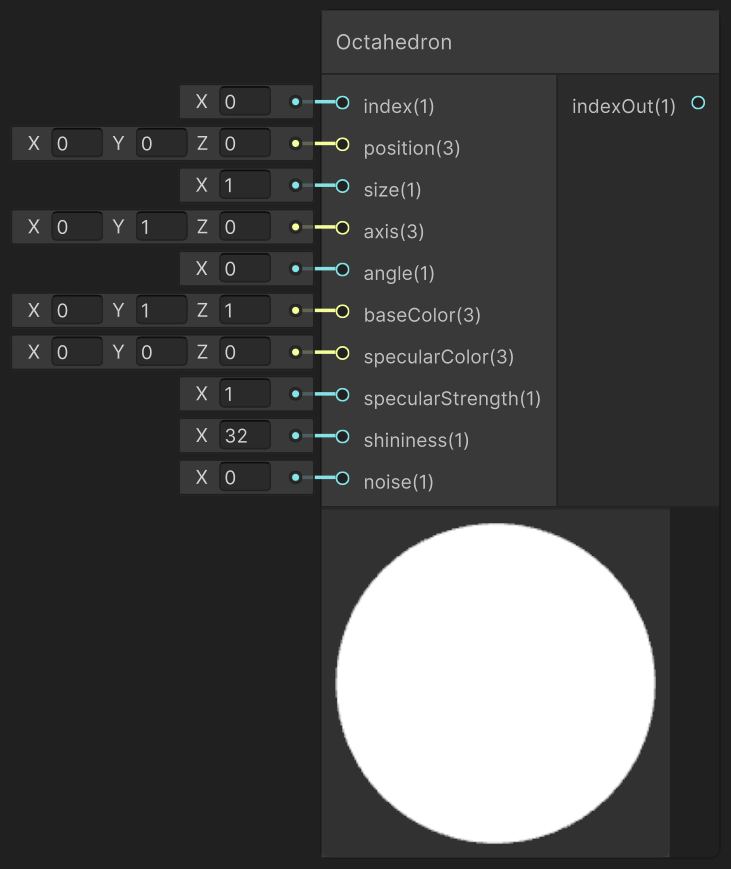

<div class="container">
    <h1 class="main-heading">SDF Octahedron</h1>
    <blockquote class="author">by Frieda Hentschel</blockquote>
</div>

This function creates an internal instance of an SDF-based octahedron. In order for the cube to be visible in the final output, [SDF Raymarching](raymarching.md) and an arbitrary [Lighting Function](../lighting/generalInformation.md) have to be included. 

---

## The Code

``` hlsl
float sdOctahedron(float3 position, float s)
{
    position = abs(position);
    return (position.x + position.y + position.z - s) * 0.57735027;
}

void addOctahedron_float(int index, float3 position, float radius, float3 axis, float angle, float3 baseColor, float3 specularColor, float specularStrength,
float shininess, float noise, out int indexOut)
{
    addSDF(index, 5, position, float3(0.0, 0.0, 0.0), radius, axis, angle, noise, baseColor, specularColor, specularStrength, shininess, 0, 0);
    indexOut = index + 1;
}
```

---

## The Parameters

### Inputs:
| Name            | Type     | Description |
|-----------------|----------|-------------|
| `index`    | int   | Index at which the octahedron is stored  |
| `position`        | float3   | Central position |
| `radius`        | float   | Radius of the octahedron <br> <blockquote>*ShaderGraph default value*: 1</blockquote>|
| `axis`            | float3   | Axis determining the orientation <br> <blockquote>*ShaderGraph default value*: float3(0,1,0)</blockquote>|
| `angle` | float   | World-space position of the light source |
| `baseColor`  | float3   | Underlying color <br> <blockquote>*ShaderGraph default value*: float3(0,0,1)</blockquote>|
| `specularColor`        | float3   | Color of the highlights |
| `specularStrength`            | float   | Intensity with which highlights are created <br> <blockquote>*ShaderGraph default value*: 1</blockquote> |
| `shininess` | float   | Shape and sharpness of the highlights; the larger the value, the more focussed the highlight  <br> <blockquote>*ShaderGraph default value*: 32</blockquote>|
| `noise` | float   | Noise that is added to the shape of the octahedron |

### Outputs:
| Name            | Type     | Description |
|-----------------|----------|-------------|
| `indexOut`  | int   | Incremented input index that can be used as either the input index to another SDF function or as the amount of SDFs in the scene to the [SDF Raymarching](raymarching.md) |

---

## Implementation

=== "Visual Scripting"
    Find the node at `PSF/SDFs/Octahedron`

    <figure markdown="span">
        { width="500" }
    </figure>

=== "Standard Scripting"
    Include - ```#include "Packages/com.tudresden.proceduralshaderframeworkpackage/Runtime/scripts/sdf_functions.hlsl"```

    Example Usage

    ```hlsl
    addOctahedron_float(index, float3(-2, 1, -6), 1.2, float3(1, 0, 0), 45.0, float3(0.7, 0.2, 0.5), float3(1, 1, 1), 0.5, 32.0, 0.05, index);
    ```

This is an engine-specific implementation without a shader-basis.