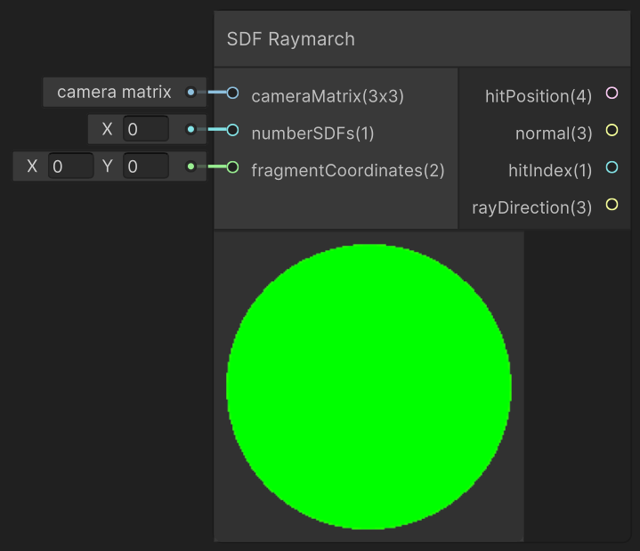
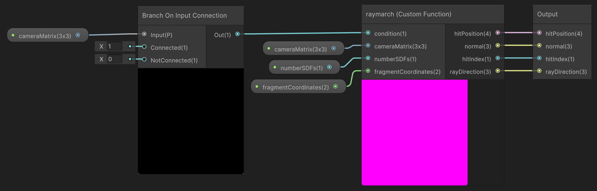

<div class="container">
    <h1 class="main-heading">SDF Raymarching</h1>
    <blockquote class="author">by Frieda Hentschel</blockquote>
</div>

This function performs raymarching considering all previously instantiated SDFs.

---

## The Code

``` hlsl
float evalSDF(int index, float3 position)
{
    int sdfType = _sdfType[index];
    float3 probePt = mul((position - _sdfPosition[index]), _sdfRotation[index]);
    
    if (sdfType == 0)
        return sdSphere(probePt, _sdfRadius[index]);
    else if (sdfType == 1)
        return sdRoundBox(probePt, _sdfSize[index], _sdfRadius[index]);
    else if (sdfType == 2)
        return sdTorus(probePt, _sdfSize[index].yz);
    else if (sdfType == 3)
        return sdEllipsoid(probePt, _sdfSize[index]);
    else if (sdfType == 4)
        return sdHexPrism(probePt, _sdfRadius[index]);
    else if (sdfType == 5)
        return sdOctahedron(probePt, _sdfRadius[index]);
    else if (sdfType == 6)
        return dolphinDistance(probePt, _sdfPosition[index], _timeOffsetDolphin[index], _speedDolphin[index]).x;
    return 1e5;
}

void raymarch_float(int condition, float3x3 cameraMatrix, int numberSDFs, float2 fragmentCoordinates, out float4 hitPosition, out float3 normal, out int hitIndex, out float3 rayDirection)
{
    if (condition == 0)
    {
        cameraMatrix = computeCameraMatrix(float3(0, 0, 0), _rayOrigin, float3x3(1, 0, 0, 0, 1, 0, 0, 0, 1));
    }
    
    rayDirection = normalize(mul(float3(fragmentCoordinates, -1), cameraMatrix));
    float t = 0.0;
    hitPosition = float4(0, 0, 0, 0);
    for (int i = 0; i < 100; i++)
    {
        float3 currentPosition = _rayOrigin + rayDirection * t; 
        float d = 1e5;
        int bestIndex = -1;
        for (int j = 0; j < numberSDFs; ++j)
        {
            float dj = evalSDF(j, currentPosition);
            if (dj < d)
            {
                d = dj; 
                bestIndex = j;
            }
        }
        hitIndex = bestIndex;
        d += _sdfNoise[hitIndex] * 0.3;
        if (d < 0.001)
        {
            hitPosition.xyz = currentPosition;
            normal = getNormal(hitIndex, currentPosition);
            break;
        }
        if (t > _raymarchStoppingCriterium)
        {
            hitPosition.xyz = currentPosition;
            break;
        }
        t += d;
    }
    hitPosition.w = t;
}
```

---

## The Parameters

### Inputs:
| Name            | Type     | Description |
|-----------------|----------|-------------|
| `condition`    | int   |  A value that is used to check whether the default camera matrix should be computed or a custom camera matrix has been put in <br> <blockquote> condition = 0: The default camera matrix should be computed </blockquote> <blockquote> condition = 1: A custom camera matrix has been added </blockquote>|
| `cameraMatrix`  | float3x3   |  Camera matrix <br> <blockquote>Can be aquired using [Camera Matrix](../camera/cameraMatrix.md)</blockquote> |
| `numberSDFs`  | int   |  Camera matrix <br> <blockquote>Should be aquired as the output of the SDF which is instanciated last</blockquote> |
| `fragmentCoordinates` | float2   |  The fragment's coordinates <br> <blockquote>Can be aquired using [Fragment Coordinates](../basics/fragCoords.md)</blockquote> |

### Outputs:
| Name            | Type     | Description |
|-----------------|----------|-------------|
| `hitPosition`    | float4   |  The first three dimensions contain the position at which the water has been hit. The w-component contains the raymarching parameter at which the hit occured. This is required in order to be able to combine the raymarching output with other visual elements. |
| `normal`  | float3   |  Normal at the hit position |
| `hitIndex` | int  |  A value determining which SDF surface is the first to be hit|
| `rayDirection` | float3   |  Ray direction from the camera to the hit position |

---

## Implementation

=== "Visual Scripting"
    Find the node at `PSF/SDFs/SDF Raymarch`

    <figure markdown="span">
        { width="500" }
    </figure>

    >Due to internal workings of the node, the condition-input is not required. Within the SubGraph a *Branch On Input Connection* node is used to determine whether a camera matrix was connected to its respective input. This in turn determines the condition-value.

    <figure markdown="span">
        { width="700" }
    </figure>

=== "Standard Scripting"

    Include - ```#include "Packages/com.tudresden.proceduralshaderframeworkpackage/Runtime/scripts/sdf_functions.hlsl"```

    Example Usage

    ```hlsl
    raymarch_float(1, camMat, index, uv, hitPos1, normal1, hitID1, rayDir1);
    ```

---

Find the original shader code [here](../../../shaders/geometry/SDF_Shader.md).