

    <h1 class="main-heading">Tutorial: Christmas Tree</h1>
    <blockquote class="author">by Frieda Hentschel</blockquote>

This tutorial is designed to illustrate the workflow of Unity's integration of the framework. It showcases relevant connections between functions and gives examplary usecases for them. 

The tutorial goes step-by-step through the creation of a scene containing a **bouncing christmas tree** using animated SDFs and **some lights**.

> To keep the visual results of the ShaderGraph a bit clearer, all nodes were folded and do not show the visual preview.

---

## Step-by-Step

1. Create and setup a Unity project with a material and shader as explained in the [Overview](../../unity.md). This tutorial uses a cube to apply the material to.
2. Navigate to the shader.
3. Creation of the tree around the world origin
    1. Create the trunk as a [Hexagonal Prism](../sdfs/hexPrism.md) with *height 1* and place it just below the world origin at *position (0,-5,0)*
    2. Create the three out of five [Ellipsoids](../sdfs/ellipsoid.md) of varying sizes
   
        Start with an ellipsoid of *size (5,1.5,5)*; locate it above the trunk by placing its central position at *position (0,-3,0)*
   
        Continue by decrementing the size in x- and z-direction by one, and incrementing the position in y-position by 1.5 four more times.

        <figure markdown="span">
            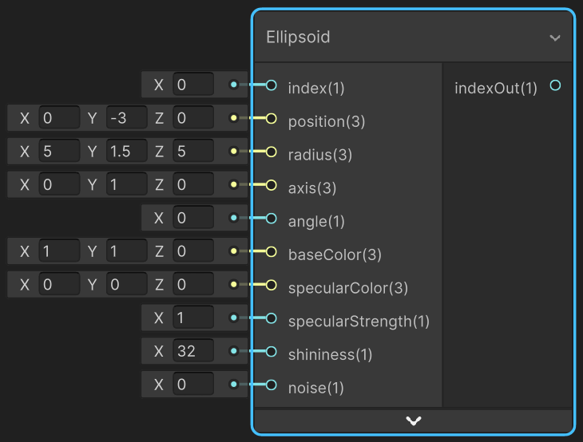{ width="400" }
        </figure>

    4. Connect the instantiations of the SDFs in series. The order is irrelevant, this is an examplary order:

        Hexagonal Prism: *index 0*

        Ellipsoid 1: *hexagonal prism index* 

        Ellipsoid 2: *ellipsoid 1 index*

        Ellipsoid 3: *ellipsoid 2 index*

        Ellipsoid 4: *ellipsoid 3 index*
    
        Ellipsoid 5: *ellipsoid 4 index*

        <figure markdown="span">
        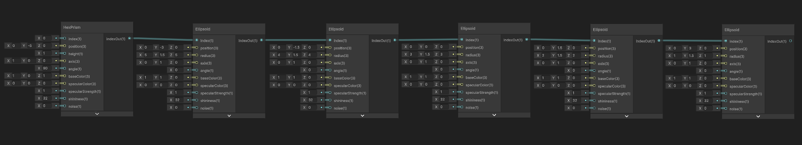{ width="700" }
        </figure>

    5. Add fitting colors to the SDFs, e.g.

        Hexagonal Prism: *#453535*

        Ellipsoids: *#18631B*

        <figure markdown="span">
        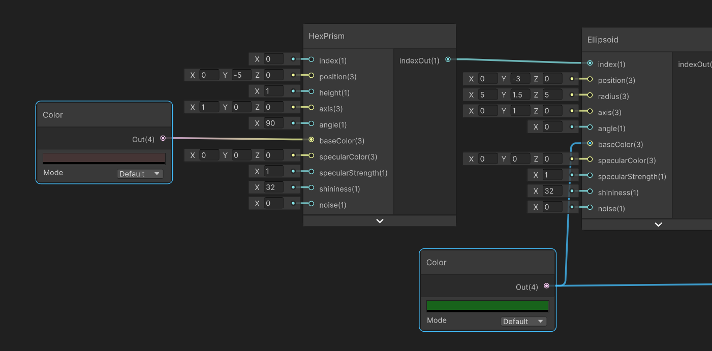{ width="700" }
        </figure>

    6.  Add noise to the SDFs for a more organic look, e.g.

        Hexagonal Prism: Unity's build-in *Gradient Noise Node* with *scale 30*
        
        Ellipsoids: Unity's build-in *Voronoi Noise Node* with *angleOffset 2* and *cellDensity 100*

        > Be aware that these noises use UV-coordinates of the underlying object and are deterministic with regard to them. Therefore, once animation is added, the noise will move.

        <figure markdown="span">
        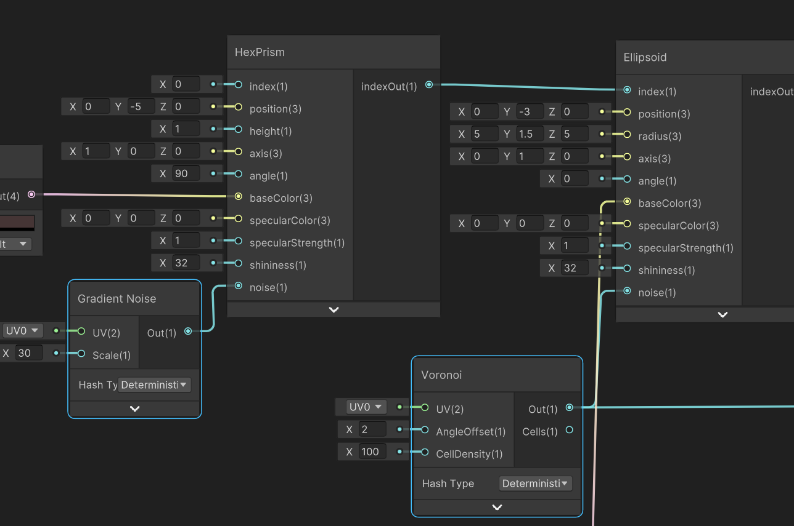{ width="500" }
        </figure>

7. Plug the final SDF's index *ellipsoid 5 index* into the [SDF Raymarching](../sdfs/raymarching.md). 

    <figure markdown="span">
        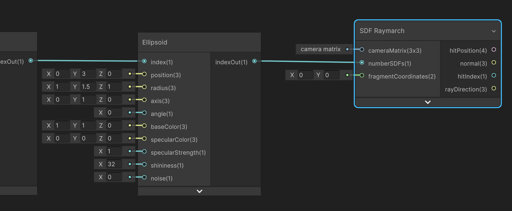{ width="500" }
    </figure>

8. Create [Fragment Coordinates](../basics/fragCoords.md) and connect it to the input of the raymarching.
   
    > Since the material will be applied to a cube, the **scaling values** can remain 1.

    <figure markdown="span">
        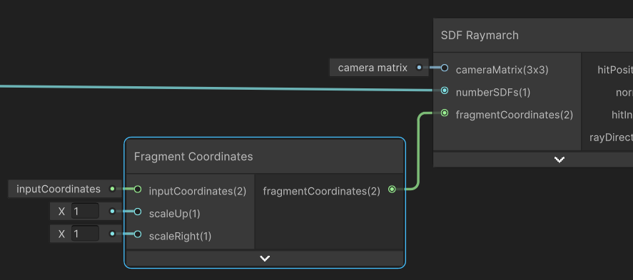{ width="400" }
    </figure>

9. Create a [Point Light](../lighting/pointLight.md) at *position (10,0,0)* and with a custom *dropPower 2*
   
    Connect all of the raymarching's outputs to the inputs of the point light.

    <figure markdown="span">
        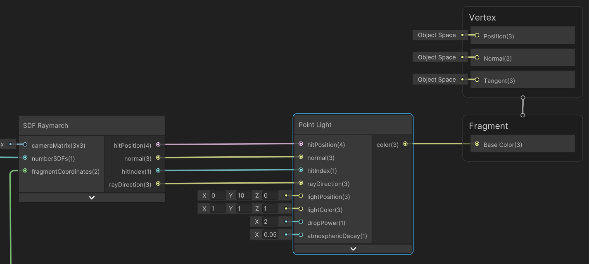{ width="600" }
    </figure>

10. Connect the color-output of the point light to the fragment's *base color*.
    
    This creates a finished static scene that shows a christmas tree being illuminated by a single point light from above. The camera position can be adjusted in the inspector of the prefab. Read more about it in [Uniforms and C#](../uniformsAndCs.md). 
    
    The following image uses a camera at `float3(0,-2,10)`.

    <figure markdown="span">
        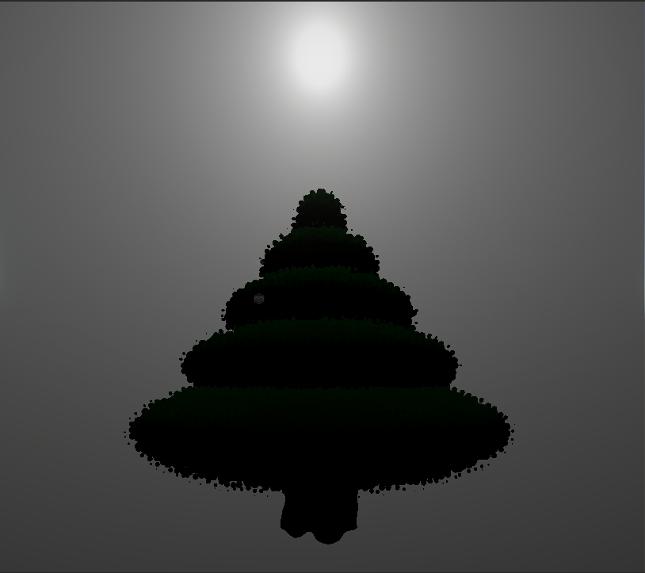{ width="500" }
    </figure>

11. To create the animation, add [3D Tweening](../animations/tweening.md) functions to every single SDF. Insert the SDF's current position as the *startValue*. Add 2 to the y-value of that starting position and use it as the *endValue*. Use an arbitrary integer as the *duration* and *tweenType*.

    <figure markdown="span">
        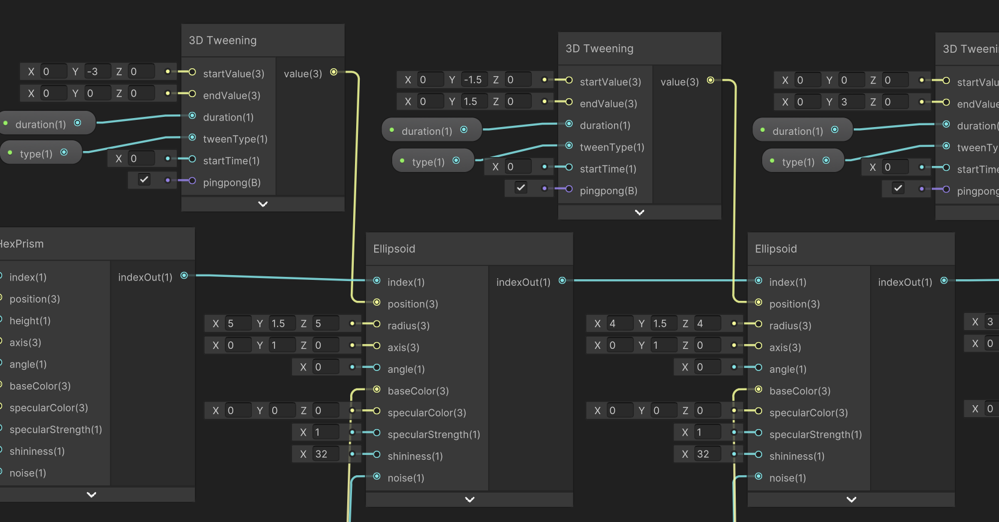{ width="700" }
    </figure>

    > Exposed variables can be created in the **Blackboard** can are changable in the material's inspector during runtime. They can be dragged into the ShaderGraph.

    <figure markdown="span">
        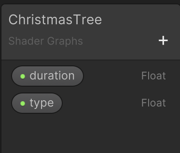{ width="200" }
    </figure>

12. Add an ornament to the top of the tree.
    1. Create a [Sphere](../sdfs/sphere.md).
    2. Add a [3D Tweening](../animations/tweening.md) and use its output as the position.

        Increment the last ellipsoid's y-value by 1.5 again to get a *startValue (0,4.5,0)* 

        Increment the starting position by 3 in the y-direction to the the *endPosition (0,7.5,0)*

    3. Decrease the size of the sphere to *radius 0.3*.
    4. Set *specularColor (1,1,1)*, *specularPower 0.8*, *shininess 40* to get bright and sharp highlights.
    5. Create a [Cylce Color](../animations/colorAnimation.md) function and plug the output into *color*. Use a festive red as the *seedColor*.
    6. Reorganise the graph so that *ellipsoid 5 index* goes into the sphere's input index, and the *sphere index* is fed into the raymarching.

    <figure markdown="span">
        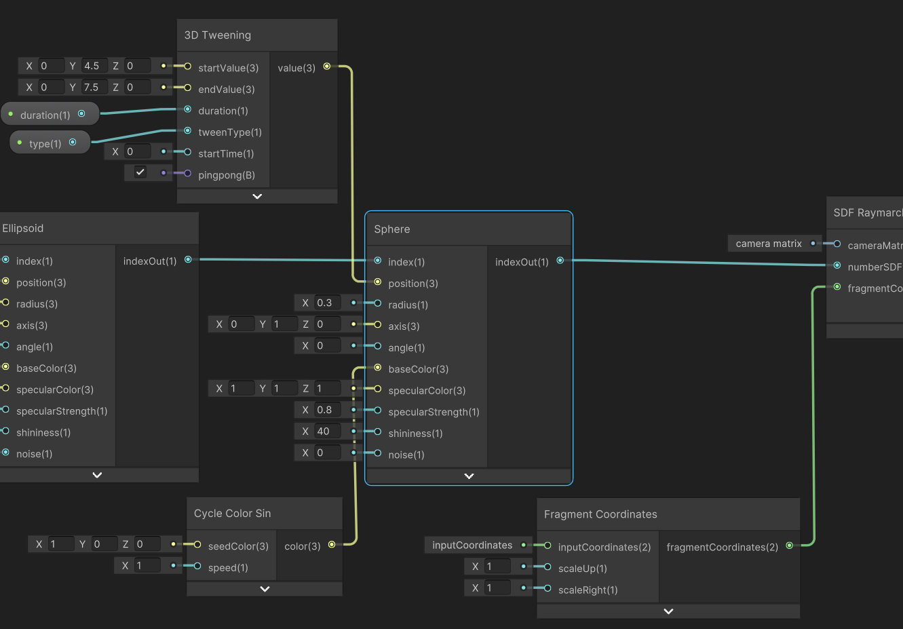{ width="700" }
    </figure>

13. Add more lights.
    1. Add two more [Point Lights](../lighting/pointLight.md).
    2. Connect all of them to the outputs of the raymarching. 
    3. To arrange the lights in a circular manner **compute the positions manually** or use one animation function [Orbit Around Point](../animations/orbitObject.md) for each light.
    4. Set the *speed 0* so that only the positinal offset is used.
    5. Use *seedPosition (0,5,0)* and *radius 3* to place the lights around the tree at height 5 with a distance of three to the centre.
    6. For an even distribution on the circle use *0*, *120*, *240* as the respective *angleOffsets*. 
    7. Combine the lights by adding their resulting colors together. 

       > Visual Scripting: Unity's *Add Node* can be used. 
    
    8. Reorganise the graph so that the final output of the addition is used as the fragment's *base color*.

    <figure markdown="span">
        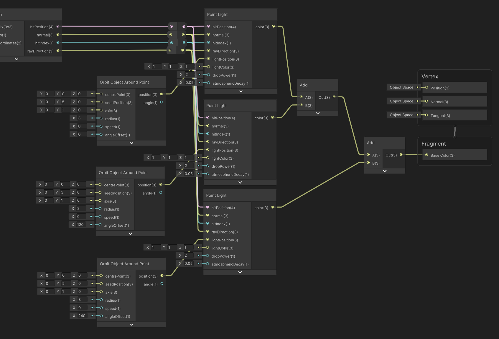{ width="700" }
    </figure>

14. To move the camera around the tree, add [Camera Rotation](../camera/cameraRotation.md).

    <figure markdown="span">
        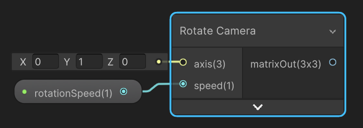{ width="400" }
    </figure>

    > Another exposed variable via the **Blackboard** may be used to adjust the camera's speed during runtime.

    <figure markdown="span">
        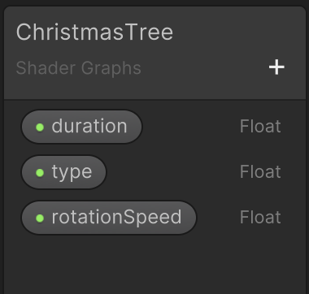{ width="200" }
    </figure>

15. Add a [Camera Matrix](../camera/cameraMatrix.md). Add the outputted matrix of the rotation as input the the function. The second transformation matrix is a simple identity matrix as no combination of multiple animations is necessary. 
16. Use the computed camera matrix as input to the raymarching function.
    
    <figure markdown="span">
        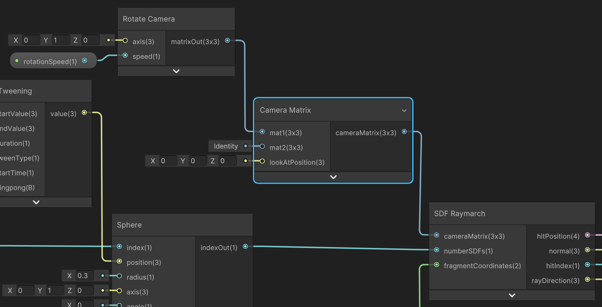{ width="500" }
    </figure>

--- 

## The Result

The finished ShaderGraph:
    <figure markdown="span">
    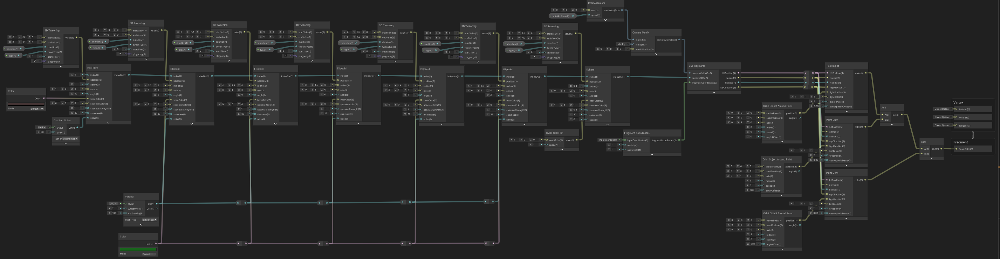{ width="900" }
    </figure>

The output with camera at `float3(0,-2,10)`:
    <figure markdown="span">
    { width="500" }
    </figure>
