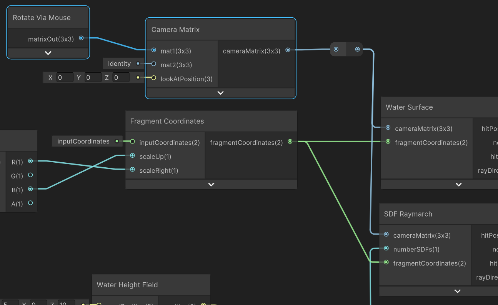
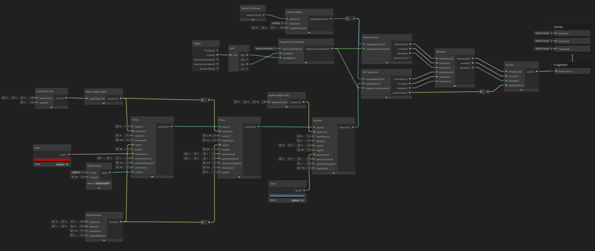

    <h1 class="main-heading">Tutorial: Safety Buoy</h1>
    <blockquote class="author">by Frieda Hentschel</blockquote>

The tutorial goes step-by-step through the creation of a scene containing the **ocean on which a safety buoy is floating**. In the **foreground a dolphin swims by** and the sky is illuminated by the **setting sun**.

> This tutorial is for Visual Scripting only. To keep the visual results of the ShaderGraph a bit clearer, all nodes were folded and do not show the visual preview.

Once the UPM ist installed, this example can be [downloaded](../../unity.md#user-shaders).

---

## Step-by-Step

1. Create and setup a Unity project with a material and shader as explained in the [Overview](../../unity.md). This tutorial uses a rectangular plane with a scaling of (20,1,10) to apply the material to.
2. Navigate to the shader.
3. Set up the [Water Surface](../water/waterSurface.md).

    <figure markdown="span">
        { width="400" }
    </figure>

4. Create [Fragment Coordinates](../basics/fragCoords.md) and connect it to the input of the water function.
   
    Since the material is applied to a rectangular plane, the **scaling values** have to be altered to fit the scaling of the plane. 

    1. Add Unity's *Object Node* and *Split Node*.
    2. Connect the *scale* of the first to the latter.
    3. Use the values from the *Split Node* as input to the custom one: *R* as *scaleRight* and *B* as *scaleUp*.

    <figure markdown="span">
        { width="600" }
    </figure>

5. To illuminate the water, add a [Sunrise](../lighting/sunriseLight.md). Connect all the outputs of the water to the inputs of the sunrise.

    Connect all the outputs of the water to the inputs of the sunrise.

    <figure markdown="span">
        { width="500" }
    </figure>
    
6. Connect the color-output of the sunrise to the fragment's *base color*.
    
    This creates a finished scene that shows the sun setting over the ocean. The camera position can be adjusted in the inspector of the prefab. Read more about it in [Uniforms and C#](../uniformsAndCs.md). 

7. Add a safety buoy by combining two tori.
    1. Add a major torus with *radius 2*, *thickness 0.8*, and a custom *color* (e.g. *#C20707*).
    2. In order to make the buoy look slightly beat up, add Unity's built-in *Simple Noise Node* with a *scale 50*.
    3. In the default implementation, a torus' hole faces the z-direction. Rotate both tori by setting *angle 90* and *axis (1,0,0)* so that their orientation aligns with the water.
    4. Add a thinner torus with *radius 2.75*, *tickness 0.2*, and a white *color*. The radius is chosen so that this thinner torus sits snuggly around the major one. This is achieved by adding the major torus' radius and thickness together. Subtract a fraction of the thinner torus' thickness to inset it into the major one.
    5. To make the buoy look slightly wet, set the *specularColor (1,1,1)*, *specularStrength 0.5*, and *shininess 50* for both tori.

    <figure markdown="span">
        { width="600" }
    </figure>

8. Place the buoy on the water.
    1. Add the [Water Height Field](../water/waterHeight.md) and connect its output to the *position* values of both tori. 
    2. To get a drifting look, [Cycle Color](../animations/colorAnimation.md) can be used. It periodically goes through values from 0 to 1. Thus, making the buoy move within the coordinates from 0 to 1. Use its output as input to the water's height field node.
    3. As the waves should effect the orientation of the buoy, add [Water Normal](../water/waterNormal.md). Use the previously used *axis (1,0,0)* as offset and connect the normal function's output to the tori's *axis* instead.
    4. Due to the fact that the water's normal changes rapidly and to avoid large and unnatural movements of the buoy, set *influence 0.3* and *sampleRadius 3*.

    <figure markdown="span">
        { width="600" }
    </figure>

9. Add a dolphin.
    1. Initialise the [Dolphin](../sdfs/dolphin.md).
    2. If desired, set its *color* to a custom one (e.g. *#516478*).
    3. Yet again, determine the *position* with [Water Height Field](../water/waterHeight.md). Use *seedPosition (5,0,10)* to make the dolphin come from the lower right corner (depending on the camera's position).
    4. Set *angle 80* to make the dolphin swim from the lower right corner to the upper left corner (depending on the camera's position).

    <figure markdown="span">
        { width="400" }
    </figure>

10. Connect the instantiations of the SDFs in series. The order is irrelevant, this is an examplary order:

    Major Torus: *index 0*

    Thin Torus: *major torus index* 

    Dolphin: *thin torus index*

    <figure markdown="span">
        { width="700" }
    </figure>

11. Plug the final SDF's index *dolphin index* into the [SDF Raymarching](../sdfs/raymarching.md). Add the previously computed fragment coordinates as input to the raymarching. 

    <figure markdown="span">
        { width="400" }
    </figure>

12. To illuminate both the SDFs and the water with the sunrise, add a [Minimum](../basics/minimum.md) function. Plug the outputs of the raymarching and the water surface into the two sets of inputs. Rearrange the graph so that instead of using the water surface's outputs for the sunrise, the minimum function's outputs are used. 
   
    Whether the water's or the SDFs' *rayDirection* is used, is irrelevant. Both contain the same value.

    <figure markdown="span">
        { width="500" }
    </figure>

13. To enable custom rotation within the scene, add [Rotate Via Mouse](../camera/mouseBasedMovement.md). Plug the resulting matrix into the inputs of the water surface and raymarching functions. By left-clicking the mouse, the scene can know be rotated. 

    > To move within the scene, enable the *Allow Movement* option in the prefab's inspector. Read more about it in [Uniforms and C#](../uniformsAndCs.md).

    <figure markdown="span">
        { width="400" }
    </figure>

---

## The Result

The finished ShaderGraph:
    <figure markdown="span">
    { width="900" }
    </figure>

Finally, the shader shows the safety buoy peacefully floating on the ocean. This output uses a camera at `float3(0,3,15)`:
    <figure markdown="span">
    { width="700" }
    </figure>
