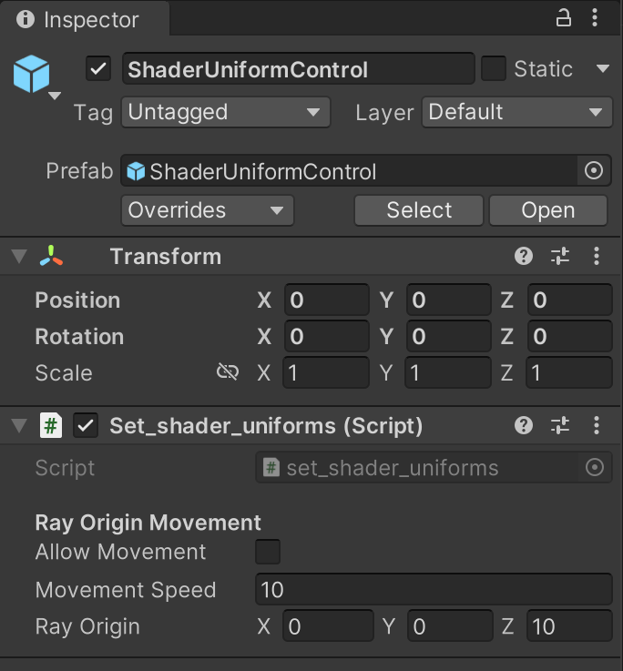

<div class="container">
    <h1 class="main-heading">Uniforms and C#</h1>
    <blockquote class="author">by Frieda Hentschel</blockquote>
</div>

Uniforms in Unity are set via a custom C#-file. It is essential to add them to a scene as they are responsible for:

- Setting the ray origin/camera position: As the ray origin is defined as a [Global Variable](globalVariables.md), it has to be initialised. Unity ShaderGraph does not take initialisations outside of hlsl-functions into account. Therefore, to initialise it, the ray origin is defined via a uniform. **This potentially leads to shaders which do not show the desired output upon their first compilation. See [Bug: Empty Shader](#bug-empty-shader) to learn more about this.**
- Setting the global variable **_raymarchStoppingCriterium** for the reason mentioned above. This variable defines the stopping criterium after which the raymarching of the [Water Shader](water/waterSurface.md) or the [SDF Raymarching](sdfs/raymarching.md) is terminated. 
- Providing the mouse position to the [Mouse-Based Camera Rotation](camera/mouseBasedMovement.md). This is necessary since Unity's hlsl support has no built-in mouse variable.
- Enabling translations through the scene using **WASDQE**.  

The C#-file is connected to the prefab *ShaderUniformControl*. Once the prefab has been added to a scene, the uniforms are set during runtime. Read about how to include the prefab in a scene in [Overview](../unity.md).

---

## The Code

``` cs
using System.Collections;
using System.Collections.Generic;
using UnityEngine;

public class set_shader_uniforms : MonoBehaviour
{
    private Vector2 lastMousePos;
    private Vector2 accumulatedMouseDelta = new Vector2(Screen.width * 0.5f, Screen.height * 0.5f);
    private bool isDragging = false;

    [Header("Ray Origin Movement")]
    public bool allowMovement = false;
    public float movementSpeed = 10f;
    public Vector3 rayOrigin = new Vector3(0, 0, 10);

    void Start()
    {
        Shader.SetGlobalVector("_rayOrigin", rayOrigin);
        Shader.SetGlobalFloat("_raymarchStoppingCriterium", 50);

        Shader.SetGlobalVector("_mousePoint", accumulatedMouseDelta);
        Shader.SetGlobalVector("_Mouse", accumulatedMouseDelta);
    }

    void onValidate()
    {
        Shader.SetGlobalVector("_rayOrigin", rayOrigin);
    }

    void Update()
    {
        if (!allowMovement)
        {
            Shader.SetGlobalVector("_mousePoint", accumulatedMouseDelta);
            Shader.SetGlobalVector("_Mouse", accumulatedMouseDelta);
        }

        // --- Mouse drag rotation ---
        if (Input.GetMouseButtonDown(0))
        {
            lastMousePos = Input.mousePosition;
            isDragging = true;
        }
        else if (Input.GetMouseButtonUp(0))
        {
            isDragging = false;
        }

        if (isDragging)
        {
            Vector2 currentMousePos = Input.mousePosition;
            Vector2 delta = currentMousePos - lastMousePos;
            lastMousePos = currentMousePos;

            // Accumulate and normalize
            accumulatedMouseDelta += delta;


            Shader.SetGlobalVector("_mousePoint", accumulatedMouseDelta);
            Shader.SetGlobalVector("_Mouse", accumulatedMouseDelta);
        }

        Vector3 direction = Vector3.zero;

        if (Input.GetKey(KeyCode.S)) direction += Vector3.forward;
        if (Input.GetKey(KeyCode.W)) direction += Vector3.back;
        if (Input.GetKey(KeyCode.A)) direction += Vector3.left;
        if (Input.GetKey(KeyCode.D)) direction += Vector3.right;
        if (Input.GetKey(KeyCode.E)) direction += Vector3.up;
        if (Input.GetKey(KeyCode.Q)) direction += Vector3.down;

        if (direction != Vector3.zero)
        {
            if (Input.GetKey(KeyCode.LeftShift))
            {
                direction *= 2;
            }
            rayOrigin += direction * movementSpeed * Time.deltaTime;
        }

        Shader.SetGlobalVector("_rayOrigin", rayOrigin);
    }
}
```

## Experience

Within the inspector of the *ShaderUniformControl*:

- Enable *Allow Movement*
    - Translations via **WASDQE**
    - **W**: Forward Movement
    - **A**: Left Movement
    - **S**: Backward Movement
    - **D**: Right Movement
    - **Q**: Downward Movement
    - **E**: Upward Movement
- Press *Shift* to speed up.
- Alter *Movement Speed* to adjusted the general speed of the movement. 
- Adjust *Ray Origin* to change the camera position. Be aware that this only leads to lasting changes if the *Allow Movement* is not used and no camera animation is used in the shader.

    <figure markdown="span">
        { width="300" }
    </figure>

## Bug: Empty Shader

If a custom shader has been composed and compiled for the first time but but the output in Scene-mode is blank or shows strange artifacts, it could be due to the lack of initialisation of essential uniform variables. All nodes using **_rayOrigin** and **_raymarchStoppingCriterium** are affected. On the other hand, functions that use neither, such as the [Sunrise](lighting/sunriseLight.md), are usually correctly rendered. 

To resolve this issue, simply run the scene once. By running the scene, the C#-file connected to the prefab in the scene will be executed and the uniform variables will be set. The uniforms will remain to be set even after the Game-mode has been exited.