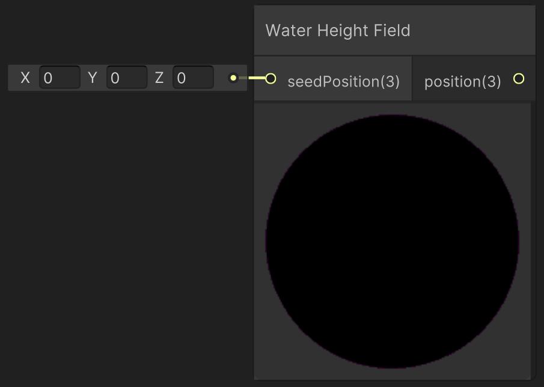

<div class="container">
    <h1 class="main-heading">Sample Water Height</h1>
    <blockquote class="author">by Frieda Hentschel</blockquote>
</div>

This function computes the height of the water environment using raymarching. It takes an arbitrary input position and returns that very position moved to the correct height. This is useful for placing objects on the [Water Surface](waterSurface.md).

---

## The Code

??? "Water Related Helper Functions"
    ```` hlsl
    float waveStrength = 0.0;

    float2x2 compute2DRotationMatrix(float angle)
    {
        float c = cos(angle), s = sin(angle);
        return float2x2(c, s, -s, c);
    }

    float hashNoise(float3 p)
    {
        float3 f = floor(p), magic = float3(7, 157, 113);
        p -= f;
        float4 h = float4(0, magic.yz, magic.y + magic.z) + dot(f, magic);
        p *= p * (3.0 - 2.0 * p);
        h = lerp(frac(sin(h) * 43785.5), frac(sin(h + magic.x) * 43785.5), p.x);
        h.xy = lerp(h.xz, h.yw, p.y);
        return lerp(h.x, h.y, p.z);
    }

    float computeWave(float3 position)
    {
        float3 warped = position - float3(0, 0, _Time.y % 62.83 * 3.0);

        float direction = sin(_Time.y * 0.15);
        float angle = 0.001 * direction;
        float2x2 rotation = compute2DRotationMatrix(angle);

        float accumulated = 0.0, amplitude = 3.0;
        for (int i = 0; i < 7; i++)
        {
            accumulated += abs(sin(hashNoise(warped * 0.15) - 0.5) * 3.14) * (amplitude *= 0.51);
            warped.xy = mul(warped.xy, rotation);
            warped *= 1.75;
        }
        
        waveStrength = accumulated;

        float height = position.y + accumulated;
        height *= 0.5;
        height += 0.3 * sin(_Time.y + position.x * 0.3); // slight bobbing
        return height;
    }
    ````

```` hlsl
void sampleHeightField_float(float3 seedPosition, out float3 heightPosition)
{
    float y = 0;
    float stepSize = 0.05; 

    for (int i = 0; i < 100; i++)
    {
        seedPosition.y = y;
        float height = computeWave(seedPosition);
        if (height < 0.01)
            break;
        y -= stepSize;
    }
    heightPosition = float3(seedPosition.x, y, seedPosition.z);
}
````

---

## The Parameters

### Inputs:
| Name            | Type     | Description |
|-----------------|----------|-------------|
| `seedPosition`    | float3   |  Seed position for which the height of the water surface is computed |

### Outputs:
| Name            | Type     | Description |
|-----------------|----------|-------------|
| `heightPosition`    | float3   |  Original position moved to the correct height of the water. This position can be plugged into the position-input of an [SDF](../sdfs/generalInformation.md) or [Lighting Function](../lighting/generalInformation.md) in order to place then on top of the water's surface. |

---

## Implementation

=== "Visual Scripting"
    Find the node at `PSF/Environments/Water Height Field`
    
    <figure markdown="span">
        { width="500" }
    </figure>

=== "Standard Scripting"

    Include - ```#include "Packages/com.tudresden.proceduralshaderframeworkpackage/Runtime/scripts/water_surface.hlsl"```

    Example Usage

    ```hlsl
    sampleHeightField_float(float3(0,0,0), waterSurfacePos);
    ```


---

This is an engine-specific extension to the shader code's water shader which can be found [here](../../../shaders/scenes/water_surface.md).