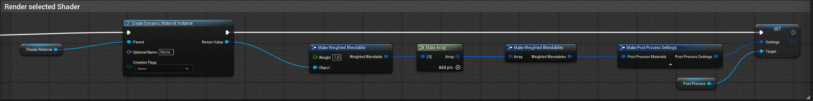
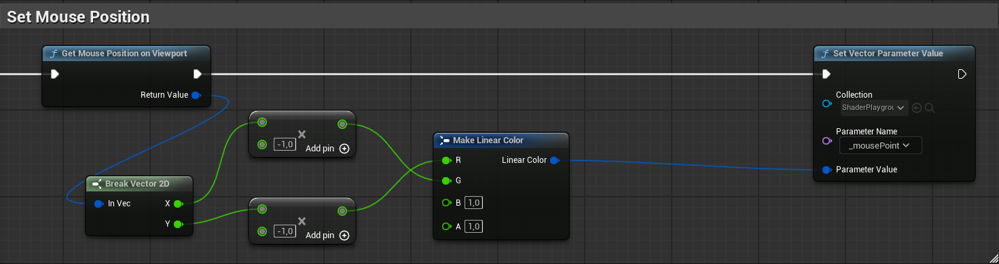
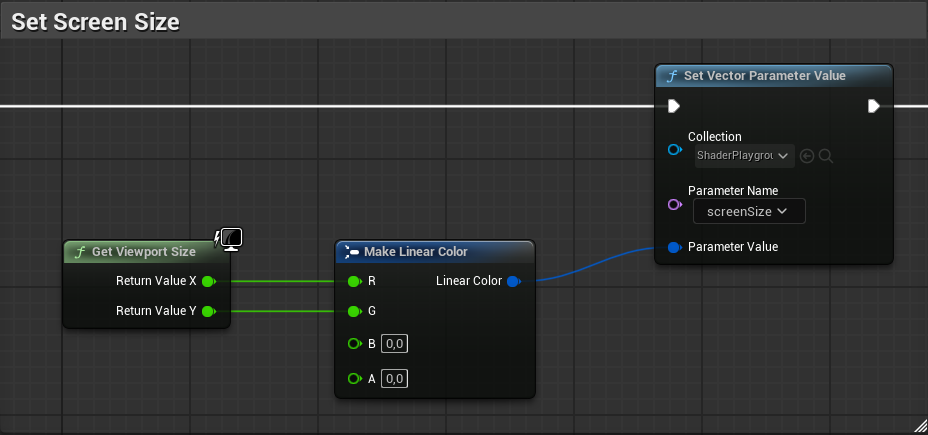
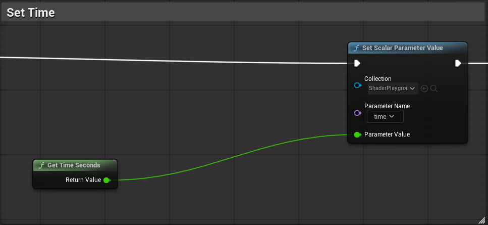

<div class="container">
    <h1 class="main-heading"> Shader Playground</h1>
    <blockquote class="author">by Maximilian Lipski</blockquote>
</div>


Since Unreal Engine's graphics API is so low level, uniforms are not directly supported in our implementation. They are not accessible directly in HLSL code, but are inserted through the input pins of the ```Custom```-Node for HLSL Scripting, as can be seen in the [Setup](../../unreal.md) or as Nodes for Visual Scripting. For that, a Collection of Material Parameters is used.

---

## Set Shader Material

Not a node, but a setting needed for the Framework to render the provided shader.
After setting the ShaderMaterial to be rendered, the Material is added to a infinitely extended PostProcessingVolume.  

*<figure markdown="span">
    { width="1000" }
</figure>*

 ---

## Get Mouse Position
ShaderPlayground converts the mouse position from viewport space into a coordinate system consistent with those used in other engines.

*<figure markdown="span">
    { width="1000" }
</figure>*

---

## Get Screen Size
The Size of the Viewport is propagated down to the shaders to be used by nodes like [ComputeUV](../utils/fragCoords.md).

*<figure markdown="span">
    { width="1000" }
</figure>*

---

## Get Time

The Time is taken from the Engine and passed down to the shader. Slowing down the Engine time results in a slower time for the shaders.
*<figure markdown="span">
    { width="1000" }
</figure>*
