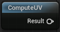

<div class="container">
    <h1 class="main-heading">Fragment Coordinates</h1>
    <blockquote class="author">by Maximilian Lipski</blockquote>
</div>

This function computes fragment coordinates ranging from 0 to 1 based on input coordinates and the viewport size. As this function is responsible for computing the coordinates at which a fragement is computed, it is the basis for all others. **It should always be included in a shader.**

---

## The Code

``` hlsl
void computeUV(float2 fragCoord, float2 viewportSize, out float2 uv)
{
    float2 flippedUv = float2(fragCoord.x, -fragCoord.y + 1);
    uv = flippedUv * 2 - 1;
}
```

---

## The Parameters

### Inputs:
| Name            | Type     | Description |
|-----------------|----------|-------------|
| `fragCoord`    | float2   | The coordinates of the current fragment in screen space, measured in pixels.|
| `viewportSize`    | float2   | The size of the current viewport, measured in pixels.|

### Outputs:
| Name            | Type     | Description |
|-----------------|----------|-------------|
| `uv`    | float2   | Normalized texture coordinates of the current fragment. Required input to [SDF Raymarching](../sdfs/raymarching.md), [Water Surface](../water/waterSurface.md), and certain lighting functions|

---


## Implementation

=== "Visual Scripting"
    Find the node at `ProceduralShaderFramework/Basics/ComputeUV`

     <figure markdown="span">
        { width="500" }
    </figure>
    

=== "Standard Scripting"
    Include - ```#include "/ProceduralShaderFramework/util_functions.ush"```

---

This is an engine-specific implementation without a shader-basis.