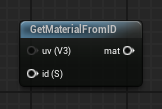
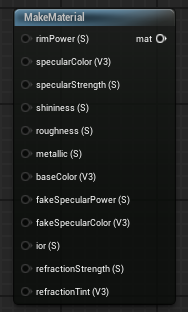

<div class="container">
    <h1 class="main-heading">Lighting in Unreal</h1>
    <blockquote class="author">by Runtong Li</blockquote>
</div>

The Material functions are an essential part of the framework. It returns a material parameter which contains each shader's material information like baseColor, specularColor ect. 

---

## The strcuture of MaterialParams
```hlsl
struct MaterialParams
{
    float3 baseColor;
    float3 specularColor;
    float specularStrength;
    float shininess;

    float roughness;
    float metallic;
    float rimPower;
    float fakeSpecularPower;
    float3 fakeSpecularColor;

    float ior;
    float refractionStrength;
    float3 refractionTint;
};
```
You can find the entire explanation [here](../../../shaders/material/material_system.md).

 ---

## How add MaterialParams to the SDFs
### 1. Using node "GetMaterialFromId":

Find the node at ```ProcedrualShaderFramework/GetMaterialFromId```
    <figure markdown="span">
    { width="500" }
    </figure>
This function based on the id returns a preset materialparams.

#### Inputs

| Name            | Type     | Description |
|-----------------|----------|-------------|
| `id`   | int   | Use different id to return differen materialparams |
| `uv`   | float3   | Some preset materialparams need this parameter. This UV is differet with the normal UV.|
#### Output
| Name            | Type     | Description |
|-----------------|----------|-------------|
| `mat`   | float3   | A preset materialparams. |

#### Material corresponding to ID
| MaterialName            | ID     |
|-----------------|----------|
| MAT_PLASTIC_WHITE         |  1   |
| MAT_PLASTIC_COLOR         |  2   |
| MAT_METAL_BRUSHED         |  3   |
| MAT_METAL_POLISHED         |  4   |
| MAT_GLASS_CLEAR         |  5   |
| MAT_GLASS_TINTED         |  6   |
| MAT_RUBBER_BLACK         |  7   |
| MAT_CERAMIC_WHITE         |  8   |
| MAT_EMISSIVE_WHITE         |  9   |
| MAT_METAL_WING         |  100   |
| MAT_SOLAR_PANEL         |  101   |
| MAT_COCKPIT_GLASS         |  102   |
| MAT_WINDOW_FRAME         |  103   |
| MAT_COCKPIT_BODY         |  104   |
| MAT_GUN_BARREL         |  105   |
| MAT_LASER_EMISSIVE         |  106   |


---

### 2. Using node "MakeMaterial".
Find the node at ```ProcedrualShaderFramework/MakeMaterial```
    <figure markdown="span">
    { width="500" }
    </figure>
You need to set each input. But it also has default input.
| input            | value     |
|-----------------|----------|
| rimPower         |  2        |
| specularColor         | float3(1.0, 1.0, 1.0) |
| specularStrength        |  1   |
| shininess         |  32   |
| roughness         |  0.5   |
| metallic         |  0   |
| baseColor         |  float3(1.0, 1.0, 1.0)   |
| fakeSpecularColor         |  32   |
| fakeSpecularPower        |  float3(1.0, 1.0, 1.0)  |
| Ior         |  1.45   |
| refractionStrength         |  0   |
| refractionTint         |  float3(1.0, 1.0, 1.0)   |
---

## For Standard Scripting
    Include - ```"/ProceduralShaderFramework/material_functions.ush"```
    Example usage

    ```hlsl
    MaterialParams mat;
    mat.baseColor = baseColor;
    mat.specularColor = specularColor;
    mat.specularStrength = specularStrength;
    mat.shininess = shininess;
    mat.roughness = roughness;
    mat.metallic = metallic;
    mat.rimPower = rimPower;
    mat.fakeSpecularColor = fakeSpecularColor;
    mat.fakeSpecularPower = fakeSpecularPower;
    mat.ior = ior;
    mat.refractionStrength = refractionStrength;
    mat.refractionTint = refractionTint;
    ```

Find the original shader code [here](../../../shaders/material/material_system.md).