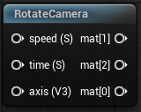

<div class="container">
    <h1 class="main-heading">Camera Rotation</h1>
    <blockquote class="author">by Maximilian Lipski</blockquote>
</div>

This function imitates a camera rotation by changing the ray origin and the camera matrix. The rotation will always be __centred at the world origin__. The distance at which the rotation is applied is defined by the __distance between the world origin and the current ray origin__.

---

## The Code

``` hlsl
void rotateCamera(float3 axis, float speed, float time, out float3x3 mat)
{
    float angle = time * speed;
    mat = computeRotationMatrix(normalize(axis), angle);
}
```

See [Helper Functions](../helperFunctions.md) to find out more about ```computeRotationMatrix(float3 axis, float angle)```

---

## The Parameters

### Inputs:
| Name            | Type     | Description |
|-----------------|----------|-------------|
| `axis`        | float3  | Axis around which the camera rotates  <br> <blockquote>*Visuial Scripting default value*: float3(0,1,0)</blockquote>|
| `speed`        | float   | Speed with which the rotation is applied <br> <blockquote>*Visual Scripting default value*: 1</blockquote>|
| `time`        | float   | Time the application is running |

### Outputs:
| Name            | Type     | Description |
|-----------------|----------|-------------|
| `mat`        | float3x3   | Transformation matrix which __needs to be__ plugged into the [Camera Matrix](cameraMatrix.md) before it can be used within the rest of the pipeline. This is necessary to apply the transformation matrix to the ray origin and to compute the correct camera matrix |

---

## Implementation

=== "Visual Scripting"
    Find the node at `ProceduralShaderFramework/Camera/RotateCamera`

    <figure markdown="span">
        { width="500" }
    </figure>

=== "Standard Scripting"
    Include - ```#include "/ProceduralShaderFramework/camera_functions.ush"```

---

Find the original shader code [here](unity/cameraMatrix.md).