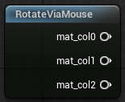

<div class="container">
    <h1 class="main-heading">Mouse-Based Camera Rotation</h1>
    <blockquote class="author">by Maximilian Lipski</blockquote>
</div>

This function imitates a camera rotation based on the mouse position. With a left mouse-click the world can be rotated in the x- and y-direction. 

---

## The Code

``` hlsl
void rotateViaMouse(float2 mousePosition, float2 screenSize, out float3x3 mat)
{
    
    float2 mouse = mousePosition.xy / screenSize.xy;

    mouse = mouse - 0.25;

    // Convert to yaw and pitch
    float yaw = lerp(-PI, PI, -mouse.x + 0.5); // == PI * mouse.x when centered
    float pitch = lerp(-PI / 2, PI / 2, mouse.y + 0.5); // invert Y axis

    float3x3 rotY = computeRotationMatrix(float3(1, 0, 0), yaw);
    float3x3 rotX = computeRotationMatrix(float3(0, 1, 0), pitch);

    mat = mul(-rotY, rotX); // yaw first, then pitch
}
```

See [Helper Functions](../helperFunctions.md) to find out more about ```computeRotationMatrix(float3 axis, float angle)```

---

## The Parameters

### Inputs:
| Name            | Type     | Description |
|-----------------|----------|-------------|
| `mousePosition`        | float2  | Position of the cursor in UV-Coordinates|
| `screenSize`        | float   | Size of the viewport|

### Outputs:
| Name            | Type     | Description |
|-----------------|----------|-------------|
| `mat`        | float3x3   | Final camera matrix that can be plugged into the [Water Shader](../water/waterSurface.md) or the [SDF Raymarching](../sdfs/raymarching.md) |

CHECK THIS
> Contrary to other animation functions, this function does not need to be finished off with a computation of the [Camera Matrix](cameraMatrix.md). 


## Implementation

=== "Visual Scripting"
    Find the node at `ProceduralShaderFramework/Camera/RotateViaMouse`

    <figure markdown="span">
        { width="300" }
    </figure>

=== "Standard Scripting"
    Include - ```#include "/ProceduralShaderFramework/camera_functions.ush"```

---

This is an engine-specific implementation without a shader-basis.