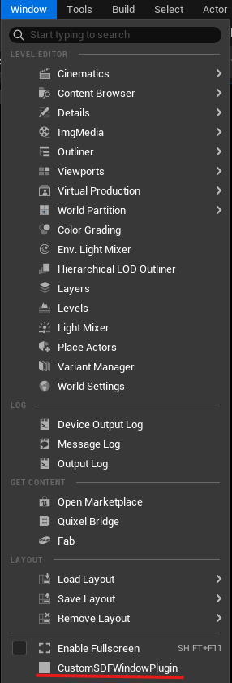

<div class="container">
    <h1 class="main-heading">SDF Desert</h1>
    <blockquote class="author">by Maximilian Lipski</blockquote>
</div>

## Custom SDFs

A significant limitation of the current implementation is the restriction to use the SDF primitives which are given by the framework. In an attempt to explore potential avenues of future development, a tool was implemented, which allows the user to generate CustomSDFs from within the engine. This tool however is more of a proof of concept rather than a fully implemented feature, since it still has some major restrictions and bugs. 

## How it works

When being in the Level Editor, a custom window can be opened from the toolbar with `Window > CustomSDFWindowPlugin`. 

*<figure markdown="span">
    { width="500" }
</figure>*

Within this window there is a textbox and a button. The user can now define their own, custom SDFs and use them hand-in-hand with the framework. The parameters that are available to the user are `probePoint` and `time`. 
`probePoint` being the point in space which is used to calculate the distance, and `time` being an optional parameter which can be used to animate the custom SDF. An over-time growing sphere can be defined as follows:

```hlsl
return length(probePoint - float3(0.0, 0.0, -10.0)) - time;
```

The function header and footer must not be included in the custom definition. 

## Example Usage

### Visual Scripting

## Technical Details

When pressing the `Generate` Button, a new `.ush` file is generated with the `sdMyCustomSDF` function. Additionally, an `addCustomSDF` function is created for use in the HLSL-Scripting approach. For Visual Scripting, a `AddCustomSDF` node is created. The SDF is then evaluated by extending the [evalSDF](../sdfs/raymarchAll.md) function with another entry. 

## Limitations

As mentioned, this is not a fully implemented feature. It proves however, that there is still room to grow for our framework. Currently, only a single custom SDF is supported. When trying to generate another one, an error message will be thrown and at times the first custom SDF even deleted. To ensure that no error is thrown, the deletion of the `addCustomSDF` node before generating the next custom SDF is required.
Although this allows for more diverse SDFs, this only allows for a single Material to applied on the entire SDF. 
Additionally, no error checking is done, and it is assumed, that the inserted HLSL code is correct. 

## Known Issues
- After restarting the engine the generated functions disapear, while the Visual Scripting node remains, resulting in a thrown error
    - To resolve, delete the custom node and regenerate

## Future Work

This approach can be extended to other parts of the framework's pipeline. When providing a skeleton or a template, the user could implement their own Raymarcher or even insert their own noise functions into the different parts of the renderer. 

