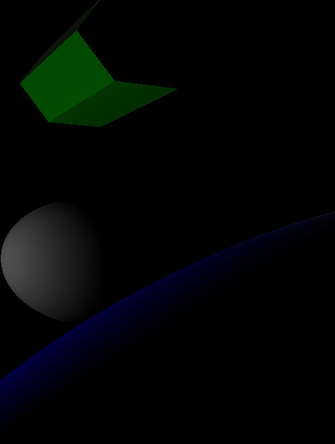

<div class="container">
    <h1 class="main-heading">PBR Lighting</h1>
    <blockquote class="author">by Runtong Li</blockquote>
</div>

This function applies simple PBR lighting with a fixed light source.
    <figure markdown="span">
        { width="500" }
    </figure>
---

## The Code
```hlsl
void applyPBRLighting(float4 hitPosition, float3 lightPosition, MaterialParams material, float3 normal, out float3 lightingColor)
{
    float3 viewDir, lightDir, lightColor, ambientColor;
    
    viewDir = normalize(_rayOrigin - hitPosition.xyz);
    lightDir = normalize(lightPosition - hitPosition.xyz);
    lightColor = float3(1.0, 1.0, 1.0);
    ambientColor = float3(0.05, 0.05, 0.05);
    
    float3 N = normalize(normal);
    float3 V = normalize(viewDir);
    float3 L = normalize(lightDir);
    float3 H = normalize(L + V);
    float3 F0 = lerp(float3(0.04, 0.04, 0.04), material.baseColor, material.metallic);

    float NDF = pow(material.roughness + 1.0, 2.0);
    float a = NDF * NDF;
    float a2 = a * a;

    // GGX Normal Distribution Function (D)
    float NdotH = max(dot(N, H), 0.0);
    float D = a2 / (PI * pow((NdotH * NdotH) * (a2 - 1.0) + 1.0, 2.0));

    // Fresnel Schlick approximation (F)
    float HdotV = max(dot(H, V), 0.0);
    float3 F = F0 + (1.0 - F0) * pow(1.0 - HdotV, 5.0);

    // Smith's Geometry Function (G)
    float NdotV = max(dot(N, V), 0.0);
    float NdotL = max(dot(N, L), 0.0);
    float k = pow(material.roughness + 1.0, 2.0) / 8.0;
    float G_V = NdotV / (NdotV * (1.0 - k) + k);
    float G_L = NdotL / (NdotL * (1.0 - k) + k);
    float G = G_V * G_L;

    // Cook-Torrance BRDF
    float3 specular = (D * F * G) / (4.0 * NdotL * NdotV + 0.001);

    // Diffuse (non-metallic only)
    float3 kd = (1.0 - F) * (1.0 - material.metallic);
    float3 diffuse = kd * material.baseColor / PI;

    // Final
    float3 lighting = (diffuse + specular) * lightColor * NdotL;
    lightingColor = lighting;
}
```

---

## Parameters

### Inputs

| Name            | Type     | Description |
|-----------------|----------|-------------|
| `hitPosition`   | float4   | World position of the surface hit; the w-component may be ignored |
| `normal`        | float3   | Surface normal at the hit point |
| `lightPosition` | float3   | World-space position of the directional light source |
| `material`      | MaterialParams | The material which the SDF is rendered with|

The inputs are typically provided by the functions [SDF Raymarching](../sdfs/raymarchAll.md) or [Water Surface](../water/waterSurface.md).

### Output
| Name            | Type     | Description |
|-----------------|----------|-------------|
| `lightingColor`   | float3   | Final RGB lighting result using diffuse and ambient components |

---

## Implementation

=== "Visual Scripting"  
    Find the node at ```ProcedrualShaderFramework/applyPBRLighting```
    <figure markdown="span">
    { width="500" }
    </figure>
    
=== "Standard Scripting"  
    Include - ```"/ProceduralShaderFramework/lighting_functions.ush"```

    Example Usage

    ```hlsl
    applyPBRLighting(hitPos, lightPosition, mat, normal, color1);
    ```

---

Find the original shader code [here](../../../shaders/lighting/lighting_functions.md).