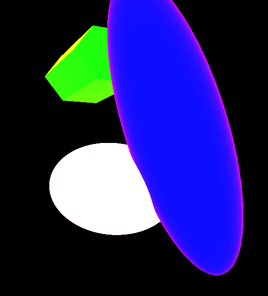
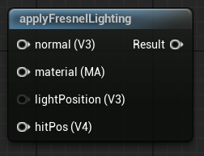

<div class="container">
    <h1 class="main-heading">Fresnell Lighting</h1>
    <blockquote class="author">by Runtong Li</blockquote>
</div>

This function applies Fresnel-based lighting using Schlick's approximation to simulate view-dependent reflectivity. It combines Lambertian diffuse shading with a specular fresnel effect that intensifies as the viewing angle approaches grazing.
    <figure markdown="span">
        { width="500" }
    </figure>
---

## The Code
```hlsl
void applyFresnelLighting(float4 hitPosition, float3 lightPosition, MaterialParams material, float3 normal, out float3 lightingColor)
{
    if (hitPosition.w > _raymarchStoppingCriterium)
    {
        lightingColor = float3(0, 0, 0);
        return;
    }
    float3 viewDirection = normalize(_rayOrigin - hitPosition.xyz);
    float3 lightDirection = normalize(lightPosition - hitPosition.xyz);
    float3 lightColor = float3(1.0, 1.0, 1.0);
    float3 ambientColor = float3(0.05, 0.05, 0.05);

    float fresnel = pow(1.0 - saturate(dot(viewDirection, normal)), 3.0);
    float rimStrength = 1.2;

    lightingColor = ambientColor + material.baseColor * lightColor + rimStrength * fresnel * material.specularColor;
}
```

---

## Parameters

### Inputs

| Name            | Type     | Description |
|-----------------|----------|-------------|
| `hitPosition`   | float4   | World position of the surface hit; the w-component may be ignored |
| `normal`        | float3   | Surface normal at the hit point |
| `lightPosition` | float3   | World-space position of the directional light source |
| `material`      | MaterialParams | The material which the SDF is rendered with|

The inputs are typically provided by the functions [SDF Raymarching](../sdfs/raymarchAll.md) or [Water Surface](../water/waterSurface.md).

### Output
| Name            | Type     | Description |
|-----------------|----------|-------------|
| `lightingColor`   | float3   | Final RGB lighting result using diffuse and ambient components |

---

## Implementation

=== "Visual Scripting"  
    Find the node at ```ProcedrualShaderFramework/applyFresnelLighting```
    <figure markdown="span">
    { width="500" }
    </figure>

=== "Standard Scripting"  
    Include - ```"/ProceduralShaderFramework/lighting_functions.ush"```
    Example Usage
    ```hlsl
    float3 color1;
    applyFresnelLighting(hitPos, lightPosition, mat, normal, color1);
    ```

---

This is an engine-specific implementation without a shader-basis.