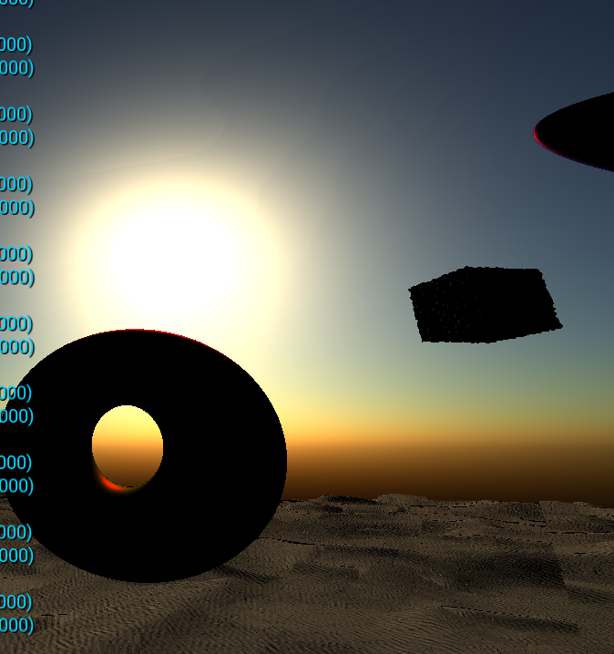

<div class="container">
    <h1 class="main-heading">Lighting in Unreal</h1>
    <blockquote class="author">by Runtong Li</blockquote>
</div>

The lighting functions are an essential part of the framework. They return the final color for a fragment and without them, the raymarched SDFs and environments are not visualised. 

---

## Types of Lighting

There are two major types of lighting implemented. Make sure to use the one that fits the scene the best or combine them. 

1. Lighting that effect the atmosphere. Even if the fragment does not contain a hit, the fragment is effected by the light.  
    1. [Sunrise](sunriseLight.md)
2. Lighting that does not effect the atmosphere. The lighting only effects objects within the scene and changes the visual output of their surface. 
    1. [Lambertian Lighting](lambLight.md)
    2. [Blinn Phong Lighting](blinnPhongLight.md)
    3. [Toon Lighting](toonLight.md)
    4. [Rim Lighting](rimLight.md)
    5. [Soft Subsurface Scattering Lighting](softSubsurfaceScattering.md)
    6. [Fresnel Lighting](fresnelLight.md)
    7. [UV Gradient Lighting](uvGradientLight.md)
    8. [UV Anisotropic Lighting](uvAnisotropicLight.md)
    9. [Fake Specular](fakeSpecular.md)
    10. [PBR Lighting](PBRLighting.md)
    11. [Phong Lighting](phongLighting.md)


---

## The Importance of Hit-Indices

In order to reduce the amount of outputs of raymarching functions and the amount of inputs to the lighting functions, the scene's materials are stored within global arrays. For each object added to the scene, the values of that object's material are stored at an instance-specific index. 

During the raymarching, the index of the object that was hit is retained, thus, enabling the retrieval of the corresponding material-values during the application of a lighting function. 

Since SDFs are stored by their parameters in their own global arrays, one set of indices is used accross the global arrays containing the SDFs' values and the global arrays containing the material-values. See the exact implementation in the [Global Variables](../globalVariables.md). 

To allow the application of lighting functions to the [Water Surface](../water/waterSurface.md) as well, an additional hard-coded hit-index for it was introduced. It is defined to be the first index after any of the ones for the SDFs. 

## How to Combine Lighting Functions

To combine lighting functions simply, you need the conncet the output of [raymarchAll](../sdfs/raymarchAll.md). 
    <figure markdown="span">
    { width="400" }
    </figure>

For the standart scripting users can combine the lights by simply adding the outputs.
Include - ```#include lighting_functions```
```hlsl
addSunriseLight(time, hitPos, normal, mat, rayDirection, color1);
```
Example output
    <figure markdown="span">
    { width="400" }
    </figure>