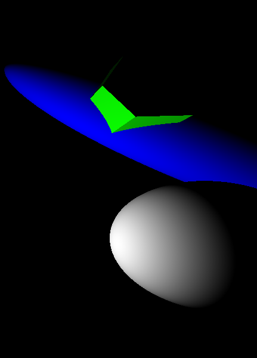
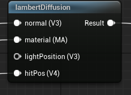

<div class="container">
    <h1 class="main-heading">Lambert Lighting</h1>
    <blockquote class="author">by Runtong Li</blockquote>
</div>

This function applies simple Lambertian diffuse lighting with a fixed light source. It computes the diffuse reflection based on the angle between the light direction and surface normal, and adds a small constant ambient term. This is a lightweight lighting model ideal for unlit or stylized shading.
    <figure markdown="span">
        { width="500" }
    </figure>
---

## The Code
```hlsl
void lambertDiffuse(float4 hitPosition, float3 lightPosition, MaterialParams material, float3 normal, out float3 lightingColor)
{
    if (hitPosition.w > _raymarchStoppingCriterium)
    {
        lightingColor = float3(0, 0, 0);
        return;
    }
    
    float3 viewDir, lightDir, lightColor, ambientColor;
    
    viewDir = normalize(_rayOrigin - hitPosition.xyz);
    lightDir = normalize(lightPosition - hitPosition.xyz);
    lightColor = float3(1.0, 1.0, 1.0);
    ambientColor = float3(0.05, 0.05, 0.05);
    
    float diff = max(dot(normal, lightDir), 0.0);
    lightingColor = material.baseColor * lightColor * diff;
}
```

---

## Parameters

### Inputs

| Name            | Type     | Description |
|-----------------|----------|-------------|
| `hitPosition`   | float4   | World position of the surface hit; the w-component may be ignored |
| `normal`        | float3   | Surface normal at the hit point |
| `lightPosition` | float3   | World-space position of the directional light source |
| `material`      | MaterialParams | The material which the SDF is rendered with |

The inputs are typically provided by the functions [SDF Raymarching](../sdfs/raymarchAll.md) or [Water Surface](../water/waterSurface.md).

### Output
| Name            | Type     | Description |
|-----------------|----------|-------------|
| `lightingColor`   | float3   | Final RGB lighting result using diffuse and ambient components |

---

## Implementation

=== "Visual Scripting"  
    Find the node at ```ProcedrualShaderFramework/lambertDiffusion```
    <figure markdown="span">
    { width="500" }
    </figure>

=== "Standard Scripting"  
    Include - ```"/ProceduralShaderFramework/lighting_functions.ush"```

    Example Usage

    ```hlsl
    lambertDiffuse(hitPos, lightPosition, mat, normal, color1);
    ```

---

Find the original shader code [here](../../../shaders/lighting/lighting_functions.md). 