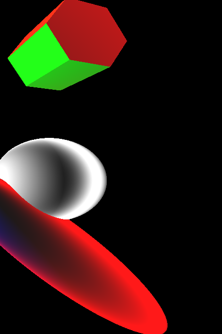
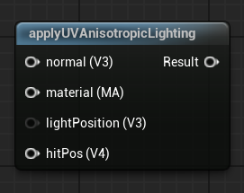

<div class="container">
    <h1 class="main-heading">UV Anisotropic Lighting</h1>
    <blockquote class="author">by Runtong Li</blockquote>
</div>

This function simulates anisotropic lighting effects using per-pixel tangent vectors derived from UV coordinates. The result mimics materials like brushed metal or hair by modulating specular highlights along UV-based tangent directions. It combines Lambertian diffuse lighting with a directional specular term.
    <figure markdown="span">
        { width="500" }
    </figure>
---

## The Code
```hlsl
void applyUVAnisotropicLighting(float4 hitPosition, float3 lightPosition, MaterialParams material, float3 normal, float2 uv, out float3 lightingColor)
{
    float3 viewDirection = normalize(_rayOrigin - hitPosition.xyz);
    float3 lightDirection = normalize(lightPosition - hitPosition.xyz);
    float3 halfVec = normalize(viewDirection + lightDirection);

    float angle = uv.x * 6.2831853; // 2π
    float3 localTangent = float3(cos(angle), sin(angle), 0.0);
    float3 tangent = normalize(localTangent - normal * dot(localTangent, normal));
    float3 bitangent = cross(normal, tangent);

    float TdotH = dot(tangent, halfVec);
    float BdotH = dot(bitangent, halfVec);
    float spectralAnisotropic = pow(TdotH * TdotH + BdotH * BdotH, 8.0);
    float diffuseValue = max(dot(normal, lightDirection), 0.0);

    float3 ambientColor = float3(0.1, 0.1, 0.1);

    lightingColor = ambientColor + diffuseValue * material.baseColor + spectralAnisotropic * material.specularColor;
}
```

---

## Parameters

### Inputs

| Name            | Type     | Description |
|-----------------|----------|-------------|
| `hitPosition`   | float4   | World position of the surface hit; the w-component may be ignored |
| `normal`        | float3   | Surface normal at the hit point |
| `lightPosition` | float3   | World-space position of the directional light source |
| `material`      | MaterialParams | The material which the SDF is rendered with|
| `uv`            | float2   | UV coordinates used to define local tangent direction; for this framework the [fragment coordinates](../basics/fragCoords.md) from Fragment Coordinates can be used|

The inputs are typically provided by the functions [SDF Raymarching](../sdfs/raymarchAll.md) or [Water Surface](../water/waterSurface.md).

### Output
| Name            | Type     | Description |
|-----------------|----------|-------------|
| `lightingColor`   | float3   | Final RGB lighting result using diffuse and ambient components |

---

## Implementation

=== "Visual Scripting"  
    Find the node at ```ProcedrualShaderFramework/applyUVAnisotropicLighting```
    <figure markdown="span">
    { width="500" }
    </figure>

=== "Standard Scripting"  
    Include - ```"/ProceduralShaderFramework/lighting_functions.ush"```

    Example Usage

    ```hlsl
    applyUVAnisotropicLighting(hitPos, lightPosition, mat, normal, uv, color1);
    ```

---

This is an engine-specific implementation without a shader-basis.