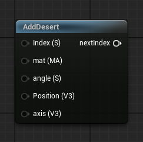

<div class="container">
    <h1 class="main-heading">SDF Desert</h1>
    <blockquote class="author">by Runtong Li</blockquote>
</div>

This function creates an internal instance of an SDF-based desert. In order for the object to be visible in the final output, [RaymarchAll](raymarchAll.md) and an arbitrary Lighting Function have to be included.

For further information of the implementations of SDFs in Unreal Engine refer to [General Information](generalInformation.md).

---

## The Code

??? "SDF-Computations for the Desert"
    ``` hlsl
    
    float surfFunc(in float3 p)
    {
        float layer1Amp = 2.0;
        float later2Amp = 1.0;
        float layer3Amp = 1.0;

        float layer1Freq = 0.2;
        float later2Freq = 0.275;
        float layer3Freq = 0.5 * 3.0;

        p /= 2.5;
        float layer1 = n2D(p.xz * layer1Freq) * layer1Amp - .5;
        layer1 = smoothstep(0., 1.05, layer1);
        float layer2 = n2D(p.xz * later2Freq) * later2Amp;
        layer2 = 1. - abs(layer2 - .5) * 2.;
        layer2 = smoothstep(.2, 1., layer2 * layer2);
        float layer3 = n2D(p.xz * layer3Freq) * layer3Amp;
        float res = layer1 * .7 + layer2 * .25 + layer3 * .05;
        return res;
    }

    float mapDesert(float3 p)
    {
        float sf = surfFunc(p);
        return p.y + (.5 - sf) * 2.;
    }

    float2x2 rot2(in float a)
    {
        float c = cos(a), s = sin(a);
        return float2x2(c, s, -s, c);
    }

    float grad(float x, float offs)
    {
        x = abs(frac(x / 6.283 + offs - .25) - .5) * 2.;
        float x2 = clamp(x * x * (-1. + 2. * x), 0., 1.);
        x = smoothstep(0., 1., x);
        return lerp(x, x2, .15);
    }

    float sandL(float2 p)
    {
        float2 q = mul(rot2(3.14159 / 18.), p);
        q.y += (gradN2D(q * 18.) - .5) * .05;
        float grad1 = grad(q.y * 80., 0.);

        q = mul(rot2(-3.14159 / 20.), p);
        q.y += (gradN2D(q * 12.) - .5) * .05;
        float grad2 = grad(q.y * 80., .5);

        q = mul(rot2(3.14159 / 4.), p);
        float a2 = dot(sin(q * 12. - cos(q.yx * 12.)), float2(.25, .25)) + .5;
        float a1 = 1. - a2;
        float c = 1. - (1. - grad1 * a1) * (1. - grad2 * a2);
        return c;
    }

    float sand(float2 p)
    {
        p = float2(p.y - p.x, p.x + p.y) * .7071 / 4.;
        float c1 = sandL(p);
        float2 q = mul(rot2(3.14159 / 12.), p);
        float c2 = sandL(q * 1.25);
        return lerp(c1, c2, smoothstep(.1, .9, gradN2D(p * float2(4, 4))));
    }

    float bumpSurf3D(in float3 p)
    {
        float n = surfFunc(p);
        float3 px = p + float3(.001, 0, 0);
        float nx = surfFunc(px);
        float3 pz = p + float3(0, 0, .001);
        float nz = surfFunc(pz);
        return sand(p.xz + float2(n - nx, n - nz) / .001 * 1.);
    }

    float3 doBumpMap(in float3 p, in float3 nor, float bumpfactor)
    {
        const float2 e = float2(0.001, 0);
        float ref = bumpSurf3D(p);
        float3 grad = (float3(bumpSurf3D(p - e.xyy),
                        bumpSurf3D(p - e.yxy),
                        bumpSurf3D(p - e.yyx)) - ref) / e.x;
        grad -= nor * dot(nor, grad);
        return normalize(nor + grad * bumpfactor);
    }

    void getDesertColor(float3 p, out float3 color)
    {
        float ripple = sand(p.xz);
        color = lerp(float3(1.0, .95, .7), // light sand
                    float3(.9, .6, .4), // darker trough
                    ripple);
    }
    float2 hash22(float2 p)
    {
        float n = sin(dot(p, float2(113, 1)));
        p = frac(float2(2097152, 262144) * n) * 2. - 1.;
        return p;
    }

    float n2D(float2 p)
    {
        float2 i = floor(p);
        p -= i;
        p *= p * (3. - p * 2.);
        return dot(mul(float2x2(frac(sin(fmod(float4(0, 1, 113, 114) + dot(i, float2(1, 113)), 6.2831853)) * 43758.5453)), float2(1. - p.y, p.y)), float2(1. - p.x, p.x));
    }

    float gradN2D(in float2 f)
    {
        const float2 e = float2(0, 1);
        float2 p = floor(f);
        f -= p;
        float2 w = f * f * (3. - 2. * f);
        float c = lerp(lerp(dot(hash22(p + e.xx), f - e.xx), dot(hash22(p + e.yx), f - e.yx), w.x),
                    lerp(dot(hash22(p + e.xy), f - e.xy), dot(hash22(p + e.yy), f - e.yy), w.x), w.y);
        return c * .5 + .5;
    }
    ```
void addDesert(inout int index, float3 position, float3 axis, float angle, MaterialParams material)
{
    SDF newSDF;
    newSDF.type = 8;
    newSDF.position = position;
    newSDF.radius = 0.0;
    newSDF.size = 0;
    newSDF.rotation = computeRotationMatrix(normalize(axis), angle * PI / 180);
    newSDF.material = material;
    addSDF(index, newSDF);
}
```
```

---

## The Parameters

### Inputs:
| Name            | Type     | Description |
|-----------------|----------|-------------|
| `index`        | int   | The index at which this object is stored <br> <blockquote> *Visual Scripting default value*: 1 </blockquote>|
| `position`        | float3   | The central position of this object |
| `axis`        | float3   | The axis determining the orientation of the object <br> <blockquote> *Visual Scripting default value*: float3(0, 0, 0) </blockquote> |
| `angle`        | float   | The angle around the axis <br> <blockquote> *Visual Scripting default value*: 0 </blockquote>|
| `material` | MaterialParams | The material which the SDF is rendered with |
    
### Outputs:
- ```int index```: The incremented input index that can be used as either the input index to another SDF function or as the amount of SDFs in the scene to the [RaymarchAll](raymarchAll.md).  

---

## Implementation

=== "Visual Scripting"
    Find the node at `ProceduralShaderFramework/SDFs/AddDesert`

<figure markdown="span">
    { width="300" }
</figure>

=== "Standard Scripting"
    Include - ```#include "ProceduralShaderFramework/Shaders/sdf_functions.ush"```
    
    Example Usage
    ```hlsl
    addDesert(index, Position, axis, angle, mat);
    ```
---

Find the original shader code [here](../../../shaders/scenes/desert.md).