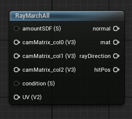

<div class="container">
    <h1 class="main-heading">SDF RaymarchAll</h1>
    <blockquote class="author">by Runtong Li</blockquote>
</div>

This function performs raymarching considering all previously instantiated SDFs.


---

## The Code
```hlsl
    float evalSDF(int index, float3 p, float time = 0.0)
    {
        SDF s = sdfArray[index];
        float3 probePoint = mul((p - s.position), s.rotation);
        if (s.type == 0)
        {
            return sdSphere(probePoint, s.radius);
        }
        else if (s.type == 1)
        {
            return sdRoundBox(probePoint, s.size, s.radius);
        }
        else if (s.type == 2)
        {
            return sdTorus(probePoint, s.size.yz);
        }
        else if (s.type == 3)
        {
            return sdHexPrism(probePoint, s.radius);
        }
        else if (s.type == 4)
        {
            return sdOctahedron(probePoint, s.radius);
        }
        else if (s.type == 5)
        {
            return sdEllipsoid(probePoint, s.size);
        }
        else if (s.type == 6)
        {
            return dolphinDistance(probePoint, s.position, dolphinArray[index].timeOffset, dolphinArray[index].speed, time).x;
        }
        else if (s.type == 7)
        {
            float base = sdBox(probePoint, s.size);
            float noise = snoise(probePoint * 5.0) * 0.1;
            return base - noise * 0.3;
        }
        else if (s.type == 8)
        {
            return mapDesert(probePoint);
        }
        return 1e5;
    }
    void raymarchAll(float condition, float3x3 cameraMatrix, float numberSDFs, float2 uv, out float4 hitPosition, out float3 normal, out MaterialParams material, out float3 rayDirection, float time = 0.0)
    {
        if (condition == 0)
        {
            cameraMatrix = computeCameraMatrix(float3(0, 0, 0), _rayOrigin, float3x3(1, 0, 0, 0, 1, 0, 0, 0, 1));
        }
        
        rayDirection = normalize(mul(float3(uv, -1), cameraMatrix));
        float t = 0.0;
        hitPosition = float4(0, 0, 0, 0);
        int hitIndex;
        for (int i = 0; i < 100; i++)
        {
            float3 currentPosition = _rayOrigin + rayDirection * t;
            float d = 1e5;
            int bestIndex = -1;
            for (int j = 0; j < numberSDFs; ++j)
            {
                float dj = evalSDF(j, currentPosition, time);
                if (dj < d)
                {
                    d = dj;
                    bestIndex = j;
                }
            }
            hitIndex = bestIndex;
            if (d < 0.001)
            {
                hitPosition.xyz = currentPosition;
                normal = get_normal(hitIndex, currentPosition);
                material = sdfArray[hitIndex].material;
                hitPosition.w = t;
                if (sdfArray[hitIndex].type == 8)
                {
                    normal = doBumpMap(hitPosition.xyz, normal, 0.07);
                    getDesertColor(hitPosition.xyz, material.baseColor);
                }
                break;
            }
            if (t > _raymarchStoppingCriterium)
            {
                hitPosition.xyz = currentPosition;
                hitPosition.w = _raymarchStoppingCriterium + 1;
                break;
            }
            t += d;
        }
    }


```

---

## The Parameters

### Inputs:
| Name            | Type     | Description |
|-----------------|----------|-------------|
| `condition`           | int       | A value that is used to check whether the default camera matrix should be computed or a custom camera matrix has been put in <br> <blockquote> condition = 0: The default camera matrix should be computed </blockquote><blockquote> condition = 1: A custom camera matrix has been added </blockquote>|
| `cameraMatrix`        | float3x3    | Camera matrix <br> <blockquote> Can be aquired using [moveViaMouse](../camera/mouseBasedMovement.md) </blockquote>|
| `numberSDFs`      | float     | Number of all sdfs <br> <blockquote> Should be aquired as the output of the SDF which is instanciated last </blockquote>|
| `uv`           | float2     | The fragment's coordinates <br> <blockquote> can be aquired by [ComputeUV](../utils//fragCoords.md) </blockquote>|

    
### Outputs:
| Name            | Type     | Description |
|-----------------|----------|-------------|
| `hitPosition`           | float4     | The first three dimensions contain the position at which the water has been hit. The w-component contains the raymarching parameter at which the hit occured. This is required in order to be able to combine the raymarching output with other visual elements.|
| `normal`           | float3     | Normal at the hit position |
| `material`        | MaterialParams | The material which the SDF is rendered with |
| `rayDirection`        | float3 | Ray direction dependant on the current fragment coordinates |


---

## Implementation

=== "Visual Scripting"
    Find the node at `ProceduralShaderFramework/SDFs/RayMarchAll`
    <figure markdown="span">
    { width="300" }
    </figure>

=== "Standard Scripting"
    Include - ```#include "ProceduralShaderFramework/Shaders/sdf_functions.ush"```

    Example Usage
    ```hlsl
    raymarchAll(condition, cameraMatrix, sdfAmount, uv, hitPos, normal, mat, rayDirection, time);
    ```
---

Find the original shader code [here](../../../shaders/geometry/raymarching_sdf.md).