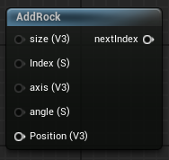

<div class="container">
    <h1 class="main-heading">SDF Rock</h1>
    <blockquote class="author">by Runtong Li</blockquote>
</div>

This function creates an internal instance of an SDF-based rock. In order for the rock to be visible in the final output, [RaymarchAll](raymarchAll.md) and an arbitrary Lighting Function have to be included.

---

## The Code

``` hlsl
// Signed distance to an axis-aligned box centered at origin
float sdBox(float3 p, float3 b)
{
    // p: point in local space
    // b: half-size in x/y/z directions
    float3 d = abs(p) - b;
    return length(max(d, 0.0)) + min(max(d.x, max(d.y, d.z)), 0.0);
}

void addRock(inout int index, float3 position, float3 size, float3 axis, float angle, MaterialParams material)
{
    SDF newSDF;
    newSDF.type = 7;
    newSDF.position = position;
    newSDF.radius = 0.0;
    newSDF.size = size;
    
    float3 u = normalize(axis);
    float rad = radians(angle);
    float c = cos(rad);
    float s = sin(rad);
    
    newSDF.rotation = float3x3(
        c + (1.0 - c) * u.x * u.x,
        (1.0 - c) * u.x * u.y - s * u.z,
        (1.0 - c) * u.x * u.z + s * u.y,

        (1.0 - c) * u.y * u.x + s * u.z,
        c + (1.0 - c) * u.y * u.y,
        (1.0 - c) * u.y * u.z - s * u.x,

        (1.0 - c) * u.z * u.x - s * u.y,
        (1.0 - c) * u.z * u.y + s * u.x,
        c + (1.0 - c) * u.z * u.z
    );
    newSDF.material = material;
    
    addSDF(index, newSDF);
}
float evalSDF(int index, float3 p, float time = 0.0)
{
    ...
     else if (s.type == 7)
    {
        float base = sdBox(probePoint, s.size);
        float noise = snoise(probePoint * 5.0) * 0.1;
        return base - noise * 0.3;
    }
    ...
}
```

---

## The Parameters

### Inputs:
| Name            | Type     | Description |
|-----------------|----------|-------------|
| `index`        | int   | The index at which the rock is stored <br> <blockquote> *Visual Scripting default value*: 1 </blockquote>|
| `position`        | float3   | The central position of the rock |
| `size`        | float3   | Half-size in x/y/z directions <br> <blockquote> *Visual Scripting default value*: float3(1, 1, 1) </blockquote>|
| `axis`        | float3   | The axis determining the orientation of the rock <br> <blockquote> *Visual Scripting default value*: float3(0, 1, 0) </blockquote> |
| `angle`        | float   | The angle around the axis |
| `material` | MaterialParams | The material which the SDF is rendered with |
    
### Outputs:
- ```int index```: The incremented input index that can be used as either the input index to another SDF function or as the amount of SDFs in the scene to the [RaymarchAll](raymarchAll.md).  

---

## Implementation

=== "Visual Scripting"
    Find the node at `ProceduralShaderFramework/SDFs/AddRock`
    <figure markdown="span">
        { width="300" }
    </figure>

=== "Standard Scripting"
    Include - ```#include "ProceduralShaderFramework/Shaders/sdf_functions.ush"```

    Example Usage
    ```hlsl
    addRock(index, Position, size, axis, angle, mat);
    ```

---

Find the original shader code [here](../../../shaders/geometry/SDF_Rock.md).