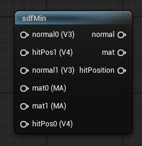

<div class="container">
    <h1 class="main-heading">SDF sdfMin</h1>
    <blockquote class="author">by Runtong Li</blockquote>
</div>

This function is used to help combining water shader and other different part.

---

## The Code

``` hlsl
if(hitpos0.w < hitpos1.w) {
    outNormal = normal0;
    smaller = 0.0f;
    return hitpos0;
} else {
    outNormal = normal1;
    smaller = 1.0f;
    return hitpos1;
}

if(smaller == 0.0f) {
    specularColor = specularColor0;
    specularStrength = specularStrength0;
    shininess = shininess0;
    roughness = roughness0;
    metallic = metallic0;
    rimPower = rimPower0;
    fakeSpecularPower = fakeSpecularPower0;
    fakeSpecularColor = fakeSpecularColor0;
    ior = ior0;
    refractionStrength = refractionStrength0;
    refractionTint = refractionTint0;
    return baseColor0;
} else {
    specularColor = specularColor1;
    specularStrength = specularStrength1;
    shininess = shininess1;
    roughness = roughness1;
    metallic = metallic1;
    rimPower = rimPower1;
    fakeSpecularPower = fakeSpecularPower1;
    fakeSpecularColor = fakeSpecularColor1;
    ior = ior1;
    refractionStrength = refractionStrength1;
    refractionTint = refractionTint1;
    return baseColor1;
}
```

---

## The Parameters

### Inputs:
| Name            | Type     | Description |
|-----------------|----------|-------------|
| `hitPos0`        | float4   | This should be hitPos from raymarchAll node |
| `normal0`        | float3   | This should be normal from computeWater node |
| `hitPos1`        | float4   | This should be hitPos from raymarchAll node |
| `Normal1`        | float3   | This should be normal from computeWater node |
| `mat0`        | MaterialParams   | This should be mat from raymarchAll node |
| `mat1`        | MaterialParams   | This should be mat from computeWater node |
    
### Outputs:
| Name            | Type     |
|-----------------|----------|
| `hitPos`        | float4   |
| `normal`        | float3   |
| `mat`        | MaterialParams   |
---

## Implementation

=== "Visual Scripting"
    Find the node at `ProceduralShaderFramework/SDFs/AddTorus`
<figure markdown="span">
    { width="300" }
</figure>

=== "Standard Scripting"
    No Standard Scripting for this funcion. 
---

This is an engine-specific implementation without a shader-basis.