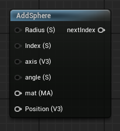

<div class="container">
    <h1 class="main-heading">SDF Sphere</h1>
    <blockquote class="author">by Runtong Li</blockquote>
</div>

This function creates an internal instance of an SDF-based sphere. In order for the sphere to be visible in the final output, [RaymarchAll](raymarchAll.md) and an arbitrary Lighting Function have to be included.

For further information of the implementations of SDFs in Unreal Engine refer to [General Information](generalInformation.md).

---

## The Code

``` hlsl
float sdSphere(float3 position, float radius)
{
    return length(position) - radius;
}

void addSphere(inout int index, float3 position, float radius, float3 axis, float angle, MaterialParams material)
{
    SDF newSDF;
    
    newSDF.type = 0;
    newSDF.position = position;
    newSDF.size = float3(0, 0, 0);
    newSDF.radius = radius;
    newSDF.rotation = computeRotationMatrix(normalize(axis), angle * PI / 180);
    newSDF.material = material;
    
    addSDF(index, newSDF);

}
```

---

## The Parameters

### Inputs:
| Name            | Type     | Description |
|-----------------|----------|-------------|
| `index`        | int   | The index at which the sphere is stored <br> <blockquote> *Visual Scripting default value*: 1 </blockquote>|
| `position`        | float3   | The central position of the sphere |
| `radius`        | float   | The radius of the sphere from center to the very outside of the tube <br> <blockquote> *Visual Scripting default value*: 1 </blockquote>|
| `axis`        | float3   | The axis determining the orientation of the sphere <br> <blockquote> *Visual Scripting default value*: float3(0, 1, 0) </blockquote> |
| `angle`        | float   | The angle around the axis |
| `material` | MaterialParams | The material which the SDF is rendered with |
    
### Outputs:
- ```int index```: The incremented input index that can be used as either the input index to another SDF function or as the amount of SDFs in the scene to the [RaymarchAll](raymarchAll.md).  

---

## Implementation

=== "Visual Scripting"
    Find the node at `ProceduralShaderFramework/SDFs/AddSphere`
<figure markdown="span">
    { width="300" }
</figure>

=== "Standard Scripting"
    Include - ```#include "ProceduralShaderFramework/Shaders/sdf_functions.ush"```

    Example Usage
    ```hlsl
    addSphere(index, Position, Radius, axis, angle, mat);
    ```

---

Find the original shader code [here](../../../shaders/geometry/SDF_Sphere.md).