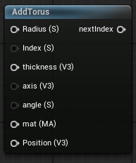

<div class="container">
    <h1 class="main-heading">SDF Torus</h1>
    <blockquote class="author">by Maximilian Lipski</blockquote>
</div>

This function creates an internal instance of an SDF-based torus. In order for the torus to be visible in the final output, [RaymarchAll](raymarchAll.md) and an arbitrary lighting function has to be included. 

---

## The Code

``` hlsl
// size.y is the major radius, size.z is the thickness
float sdTorus(float3 position, float2 size)
{
    float2 q = float2(length(position.xy) - size.x, position.z);
    return length(q) - size.y;
}

void addTorus(inout int index, float3 position, float radius, float thickness, float3 axis, float angle, MaterialParams material)
{
    SDF newSDF;
    newSDF.type = 2;
    newSDF.position = position;
    newSDF.radius = 0;
    newSDF.size = float3(0, radius, thickness);
    newSDF.rotation = computeRotationMatrix(normalize(axis), angle * PI / 180);
    newSDF.material = material;
    
    addSDF(index, newSDF);
}
```

---

## The Parameters

### Inputs:
| Name            | Type     | Description |
|-----------------|----------|-------------|
| `index`        | int   | The index at which the torus is stored <br> <blockquote> *Visual Scripting default value*: 1 </blockquote>|
| `position`        | float3   | The central position of the torus |
| `radius`        | float   | The radius of the torus from center to the very outside of the tube <br> <blockquote> *Visual Scripting default value*: 3 </blockquote>|
| `thickness`        | float   | The thickness of the torus' tube <br> <blockquote> *Visual Scripting default value*: 1 </blockquote>|
| `axis`        | float3   | The axis determining the orientation of the torus <br> <blockquote> *Visual Scripting default value*: float3(0, 1, 0) </blockquote> |
| `angle`        | float   | The angle around the axis |
| `material` | MaterialParams | The material which the SDF is rendered with |
    
### Outputs:
- ```int index```: The incremented input index that can be used as either the input index to another SDF function or as the amount of SDFs in the scene to the [RaymarchAll](raymarchAll.md).  

---

## Implementation

=== "Visual Scripting"
    Find the node at `ProceduralShaderFramework/SDFs/AddTorus`
    <figure markdown="span">
        { width="300" }
    </figure>

=== "Standard Scripting"
    Include - ```#include "ProceduralShaderFramework/Shaders/sdf_functions.ush"```

    Example Usage
    ```hlsl
    addTorus(index, Position, Radius, Thickness, axis, angle, mat);
    ```

---

Find the original shader code [here](../../../shaders/geometry/Geometry_SDFs.md).