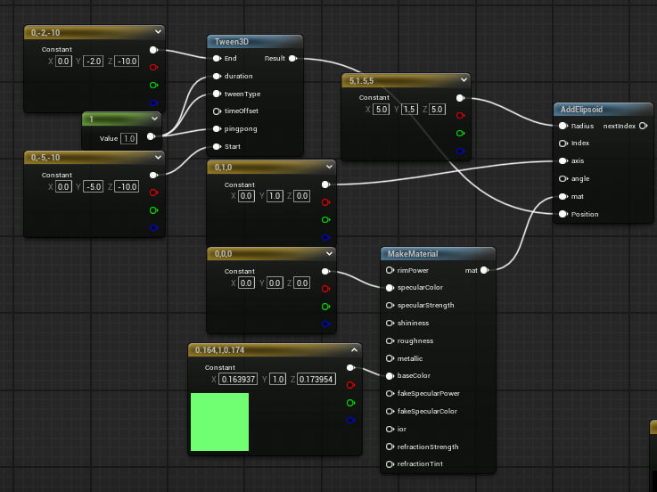
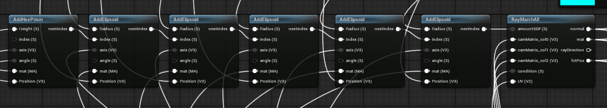
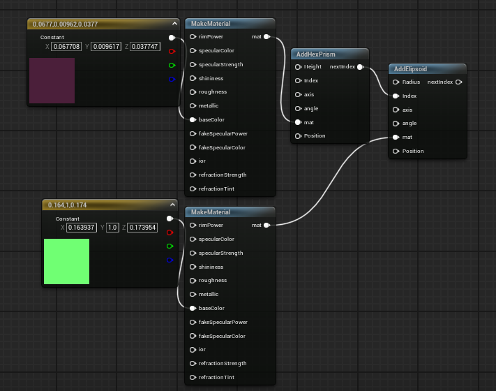
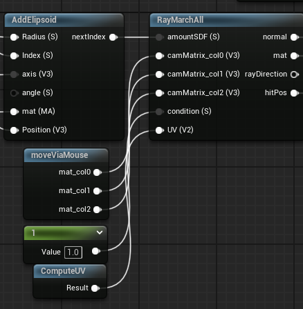
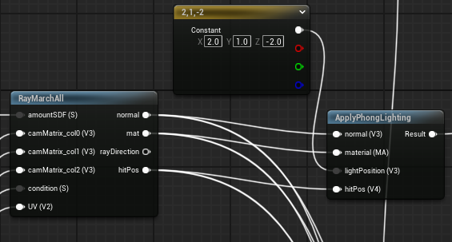
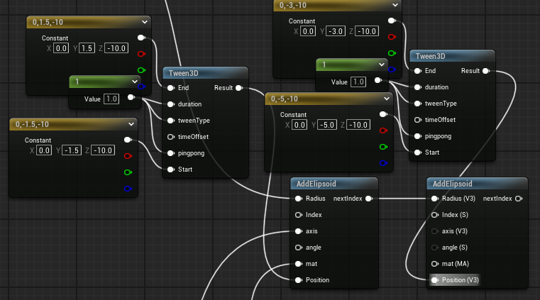
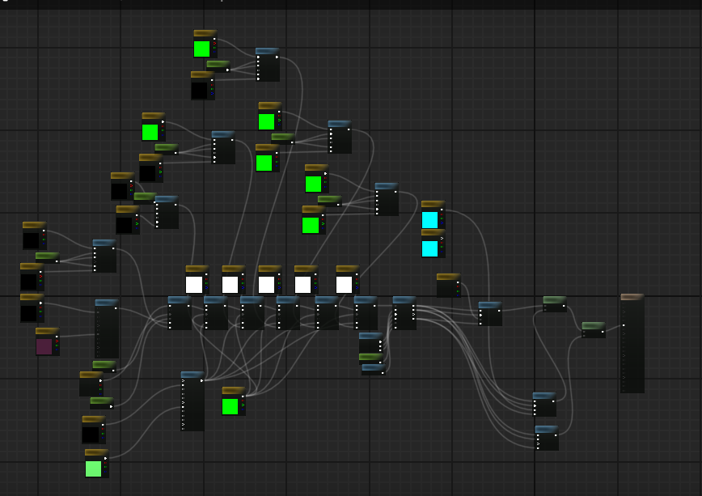
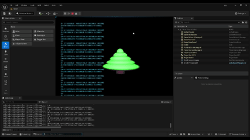

    <h1 class="main-heading">Tutorial: Christmas Tree</h1>
    <blockquote class="author">by Runtong Li</blockquote>

This tutorial is designed to illustrate the workflow of Unreal's integration of the framework. It showcases relevant connections between functions and gives examplary usecases for them. 

The tutorial goes step-by-step through the creation of a scene containing a **bouncing christmas tree** using animated SDFs and **some lights**.

> To keep the visual results of the ShaderGraph a bit clearer, all nodes were folded and do not show the visual preview.

This tutorial based on the Unity team's [christmasTree](../../unity/tutorials/christmasTree.md). Some changes have to be made to fit the unreal engine project. Still possible to implement a similar object.

---

## Step-by-Step

1. [Create](../../unreal.md) a new Unreal Project and Shader 
2. Creation of the tree around the world origin
    1. Create the trunk as a [Hexagonal Prism](../sdfs/hexprism.md) with *height 1* and place it just below the world origin at *position (0,-5,-10)*
    2. Create the three out of five [Ellipsoids](../sdfs/ellipsoid.md) of varying sizes
   
        Start with an ellipsoid of *size (5,1.5,5)*; locate it above the trunk by placing its central position at *position (0,-3,-10)*
   
        Continue by decrementing the size in x- and z-direction by one, and incrementing the position in y-position by 1.5 four more times.

        <figure markdown="span">
            { width="400" }
        </figure>

    4. Connect the instantiations of the SDFs in series. The order is irrelevant, this is an examplary order:

        Hexagonal Prism: *index 0*

        Ellipsoid 1: *hexagonal prism index* 

        Ellipsoid 2: *ellipsoid 1 index*

        Ellipsoid 3: *ellipsoid 2 index*

        Ellipsoid 4: *ellipsoid 3 index*
    
        Ellipsoid 5: *ellipsoid 4 index*

        <figure markdown="span">
        { width="700" }
        </figure>

    5. Add fitting colors to the SDFs, e.g.

        Hexagonal Prism: *#453535*

        Ellipsoids: *#18631B*

        <figure markdown="span">
        { width="700" }
        </figure>
7. Plug the final SDF's index *ellipsoid 5 index* into the [SDF raymarchAll](../sdfs/raymarchAll.md). 

    <figure markdown="span">
        { width="500" }
    </figure>

9. Create a [applyPhongLighting](../lighting/PhongLighting.md) at *position (2,1,-2)* 

    <figure markdown="span">
        { width="600" }
    </figure>

11. To create the animation, add [3D Tweening](../animations/tweening.md) functions to every single SDF. Insert the SDF's current position as the *startValue*. Add 2 to the y-value of that starting position and use it as the *endValue*. Use an arbitrary integer as the *duration* and *tweenType*.

    <figure markdown="span">
        { width="700" }
    </figure>

--- 

## The Result

The finished ShaderGraph(It's really mess. Please see Unity team's [christmasTree](../../unity/tutorials/christmasTree.md) if you want to know the structure of this ShaderGraph):
    <figure markdown="span">
    { width="900" }
    </figure>

The output:
    <figure markdown="span">
    { width="500" }
    </figure>
